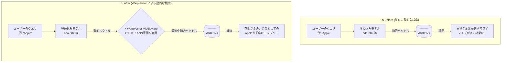

# warpvector 🌌

> [!NOTE]
> 🌍 **English Documentation:** Please see [**🇺🇸/🇬🇧 Read this in English**](./README.md) for the English version.

[](https://badge.fury.io/js/warpvector)
[](https://opensource.org/licenses/MIT)
[](#)
[](#)
[](#)

`warpvector` は、AIモデルの再学習や重い再推論を行うことなく、検索クエリやコンテキスト（意図）に応じてベクトル空間を動的に変形させる、TypeScriptネイティブの軽量ミドルウェア・ユーティリティです。

### ✨ プロジェクトのハイライト
- ⚡️ **超高速（エッジ対応）**: WASMにより、ブラウザやCloudflare Workers等のエッジ環境でサブミリ秒（数マイクロ秒）の推論を実現します。
- 🧠 **かしこい（動的ワープ）**: ユーザーの「意図」に応じて、リアルタイムにベクトル空間を歪めて検索精度を劇的に向上させます。
- 💸 **高コスパ（量子化）**: Int8 / Binary 圧縮により、ベクトルDBのストレージとメモリコストを最大96.9%（1/32）削減します。
- 📦 **ゼロ依存（Pure TS）**: Pythonも重いMLフレームワークも不要。TypeScriptだけで高度な機械学習処理が完結します。

<div align="center">
  <br />
  <a href="https://daiki-moritake.github.io/warpvector/ja.html">
    
  </a>
  <br />
  <br />
  <b>ブラウザ上でWASMによるリアルタイムのベクトル空間変換や量子化を直感的なUIで体験できます。</b>
  <br />
  <br />
</div>

<br />

---

## 💡 なぜ `warpvector` なのか？

従来のベクトル検索は静的であり、事前に生成された埋め込みベクトルの距離（類似度）に依存していました。コンテキストに応じた検索の微調整を行いたい場合、これまではメタデータのフィルタリングに頼るか、重い指示チューニング型モデル（Pythonベース）を再度動かすしかなく、リアルタイム性や柔軟性に欠けていました。

`warpvector` は、**「LLMモデルを取り替えたり再学習したりすることなく、検索結果を劇的に賢く・軽く・パーソナライズできる魔法のフィルター」** として機能します。

### 🔄 Before / After: 検索アーキテクチャの進化



---

## 🎯 5つの強力なユースケース

`warpvector` を既存の RAG やベクトル検索システムに組み込むことで、以下の課題を解決できます。

- 🎯 **1. ユーザーの「意図」に合わせたパーソナライズ検索**
  > 標準的な埋め込みモデルは「Apple」が果物か企業かを判別できません。WarpVectorを使えば、「ITドメイン」「食品ドメイン」といった意図（インテント）を切り替えるだけで、一瞬で空間が歪み、クエリが目的のドキュメントに近づきます。
  
- 🔄 **2. ログドリブンなオンライン自己学習（役割の分離）**
  > エッジでユーザー行動（クリック、スルー）を収集し、バックエンドでオンライン学習。生成された軽量な変換行列だけをエッジに即時デプロイすることで、LLM本体をいじらずに低遅延な自己学習ループを回せます。

- 📐 **3. モデル特有の「検索空間の偏り」の自動補正**
  > 多くのモデルが抱える「どんな単語を入れても類似度が高く出てしまう異方性」を、`WhiteningAdapter` でストリーミング学習・補正し、検索の解像度を引き上げます。

- 💾 **4. ベクトルDBのメモリコストを 1/4 〜 1/32 に激減させる**
  > パイプラインの最後に `.quantize("int8")` 等を追加するだけで、精度をほぼ落とさずにデータサイズを大幅に圧縮します。

- 🚀 **5. 現在の TypeScript コードを壊さずに「数行」で導入**
  > Python 不要。完全な TS ネイティブ ＆ WASM 実装であり、LangChain、LlamaIndex、Prisma (pgvector) にすぐに組み込めます。

### 🤝 対応エコシステム (Drop-in Integrations)
`[LangChain]` `[LlamaIndex]` `[Prisma / pgvector]` `[Pinecone]` `[Cloudflare Vectorize]` `[Redis]`

---

## ⚡ パフォーマンス概要

| 指標 | Before (通常検索) | After (WarpVector) | 改善率 |
|------|-----------------|---------------------|--------|
| **Int8 量子化忠実度** | — | cosine sim 0.9999 | ほぼ無損失圧縮 |
| **MLP 推論 (WASM)** | — | 1.1–3.8 µs/vector | ほぼゼロ遅延 |
| **Int8 量子化速度** | — | 322K vecs/sec | リアルタイム対応 |
| **Binary 量子化速度** | — | 1.18M vecs/sec | 超高スループット |
| **メモリ削減 (Int8)** | 6 KB/vec (1536-dim) | 1.5 KB/vec | **75% 削減** |
| **メモリ削減 (Binary)** | 6 KB/vec (1536-dim) | 192 B/vec | **96.9% 削減** |
| **パイプライン遅延** | — | 119 µs (Intent + Projection) | サブミリ秒 |
| **IR精度 (NDCG@10)** | 68.2% (vanilla) | 77.0% (Intent Warping) | **+13.0% 改善** |
| **量子化 Recall@10 (Int8)** | — | 86–96% | ほぼ無損失検索 |

<details>
<summary>📊 詳細なベンチマーク結果</summary>

| アダプタ | 次元数 | 平均遅延 | 精度指標 | 値 |
|---------|--------|---------|---------|-------|
| IntentAdapter | 128D | 21.1 µs | Identity precision | 1.000000 |
| IntentAdapter | 768D | 603.3 µs | Identity precision | 1.000000 |
| IntentAdapter | 1536D | 2406.2 µs | Identity precision | 1.000000 |
| ProjectionAdapter | 1536 → 512 | 807.0 µs | — | — |
| ProjectionAdapter | 768 → 256 | 204.0 µs | — | — |
| QuantizationAdapter | 128D (int8) | 0.7 µs | 量子化忠実度 | 0.999992 |
| QuantizationAdapter | 768D (int8) | 4.2 µs | 量子化忠実度 | 0.999992 |
| QuantizationAdapter | 1536D (int8) | 4.2 µs | 量子化忠実度 | 0.999992 |
| MlpAdapter (WASM) | 128 → 64 | 2.2 µs | — | — |
| MlpAdapter (WASM) | 768 → 256 | 3.8 µs | — | — |
| MlpAdapter (WASM) | 1536 → 512 → 128 | 1.1 µs | — | — |
| Pipeline | 768 → 256 (Intent+Proj) | 119.1 µs | — | — |

*Apple M-series, Bun ランタイムで計測。`bun run benchmarks/accuracy.ts` で再現可能。*

</details>

---

## 🧩 機能アーキテクチャ (Edge vs Backend)

`warpvector` は、超低遅延を要求される「エッジ推論」と、計算リソースを必要とする「学習・高度な処理」を明確に分離した設計を採用しています。

```mermaid
graph TD
    subgraph "⚡ Edge Inference Layer (エッジ推論層: サブミリ秒・ゼロ依存)"
        E_Core[コア変換<br/>Intent, Projection, Lora]
        E_ML[ニューラルネット<br/>MlpAdapter, 非線形活性化関数]
        E_Opt[最適化・圧縮<br/>Whitening, Quantization]
        E_Search[ハイブリッド検索・超次元計算<br/>RRF, VSA]
    end
    
    subgraph "🧠 Backend & Training Layer (バックエンド学習層: Node.js/Worker)"
        B_Train[学習エンジン<br/>InfoNCE, TripletTrainer]
        B_Auto[Auto-ML<br/>IntentMatrixFactory]
        B_Rerank[重厚リランキング<br/>ColBERT, Scattering]
    end
    
    B_Train -.->|軽量な変換行列 (Weights) をデプロイ| E_Core
    B_Auto -.->|最適な Intent 行列を自動生成してデプロイ| E_Core
    B_Train -.->|学習済みモデルの合成 (Task Arithmetic)| E_Core
```

---

## 📦 インストール

```bash
npm install warpvector
# または
bun add warpvector
```

コア機能（IntentAdapter, MlpAdapter, 量子化, VSA 等）は**ゼロ依存**で動作します。Prisma や LangChain との連携は以下のパッケージを追加してください：

```bash
# Prisma 統合（pgvector）
npm install @prisma/client sql-template-tag

# LangChain / LlamaIndex 統合
npm install @langchain/core
```

---

## 🛠 クイックスタートガイド

機能が豊富であるため、カテゴリ別に基本的な使い方をまとめています。詳細は各ドキュメントを参照してください。

### 1. パイプラインの基本構成 (WarpPipeline)
複雑なベクトル変換からDBフォーマットへの出力までを数行で直感的に記述できます。

```typescript
import { WarpPipeline } from 'warpvector';
import { MlpAdapter } from 'warpvector/ml';
import { QuantizationAdapter } from 'warpvector/extras';

// 1. パイプラインの構築
const pipeline = new WarpPipeline(1536)
  .addStep(new MlpAdapter(layers))
  .addIntent({ "domain_x": intentWeights })
  .setFinalStage(new QuantizationAdapter({ type: "int8", dim: 1536 }));

// 2. WASMなどの非同期初期化
await pipeline.init();

// 3. 超高速バッチ処理 & DB用フォーマットへの直接出力
const pineconeQuery = pipeline.runAndFormat(
  rawVector, 
  { format: "pinecone", topK: 10, filter: { genre: "action" } },
  { intent: "domain_x" }
);
```

### 2. コア変換（意図の反映・次元削減）
<details>
<summary>💻 意図に応じた空間の歪み (IntentAdapter) と次元削減 (ProjectionAdapter)</summary>

```typescript
import { IntentAdapter, ProjectionAdapter } from 'warpvector';

// 1. IntentAdapter: 意図ごとの変換行列とバイアスを定義して空間をワープ
const adapter = new IntentAdapter({
  riskAnalysis: { matrix: [...], bias: [...] }
});
const warpedVector = adapter.tune(baseVector, "riskAnalysis");

// 2. ProjectionAdapter: WASMを用いた高速な次元削減 (1536次元 -> 512次元)
const projAdapter = new ProjectionAdapter(1536, 512, { v1: { matrix: projMatrix, bias: projBias } });
const compressedVector = projAdapter.tune(baseVector, "v1");
```
</details>

### 3. ニューラルネットと空間最適化
<details>
<summary>💻 WASM MLP 推論 / Whitening / Inverse Diffusion</summary>

```typescript
import { MlpAdapter, WhiteningAdapter } from 'warpvector/ml';
import { SoftWhiteningAdapter } from 'warpvector/train';

// 1. MlpAdapter: WASM バックエンドを用いた超高速な非線形推論
const mlp = new MlpAdapter([{ matrix, bias, activation: "relu" }]);
await mlp.init();
const mlpOutput = mlp.tune(inputVector);

// 2. Whitening: 検索空間の偏り (異方性) をオンラインで除去
const whitener = new WhiteningAdapter(1536, { learningRate: 0.01, numComponents: 1 });
whitener.update(rawVector); // 偏りをストリーミング学習
const whitened = whitener.tune(searchVector);

// 3. Inverse Diffusion: 混ざり合ったコンテキストから鋭い意図を抽出
const softWhitener = new SoftWhiteningAdapter(1536, { tau: 2.0 });
const sharpVector = softWhitener.tune(queryVector);
```
</details>

### 4. 自動学習・連合学習 (バックエンド層)
<details>
<summary>💻 IntentMatrixFactory / Federated Learning</summary>

```typescript
import { IntentMatrixFactory, InfoNCETrainer, FeedbackCollector } from 'warpvector/train';

// 1. IntentMatrixFactory: サンプルベクトルから最適な行列を自動生成 🆕
const factory = new IntentMatrixFactory(1536);
factory.addCategory("tech", [techVec1, techVec2]);
const intents = await factory.build(); // InfoNCE対照学習で生成

// 2. フィードバックと学習: ユーザーログから学習データを生成
const collector = new FeedbackCollector({ dwellThresholdMs: 3000 });
// ... (ログ収集処理)
const trainer = new InfoNCETrainer(1536);
const updatedWeights = await trainer.updateOnline(currentWeights, collector.toTripletExamples()[0], { learningRate: 0.001 });
```
</details>

### 5. 高度な検索アルゴリズム
<details>
<summary>💻 量子化 / Hybrid Search / ColBERT / VSA</summary>

```typescript
import { QuantizationAdapter, rrf, ColbertAdapter, VsaAdapter } from 'warpvector';

// 1. 量子化: Int8 (1/4圧縮) または Binary (1/32圧縮)
const int8Adapter = new QuantizationAdapter({ type: "int8", dim: 1536 });
const int8Vec = int8Adapter.tune(floatVector);

// 2. Hybrid Search (RRF): Vector検索とKeyword検索の結果を統合
const rrfResults = rrf([denseResults, sparseResults]);

// 3. ColBERT: WASM を用いた MaxSim 演算による緻密なトークン照合
const colbert = new ColbertAdapter();
const ranks = colbert.rank(queryTokens, [doc1Tokens, doc2Tokens], 1536);

// 4. VSA (Vector Symbolic Architecture): 複数の概念を1つのベクトルに重ね合わせ
const bundled = VsaAdapter.bundle([scienceVec, technologyVec]);
const bound = VsaAdapter.bind(keyVec, valueVec);
```
</details>

### 6. エコシステム連携
<details>
<summary>💻 Prisma (pgvector) / LangChain / Cloudflare</summary>

**Prisma + pgvector:**
```typescript
import { PrismaClient } from '@prisma/client';
import { withWarpVector } from 'warpvector/prisma';

const prisma = new PrismaClient().$extends(
  withWarpVector({ adapter: myAdapter, vectorField: "embedding" })
);
// WarpVector推論とpgvector用SQL生成が自動で完結
const results = await prisma.document.searchByVector({ vector: rawVector, topK: 10 });
```

**LangChain:**
```typescript
import { WarpEmbeddings } from "warpvector/langchain";
const warpEmbeddings = new WarpEmbeddings({ baseEmbeddings, adapter, intentName: "domain_x" });
```

**Cloudflare Vectorize:**
```typescript
import { VectorDBAdapter } from "warpvector";
const { vector, options } = VectorDBAdapter.toVectorizeQuery(pipeline.run(queryEmbedding), 10);
const results = await env.VECTORIZE_INDEX.query(vector, options);
```
</details>

---

## 📚 クックブック (実践的サンプルコード)

すぐにプロジェクトに組み込むための実践的なサンプルスクリプト群です（`examples/` 収録）。

1. **[セキュアな RAG パイプラインの構築](./examples/01-secure-rag-pipeline.ts)** (`AnomalyDetectionAdapter` + `SafeQuantizationAdapter`)
2. **[MoE と AutoML 最適化](./examples/02-moe-auto-tuning.ts)**
3. **[Reranker のための Cross-Encoder 学習](./examples/03-cross-encoder-training.ts)**
4. **[ECサイトでのIntentベース検索](./docs/cookbook/ecommerce-search.ja.md)**
5. **[Pineconeを用いたコスト効率の高いRAG](./docs/cookbook/rag-with-pinecone.ja.md)**
6. **[Cloudflare Workers での実行](./docs/cookbook/edge-cloudflare.ja.md)**

---

## 📖 各機能の詳細ドキュメント

| # | トピック | 内容 |
|---|----------|------|
| 0 | [エッジコンピューティング クイックスタート](./docs/edge-quickstart.ja.md) | Edge環境におけるハイブリッド検索とオンライン学習 |
| 0.5 | [自動学習 実装ガイド](./docs/auto-learning-guide.ja.md) | 外部サーバー不要の自己最適化パイプライン |
| 1 | [コアアダプタ](./docs/1-core-adapters.ja.md) | Intent, Projection, LoRA |
| 2 | [ニューラルネットワーク](./docs/2-neural-networks.ja.md) | MLP (WASM) と非線形活性化関数 |
| 3 | [オンライン等方化 (Whitening)](./docs/3-whitening-pca.ja.md) | 空間的偏りのストリーミング学習と除去 |
| 4 | [量子化と圧縮](./docs/4-quantization.ja.md) | Int8 (1/4) および Binary (1/32) 圧縮 |
| 5 | [ColBERT](./docs/5-colbert.ja.md) | WASM MaxSim トークン照合 |
| 6 | [ハイブリッド検索](./docs/6-hybrid-search.ja.md) | RRF, RSF による Dense + Sparse の統合 |
| 7 | [学習エンジン (Trainers)](./docs/7-trainers.ja.md) | InfoNCE, Triplet 対照学習 |
| 8 | [エコシステム連携](./docs/8-integrations.ja.md) | LangChain, LlamaIndex, Prisma (pgvector) |
| 9 | [永続化・シリアライズ](./docs/9-serialization.ja.md) | JSON / バイナリでの状態保存と復元 |
| 10 | [次元削減・モデル間移行](./docs/10-projection-migration.ja.md) | MigrationTrainer による空間翻訳 |
| 11 | [タスクベクトル演算](./docs/11-task-arithmetic.ja.md) | 学習済み重みの加減算・合成 |
| 12 | [VSA (超次元計算)](./docs/12-vsa.ja.md) | バインド・バンドル演算 |
| 13 | [フィードバックと連合学習](./docs/13-feedback-loop.ja.md) | FeedbackCollector と FedAvg |
| 14 | [意味の逆拡散 (Inverse Diffusion)](./docs/14-soft-whitening.ja.md) | 熱伝導方程式を用いたコンテキスト抽出 |
| 15 | [時間反転波リランカー](./docs/15-time-reversal-reranker.ja.md) | 波の逆再生原理を用いた高度探索 |
| 16 | [多重経路散乱場リランカー](./docs/16-multipath-scattering-reranker.ja.md) | ランダムウォークと多重散乱理論 |
| 17 | [IntentMatrixFactory](./docs/17-intent-matrix-factory.ja.md) 🆕 | サンプルから Intent 行列を自動生成 |

---

## 🔍 デバッグ & 可観測性 (Observability)

<details>
<summary>💻 デバッグと OpenTelemetry 互換トレーシング</summary>

```typescript
// 各ステップの中間出力をデバッグ
const debug = pipeline.dryRun(testVector, { intent: "tech" });

// OpenTelemetry互換のトレーシング
import { WarpTracer } from "warpvector";
const tracer = new WarpTracer();
const warped = tracer.trace("intent.tune", { intent: "tech" }, () => adapter.tune(vector, "tech"));
console.log(tracer.getMetrics());
```
</details>

---

## 📐 数学的背景：動的アフィン変換と非線形性

入力となる標準的なベースベクトル $\mathbf{x} \in \mathbb{R}^d$ に対し、`warpvector` は以下の**アフィン写像（Affine Map）**を適用し、調律された新しいベクトル $\mathbf{x}' \in \mathbb{R}^d$ を生成します。

$$\mathbf{x}' = \sigma(\mathbf{W}_I \mathbf{x} + \mathbf{b}_I)$$

- $\mathbf{W}_I \in \mathbb{R}^{d \times d}$ ：**意図変換行列（Intent Matrix）**。空間の回転や特徴量の強調（歪み）を担当します。
- $\mathbf{b}_I \in \mathbb{R}^d$ ：**意図バイアスベクトル（Intent Bias）**。空間全体を特定のコンテキストへ平行移動（シフト）させます。
- $\sigma$ ：**非線形活性化関数（Activation Function）**。空間を曲げ込み、複雑な意味の切り分けを可能にします (`relu`, `sigmoid`, `tanh`)。

この計算複雑度はわずか $\mathcal{O}(d^2)$ （LoRAの場合は $\mathcal{O}(d \cdot r)$）であり、WASM（WebAssembly）と `Float32Array` によるメモリアライメント最適化を活用することで、**ブラウザ上やエッジ環境でも数千〜数万件の推論を数ミリ秒で完了**させることができます。

---

## 📚 関連記事 / Zenn

本ライブラリの技術的な背景や実装の工夫、具体的なユースケースについては以下の解説記事（Zenn）をご覧ください。

- 🌌 [**Pineconeのコストを96%削減し、RAGの精度を劇的に向上させるTypeScriptミドルウェア『WarpVector』を作った**](https://zenn.dev/daiki_moritake/articles/reduce-pinecone-costs)
- 🧠 [**Pythonなしで検索のパーソナライズを実装する：TypeScriptだけで対照学習（Contrastive Learning）を動かす**](https://zenn.dev/daiki_moritake/articles/ts-contrastive-learning)
- 🌊 [**Python不要！TypeScript + WASMの物理シミュレーションでRAGをリランクする技術**](https://zenn.dev/daiki_moritake/articles/physics-graph-reranker)
- 🎯 [**RAGの検索精度が低い？ベクトル空間の「異方性」を3行で解決する方法**](https://zenn.dev/daiki_moritake/articles/fix-rag-anisotropy)
- ⚡ [**Cloudflare Workersで「ベクトル推論」をサブミリ秒で動かす方法【TypeScript + WASM】**](https://zenn.dev/daiki_moritake/articles/edge-vector-inference)
- 🔗 [**LangChainの検索精度に不満？ミドルウェアを1つ挟むだけで劇的に改善する方法**](https://zenn.dev/daiki_moritake/articles/langchain-search-improvement)
- 🤖 [**TypeScriptだけで構築するベクトルのオートチューニング（AutoML）とRAG検索精度評価の裏側**](https://zenn.dev/daiki_moritake/articles/automl-vector-tuning)
- 🛡️ [**AI社会実装の壁を破る：エッジAIのプライバシー・コスト課題と、ベクトル変換による解決策**](https://zenn.dev/daiki_moritake/articles/ai-implementation-challenges-and-solution)

---

## 🤝 貢献 (Contributing)

本プロジェクトはオープンソースです。新機能の追加、VectorDB用の最適化アダプターの提供、パフォーマンス改善のプルリクエストを歓迎します！

## 📄 ライセンス

MIT License
