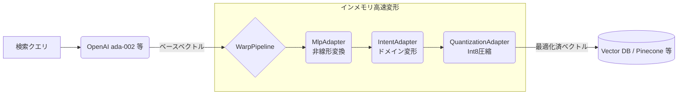

# warpvector 🌌

> [!NOTE]
> 🌍 **English Documentation:** Please see [**🇺🇸/🇬🇧 Read this in English**](./README.md) for the English version.

[](https://badge.fury.io/js/warpvector)
[](https://opensource.org/licenses/MIT)
[](#)
[](#)
[](#)

`warpvector` は、AIモデルの再学習や重い再推論を行うことなく、検索クエリやコンテキスト（意図）に応じてベクトル空間を動的に変形させる、TypeScriptネイティブの軽量ミドルウェア・ユーティリティです。

<div align="center">
  <br />
  <a href="https://daiki-moritake.github.io/warpvector/ja.html">
    
  </a>
  <br />
  <br />
  <b>ブラウザ上でWASMによるリアルタイムのベクトル空間変換や量子化を直感的なUIで体験できます。</b>
  <br />
  <br />
</div>


<br />

### 📚 Zenn / 技術解説記事
本ライブラリの技術的な背景や実装の工夫、具体的なユースケースについては以下の解説記事（Zenn）をご覧ください。

- 🌌 [**Pineconeのコストを96%削減し、RAGの精度を劇的に向上させるTypeScriptミドルウェア『WarpVector』を作った**](https://zenn.dev/daiki_moritake/articles/reduce-pinecone-costs)
- 🧠 [**Pythonなしで検索のパーソナライズを実装する：TypeScriptだけで対照学習（Contrastive Learning）を動かす**](https://zenn.dev/daiki_moritake/articles/ts-contrastive-learning)
- 🌊 [**Python不要！TypeScript + WASMの物理シミュレーションでRAGをリランクする技術**](https://zenn.dev/daiki_moritake/articles/physics-graph-reranker)
- 🎯 [**RAGの検索精度が低い？ベクトル空間の「異方性」を3行で解決する方法**](https://zenn.dev/daiki_moritake/articles/fix-rag-anisotropy)
- ⚡ [**Cloudflare Workersで「ベクトル推論」をサブミリ秒で動かす方法【TypeScript + WASM】**](https://zenn.dev/daiki_moritake/articles/edge-vector-inference)
- 🔗 [**LangChainの検索精度に不満？ミドルウェアを1つ挟むだけで劇的に改善する方法**](https://zenn.dev/daiki_moritake/articles/langchain-search-improvement)
- 🤖 [**TypeScriptだけで構築するベクトルのオートチューニング（AutoML）とRAG検索精度評価の裏側**](https://zenn.dev/daiki_moritake/articles/automl-vector-tuning)
- 🛡️ [**AI社会実装の壁を破る：エッジAIのプライバシー・コスト課題と、ベクトル変換による解決策**](https://zenn.dev/daiki_moritake/articles/ai-implementation-challenges-and-solution)

---

## ⚡ パフォーマンス概要

| 指標 | Before (通常検索) | After (WarpVector) | 改善率 |
|------|-----------------|---------------------|--------|
| **Int8 量子化忠実度** | — | cosine sim 0.9999 | ほぼ無損失圧縮 |
| **MLP 推論 (WASM)** | — | 1.1–3.8 µs/vector | ほぼゼロ遅延 |
| **Int8 量子化速度** | — | 322K vecs/sec | リアルタイム対応 |
| **Binary 量子化速度** | — | 1.18M vecs/sec | 超高スループット |
| **メモリ削減 (Int8)** | 6 KB/vec (1536-dim) | 1.5 KB/vec | **75% 削減** |
| **メモリ削減 (Binary)** | 6 KB/vec (1536-dim) | 192 B/vec | **96.9% 削減** |
| **パイプライン遅延** | — | 119 µs (Intent + Projection) | サブミリ秒 |
| **IR精度 (NDCG@10)** | 68.2% (vanilla) | 77.0% (Intent Warping) | **+13.0% 改善** |
| **量子化 Recall@10 (Int8)** | — | 86–96% | ほぼ無損失検索 |

<details>
<summary>📊 詳細なベンチマーク結果</summary>

| アダプタ | 次元数 | 平均遅延 | 精度指標 | 値 |
|---------|--------|---------|---------|-------|
| IntentAdapter | 128D | 21.1 µs | Identity precision | 1.000000 |
| IntentAdapter | 768D | 603.3 µs | Identity precision | 1.000000 |
| IntentAdapter | 1536D | 2406.2 µs | Identity precision | 1.000000 |
| ProjectionAdapter | 1536 → 512 | 807.0 µs | — | — |
| ProjectionAdapter | 768 → 256 | 204.0 µs | — | — |
| QuantizationAdapter | 128D (int8) | 0.7 µs | 量子化忠実度 | 0.999992 |
| QuantizationAdapter | 768D (int8) | 4.2 µs | 量子化忠実度 | 0.999992 |
| QuantizationAdapter | 1536D (int8) | 4.2 µs | 量子化忠実度 | 0.999992 |
| MlpAdapter (WASM) | 128 → 64 | 2.2 µs | — | — |
| MlpAdapter (WASM) | 768 → 256 | 3.8 µs | — | — |
| MlpAdapter (WASM) | 1536 → 512 → 128 | 1.1 µs | — | — |
| Pipeline | 768 → 256 (Intent+Proj) | 119.1 µs | — | — |

*Apple M-series, Bun ランタイムで計測。`bun run benchmarks/accuracy.ts` で再現可能。*

</details>

---

## 💡 なぜ `warpvector` なのか？

従来のベクトル検索は静的であり、事前に生成された埋め込みベクトルの距離（類似度）に依存していました。コンテキストに応じた検索の微調整を行いたい場合、これまではメタデータのフィルタリングに頼るか、重い指示チューニング型モデルを再度動かすしかなく、リアルタイム性や柔軟性に欠けていました。

`warpvector` は、**「LLMモデルを取り替えたり再学習したりすることなく、検索結果を劇的に賢く・軽く・パーソナライズできる魔法のフィルター」** として機能する次世代DBミドルウェアです。ベースとなるベクトルデータはそのままに、検索の瞬間に軽量な行列演算を適用することで、ファイルやデータ間の意味的類似性をユーザーの「真の意図」に極限まで近づけます。

---

## 🎯 5つの強力なユースケース（具体的に何ができるか？）

`warpvector` を既存の RAG やベクトル検索システムに組み込むことで、以下の課題を解決できます。

### 1. ユーザーの「意図」に合わせたパーソナライズ検索
標準的な埋め込みモデル（OpenAI ada-002 など）は「Apple」が果物か企業かを判別できません。WarpVectorを使えば、「ITドメイン」「食品ドメイン」といった**意図（インテント）**を切り替えるだけで、一瞬でベクトル空間が歪み、クエリベクトルが目的のドキュメントに近づきます。

### 2. ログドリブンなオンライン自己学習（役割の分離）
検索結果の改善のためにLLMを再学習する必要はありません。ユーザーが「この結果をクリックした」「スルーした」というログをエッジで収集し、Node.js等のバックエンドワーカーでオンライン学習させます。モデル本体はいじらずに、**生成された軽量な変換行列だけをエッジに即時デプロイ**することで、推論の超低遅延を保ったまま自己学習ループを回せます。

### 3. モデル特有の「検索空間の偏り」の自動補正
多くの埋め込みモデルは、どんな単語を入れても類似度が高く出てしまう「異方性（空間の偏り）」を抱えています。`WhiteningAdapter` を推論パイプラインに挟むだけで、流れてくる検索クエリから無駄に偏っている方向をストリーミングで学習・補正し、**検索の解像度を劇的に引き上げます。**

### 4. ベクトルDBのメモリコストを 1/4 〜 1/32 に激減させる
1536次元のベクトルを数百万件保存すると莫大なクラウドインフラ料金がかかります。`WarpPipeline` の最後に `.quantize("int8")` を追加するだけで、**精度をほぼ落とさずに（相関 0.9999 以上）データサイズを圧縮**し、DB側での超高速検索が可能になります。

### 5. 現在の TypeScript コードを壊さずに「数行」で導入
Python や重い機械学習ライブラリに依存していると、Node.js やエッジへの組み込みは困難です。WarpVectorは完全な TypeScript ネイティブ ＆ WASM 実装であり、**LangChain、LlamaIndex、Prisma (pgvector)** の設定コードをラッパーでくるむだけで導入が完了します。

---

## 🚀 主な特徴

- **統一された `WarpAdapter` インターフェース:** 全てのアダプターが同一の `tune()` メソッドを備えたインターフェースを実装。設計の共通化により、Prisma拡張やLangChain拡張にどのアダプターでもシームレスに組み込めます。
- **アーキテクチャの分離（Edge Inference & Backend Training）:** サブミリ秒の高速変形を行う「推論層」と、計算リソースを要する「学習・高度リランク層」を明確に分離。エッジ環境を不必要に圧迫しません。
- **動的アフィン変換 & 非線形MLP:** 単純な行列変換（$W \cdot x + b$）に加え、WASMを用いた超高速な多層パーセプトロン(MLP)と非線形活性化関数(ReLU, Sigmoid, Tanh)による高度な空間変形をサポート。
- **オンライン等方化 (Whitening):** Oja's Rule を用いたオンラインPCAにより、OpenAI `ada-002` などが抱える「検索空間の極端な偏り（異方性）」をストリーミング補正し、検索精度を劇的に向上。
- **ColBERT / Late Interaction (WASM):** 単一ベクトルの代わりに「トークン行列」を用いて検索する最高峰の手法 (ColBERT) を WASM 化。TS環境では絶望的に遅い MaxSim 演算を爆速で処理し、RAGの検索品質を極限まで引き上げます（※バックエンド環境推奨）。
- **Vector Quantization (量子化):** `Float32` のベクトルを `Int8` (スカラー量子化: メモリ1/4) または `Binary` (二値化: メモリ1/32) に圧縮。大規模ベクトルデータの保持コストを激減させ、ハミング距離計算で超高速検索を実現します。
- **Hybrid Search (RRF & RSF):** ベクトル検索（Dense）とキーワード検索（Sparse/BM25）の結果を統合するハイブリッド検索ユーティリティ（Reciprocal Rank Fusionなど）を内蔵。
- **WASM/SIMDによる超高速処理:** 行列変換、PCA更新、ColBERT処理にはAssemblyScriptでコンパイルされたインラインWebAssembly（WASM）バックエンドを呼び出し、計算速度を最大化します。
- **InfoNCE & Triplet 学習エンジン (Adam Optimizer内蔵):** Python不要。ユーザーのフィードバックから Contrastive Learning (複数Negative対応の対照学習) をNode.js環境で直接学習し、エッジ用の重みを生成します。
- **フィードバックループと連合学習 (Feedback & Federated Learning):** ユーザーの検索ログ（クリック、スキップ、滞在時間）から暗黙的フィードバックを収集し、自動で学習データを生成。さらに、複数クライアントの学習済み重みをバックエンドで集約する FedAvg アルゴリズムをサポート。
- **LoRA (低ランク適応) アーキテクチャ:** `LoraIntentAdapter` により、超高次元ベクトル（1536次元など）でもメモリ使用量・計算量を劇的に削減。
- **Prisma + pgvector ネイティブ統合拡張:** Prisma Client Extensionとして透過的に統合。複雑なSQLを書かずに WarpVector で推論・補正されたベクトルでのデータベース検索がメソッド1つで完結。
- **次元削減 / 射影変換 (ProjectionAdapter):** PCAやSVDで事前計算した射影行列を用いたベクトルの次元削減・拡張をWASM高速処理でサポート。
- **タスクベクトル演算 (Task Arithmetic):** 複数の学習済みアダプタの重みを「タスクベクトル」として加減算し、推論時にゼロオーバーヘッドの静的マージを実現。
- **超次元計算 / VSA (Vector Symbolic Architecture):** ベクトルのバインド（結合）・バンドル（重ね合わせ）・アンバインド（抽出）を提供。Binary VSA（XOR演算）にも対応し、メタデータをベクトルに埋め込んだまま検索が可能。
- **TypeScriptネイティブ & ゼロ依存:** 外部の機械学習ライブラリは一切不要。Cloudflare Workers、Bun、Node.jsなどのモダンなサーバーレス/エッジ環境に完全対応。

---

## 🧩 機能アーキテクチャ (Feature Architecture)

`warpvector` は、超低遅延を要求される「エッジ推論」と、計算リソースを必要とする「学習・高度なリランキング」を明確に分離した設計を採用しています。

### ⚡ Edge Inference Layer (エッジ推論層: サブミリ秒・ゼロ依存)
Cloudflare Workers やブラウザで直接動作する超軽量・超高速レイヤーです。

| カテゴリ | 機能 |
|----------|------|
| **コア変換** | IntentAdapter, LoraIntentAdapter, ProjectionAdapter |
| **ニューラルネット** | MlpAdapter (WASM), MoEAdapter, 非線形活性化関数 (ReLU, Sigmoid, Tanh) |
| **軽量ストリーミング**| WhiteningAdapter (オンラインPCA) |
| **量子化・圧縮** | Int8 スカラー (4× 圧縮), Binary (32× 圧縮), SafeQuantizationAdapter |
| **ハイブリッド検索** | Reciprocal Rank Fusion (RRF), Relative Score Fusion (RSF) |
| **超次元計算** | VSA (Vector Symbolic Architecture: バインド/バンドル/アンバインド) |
| **セキュリティ** | AnomalyDetectionAdapter |

### 🧠 Backend & Training Layer (バックエンド学習・高度処理層)
Node.js やバッチワーカー等のリソースが豊富な環境で動作し、エッジに配布する「重み」や「最適化済みベクトル」を生成します。

| カテゴリ | 機能 |
|----------|------|
| **学習エンジン** | IntentTrainer, CrossEncoderTrainer, InfoNCE, Triplet Loss, MigrationTrainer |
| **Auto-ML** | IntentMatrixFactory, PipelineAutoTuner |
| **高度な学習** | SoftWhiteningAdapter (逆熱方程式による意味の逆拡散) |
| **モデル統合** | Task Arithmetic (重みマージ), Federated Learning (FedAvg 集約) |

### 🚀 Heavy Reranking Layer (重厚リランキング層: サーバーサイド専用)
計算量が大きく、専用のコンピュート環境での実行を推奨する高度な探索アルゴリズム群です。

| カテゴリ | 機能 |
|----------|------|
| **Late Interaction** | ColBERT (MaxSim演算によるトークン照合) |
| **波束・散乱探索** | TimeReversalReranker, MultipathScatteringReranker |

---

## 📚 クックブック (実践的サンプルコード)

WarpVectorの高度な機能をすぐにプロジェクトに組み込むための実践的なサンプルスクリプト群です。
これらはリポジトリ内の `examples/` ディレクトリに収録されています。

1. **[セキュアな RAG パイプラインの構築 (`examples/01-secure-rag-pipeline.ts`)](./examples/01-secure-rag-pipeline.ts)**
   - `AnomalyDetectionAdapter` と `SafeQuantizationAdapter` を用いて、異常なベクトル入力を防ぎつつ安全にInt8圧縮を行う実装例。
2. **[MoE (Mixture of Experts) と AutoML 最適化 (`examples/02-moe-auto-tuning.ts`)](./examples/02-moe-auto-tuning.ts)**
   - 複数の異なるエキスパートアダプタをルーティングする機構を構築し、ハイパーパラメータをグリッドサーチで自動探索（Auto-Tuning）する例。
3. **[Reranker のための Cross-Encoder 学習 (`examples/03-cross-encoder-training.ts`)](./examples/03-cross-encoder-training.ts)**
   - OOM（メモリ枯渇）を防ぐため、無限のジェネレータストリームから大規模なベクトルペアを安全にオンライン学習する実装例。
4. **[ECサイトでのIntentベース検索 (`docs/cookbook/ecommerce-search.ja.md`)](./docs/cookbook/ecommerce-search.ja.md)**
   - 検索キーワードの意図（フォーマル、スポーツ等）に合わせて動的にベクトル空間を歪めるインテントベース検索の実装例。
5. **[Pineconeを用いたコスト効率の高いRAG (`docs/cookbook/rag-with-pinecone.ja.md`)](./docs/cookbook/rag-with-pinecone.ja.md)**
   - Float32ベクトルをBinaryに圧縮し、DBストレージと月額インフラコストを最大96%削減する実装例。
6. **[エッジ（Cloudflare Workers）でのWarpVectorの実行 (`docs/cookbook/edge-cloudflare.ja.md`)](./docs/cookbook/edge-cloudflare.ja.md)**
   - ゼロ依存とWASMを活用し、Cloudflare Workersで超低遅延（サブミリ秒）でベクトル推論を行う実装例。

---

## 基本的な使い方 (WarpPipeline)

新しく導入された `WarpPipeline` を使うと、複雑なベクトル変換（非線形推論、インテント変換、量子化）からDBフォーマットへの出力までを数行で直感的に記述できます。



```typescript
import { WarpPipeline } from 'warpvector';
import { MlpAdapter } from 'warpvector/ml';
import { QuantizationAdapter } from 'warpvector/extras';

// MLP アダプタと量子化アダプタを事前に作成
const mlp = new MlpAdapter(layers);
const quantizer = new QuantizationAdapter({ type: "int8", dim: 1536 });

// 1. パイプラインの構築
const pipeline = new WarpPipeline(1536)
  .addStep("MlpAdapter", mlp)                 // 非線形変換 (WASM使用)
  .addIntent({ "domain_x": intentWeights })   // ユーザーごとに空間を歪める
  .setFinalStage("QuantizationAdapter", quantizer); // 最後に Int8 に量子化して圧縮

// 2. 非同期初期化 (WASMモジュールのセットアップなどを一括実行)
await pipeline.init();

// 3. 超高速バッチ処理 (WASM/SIMD対応)
const batchVectors = [[0.1, ...], [0.5, ...]]; // 大量データ
const results = pipeline.runBatch(batchVectors, { intent: "domain_x" });

// 4. Vector DB 用フォーマットへの直接出力
const pineconeQuery = pipeline.runAndFormat(
  rawVector, 
  { format: "pinecone", topK: 10, filter: { genre: "action" } }
);

// 5. パイプライン丸ごとの永続化と復元
const stateJson = pipeline.exportState(); 
const restoredPipeline = WarpPipeline.importState(stateJson);
```

## 各機能のドキュメント (Documentation)

各機能のより詳細な仕組み、コードスニペット、ユースケースについては以下の個別ドキュメントをご参照ください。

0. **[エッジコンピューティング クイックスタート (Edge Quickstart)](./docs/edge-quickstart.ja.md)**
   - Cloudflare Workers や Vercel Edge 等のエッジ環境におけるハイブリッド検索とオンライン学習の最速実装ガイド
0.5. **[自動学習 実装ガイド (Auto-Learning Guide)](./docs/auto-learning-guide.ja.md)**
   - 外部サーバー不要で、ユーザーの行動ログから検索空間を自動最適化する学習パイプラインの構築手順
1. **[コアアダプタ (Core Adapters)](./docs/1-core-adapters.ja.md)**
   - `IntentAdapter`, `ProjectionAdapter`, `LoraIntentAdapter` の基本
2. **[ニューラルネットワーク (Neural Networks)](./docs/2-neural-networks.ja.md)**
   - `MlpAdapter` を用いた多層パーセプトロンと非線形活性化関数
3. **[オンライン等方化・PCA (Whitening)](./docs/3-whitening-pca.ja.md)**
   - 空間的偏り (異方性) のストリーミング学習による除去
3.5 **[意味の逆拡散・シャープニング (Inverse Diffusion)](#35-意味の逆拡散シャープニング-soft-whitening)**
   - 逆熱方程式によるコンテキストの混ざり合いの解消と、鋭い意図の抽出
4. **[量子化と圧縮 (Quantization)](./docs/4-quantization.ja.md)**
   - `Int8` (1/4圧縮) および `Binary` (1/32圧縮) による高速化と省メモリ化
5. **[Late Interaction / ColBERT](./docs/5-colbert.ja.md)**
   - WASM を用いた MaxSim 演算による緻密なトークン照合
6. **[ハイブリッド検索フュージョン (Hybrid Search)](./docs/6-hybrid-search.ja.md)**
   - ベクトル検索とキーワード検索の統合 (`RRF`, `RSF`)
7. **[オンライン学習エンジン (Trainers)](./docs/7-trainers.ja.md)**
   - 対照学習によるリアルタイムな空間最適化 (`InfoNCETrainer`, `TripletTrainer`)
8. **[エコシステム統合 (Integrations)](./docs/8-integrations.ja.md)**
   - `LangChain`, `LlamaIndex`, `Prisma + pgvector` とのシームレスな連携
9. **[状態の永続化・シリアライズ (Serialization)](./docs/9-serialization.ja.md)**
   - 学習結果の JSON / バイナリ形式での保存と復元
10. **[次元削減・モデル間移行 (Projection & Migration)](./docs/10-projection-migration.ja.md)**
    - `ProjectionAdapter` による射影変換と `MigrationTrainer` によるモデル間移行
11. **[タスクベクトル演算 (Task Arithmetic)](./docs/11-task-arithmetic.ja.md)**
    - 学習済み重みの加減算によるゼロオーバーヘッドのモデルマージ
12. **[超次元計算 / VSA (Vector Symbolic Architecture)](./docs/12-vsa.ja.md)**
    - ベクトルのバインド・バンドル・アンバインドによるメタデータ埋め込み演算
13. **[フィードバックループと連合学習 (Feedback & Federated Learning)](./docs/13-feedback-loop.ja.md)**
    - ユーザーログからのオンライン学習データ生成と複数クライアントの重み集約 (FedAvg)
14. **[意味の逆拡散・シャープニング (Inverse Diffusion)](./docs/14-soft-whitening.ja.md)**
    - 逆熱方程式によるコンテキストの混ざり合いの解消と、鋭い意図の抽出
15. **[時間反転波リランカー (Time-Reversal Reranker)](./docs/15-time-reversal-reranker.ja.md)**
    - 時間反転鏡(TRM)の原理を用い、検索候補グラフ上で波を逆再生して真のソースドキュメントを特定
16. **[多重経路散乱場リランカー (Multipath Scattering Reranker)](./docs/16-multipath-scattering-reranker.ja.md)**
    - 波動の多重散乱場理論（ランダムウォーク）を用い、多重経路で支持されている真のハブドキュメントを特定
17. **[IntentMatrixFactory — Intent行列の自動生成](./docs/17-intent-matrix-factory.ja.md)** 🆕
    - カテゴリサンプルから最適なIntent行列をInfoNCE対照学習で自動生成
---

## 📦 インストール

```bash
npm install warpvector
# または
bun add warpvector
```

コア機能（IntentAdapter, MlpAdapter, WhiteningAdapter, 各Trainer, 量子化, VSA 等）は**ゼロ依存**で動作します。

Prisma や LangChain との統合機能を使う場合は、それぞれの依存を追加でインストールしてください：

```bash
# Prisma 統合（pgvector）
npm install @prisma/client sql-template-tag

# LangChain / LlamaIndex 統合
npm install @langchain/core
```

---

## 🛠 クイックスタート

### 1. 基本的なアフィン変換 (IntentAdapter)

```typescript
import { IntentAdapter } from 'warpvector';

// 意図ごとの変換行列とバイアスを定義
const myIntents = {
  riskAnalysis: {
    matrix: [
      [1.2, 0.1, -0.4],
      [-0.1, 1.5, 0.2],
      [0.3, -0.2, 1.1],
    ],
    bias: [0.05, -0.1, 0.2]
  }
};

const adapter = new IntentAdapter(myIntents);
const baseVector = [0.15, -0.23, 0.88];

// "riskAnalysis" の意図に合わせてベクトルをワープ
const warpedVector = adapter.tune(baseVector, "riskAnalysis");
```

### 2. 多層ニューラルネットワークの高速推論 (MlpAdapter)

WASMバックエンドにより、ブラウザやエッジ環境で重厚なフレームワークなしに多層MLPの推論が可能です。

```typescript
import { MlpAdapter } from 'warpvector';

// 1536次元から128次元の中間層を経て2次元に出力する2層MLP
const mlp = new MlpAdapter([
  { matrix: matrix1, bias: bias1, activation: "relu" },   // 1536 -> 128
  { matrix: matrix2, bias: bias2, activation: "linear" }  // 128 -> 2
]);

// WASM の初期化 (重みもWASMメモリに永続化される)
await mlp.init();

// 超高速非線形推論 (WASM)
const output = mlp.tune(baseVector);
```

### 3. 検索空間の等方化 (Online Whitening)

事前学習済みモデル（ada-002等）特有の「全ての類似度が高く出てしまう空間の偏り」をオンラインで自動補正します。

```typescript
import { WhiteningAdapter } from 'warpvector';

// トップ1つの主成分（偏り）をストリーミング学習して除去するアダプター
const adapter = new WhiteningAdapter(1536, { learningRate: 0.01, numComponents: 1 });

// ベクトルを受信するたびに自動で偏りの方向を学習 (Oja's Rule)
adapter.update(rawVector1);
adapter.update(rawVector2);

// 検索時に偏りを除去（検索の解像度が劇的に向上）
const whitenedVector = adapter.tune(searchVector);
```

### 3.5 意味の逆拡散・シャープニング (Inverse Diffusion)

LLMによって複数の文脈が混ざり合い「拡散（Blur）」してしまったベクトルから、逆熱方程式（Inverse Heat Equation）の公式を用いて、波源となる「鋭い意図（Sharp Source）」を抽出・復元します。

```typescript
import { SoftWhiteningAdapter } from 'warpvector/train';

// 固有空間の分散（固有値）をトラッキングし、逆拡散フィルタを適用するアダプタ
// tau: 巻き戻し時間（シャープネスの強さ）。大きいほど強く拡散成分を抑制する。
const adapter = new SoftWhiteningAdapter(1536, { tau: 2.0, numComponents: 5 });

// ユーザーのログ等からストリーミング学習
adapter.update(vectorA);
adapter.update(vectorB);

// 検索時にコンテキストの濁りを解消し、本来の鋭い意味空間にシャープニング
const sharpVector = adapter.tune(queryVector);
```

### 4. Prisma + pgvector ネイティブ統合

WarpVector を Prisma Client Extension としてアタッチすることで、ベクトル推論とデータベース検索を統合します。

```typescript
import { PrismaClient } from '@prisma/client';
import sql from 'sql-template-tag';
import { withWarpVector } from 'warpvector/prisma';
import { WhiteningAdapter } from 'warpvector';

const adapter = new WhiteningAdapter(1536);

// Prisma Client に WarpVector 拡張をアタッチ
const prisma = new PrismaClient().$extends(
  withWarpVector({
    adapter: adapter,
    vectorField: "embedding", // DB上の pgvector 保存先カラム名
    distanceOperator: "<=>"   // コサイン距離を使用
  })
);

// 生のベクトルを渡すだけ！（内部でWarpVector推論とpgvector用SQL生成が自動で行われる）
const results = await prisma.document.searchByVector({
  vector: rawSearchVector,
  topK: 10,
  where: sql`category = 'science'` // sql-template-tag で安全な WHERE 句を記述
});
```

### 5. 高品質 RAG のための Late Interaction (ColBERT)

単一ベクトルでは潰れてしまう細かいニュアンスを、トークンごとの行列で保持し、WASMの超高速 MaxSim 演算によって緻密に照合します。

```typescript
import { ColbertAdapter } from 'warpvector';

const adapter = new ColbertAdapter();

// queryTokens: クエリのトークン行列 (平坦化された Float32Array)
// documentTokensArray: 各ドキュメントのトークン行列の配列
const results = adapter.rank(queryTokens, [doc1Tokens, doc2Tokens, doc3Tokens], 1536);

console.log(results); // [{ index: 1, score: 1.44 }, { index: 0, score: 0.76 }, ...]
```

### 6. Hybrid Search / 検索結果の統合 (RRF & RSF)

ベクトル検索結果（Dense）とキーワード検索結果（Sparse/BM25）をシームレスに統合（フュージョン）するための独立したアルゴリズムを提供します。WarpVector のコアなベクトル変形機能と組み合わせることで、最高峰の検索精度を達成できます。

```typescript
import { rrf, rsf } from 'warpvector';

const denseResults = [
  { id: "doc1", score: 0.95 }, 
  { id: "doc2", score: 0.88 }
];

const sparseResults = [
  { id: "doc2", score: 15.2 }, 
  { id: "doc1", score: 12.1 }
];

// RRF (Reciprocal Rank Fusion): スコアの絶対値に依存せず、順位(Rank)のみを使って公平に統合
const rrfResults = rrf([denseResults, sparseResults]);

// RSF (Relative Score Fusion): Min-Max正規化を行い、重み(Dense 70%, Sparse 30%)をつけて加算統合
const rsfResults = rsf([denseResults, sparseResults], [0.7, 0.3]);
```

### 7. ベクトル量子化 (Vector Quantization)

メモリ制約の厳しいエッジ環境向けに、`Float32` (32ビット) のベクトルを `Int8` (8ビットスカラー) または `Binary` (1ビット) に圧縮するアダプターを提供します。

```typescript
import { QuantizationAdapter } from 'warpvector';

// Int8 量子化 (メモリを 1/4 に削減)
const int8Adapter = new QuantizationAdapter({ type: "int8", dim: 1536 });
const int8Vec = int8Adapter.tune(floatVector); // Int8Array
const dot = QuantizationAdapter.int8DotProduct(int8Vec, int8Vec2);

// Binary 量子化 (メモリを 1/32 に削減)
const binaryAdapter = new QuantizationAdapter({ type: "binary", dim: 1536 });
const binVec = binaryAdapter.tune(floatVector); // Uint8Array(192バイト)
const dist = QuantizationAdapter.hammingDistance(binVec, binVec2); // 超高速なXORハミング距離計算
```

### 8. 動的学習エンジン (Trainers with Adam)

Python環境を構築することなく、ユーザーのフィードバックをもとにNode.jsなどのバックエンド環境でベクトル空間を最適化できます。Adamオプティマイザーと InfoNCE Loss (複数Negative) に対応しています。

```typescript
import { InfoNCETrainer } from 'warpvector/train';

const trainer = new InfoNCETrainer(1536);

// 1つの正解と複数の不正解（In-batch Negatives）を同時に学習
const updatedWeights = await trainer.updateOnline(
  currentWeights,
  {
    anchor: anchorVector,
    positive: positiveVector,
    negatives: [negativeVector1, negativeVector2],
  },
  { learningRate: 0.001, temperature: 0.1 }
);
```

### 9. LangChain / LlamaIndex との統合 (Integrations)

### 8.5 Intent行列の自動生成 (IntentMatrixFactory) 🆕

変換行列を手動で設計する代わりに、カテゴリごとのサンプルベクトルから自動でIntent行列を学習できます。

```typescript
import { IntentMatrixFactory } from 'warpvector/train';
import { IntentAdapter } from 'warpvector';

// サンプルベクトルを登録するだけ
const factory = new IntentMatrixFactory(1536);
factory.addCategory("tech", [techVec1, techVec2, techVec3]);
factory.addCategory("business", [bizVec1, bizVec2, bizVec3]);

// InfoNCE対照学習で最適な行列を自動生成
const intents = await factory.build();

const adapter = new IntentAdapter(1536);
adapter.addIntent("tech", intents.tech);
adapter.addIntent("business", intents.business);

// Auto-blending: クエリの意図を自動判定して最適な変換を適用
const result = adapter.tuneAutoBlended(queryVector);
```

`warpvector` は、既存の巨大エコシステムに「たった数行」で組み込むことができます。

#### LangChain 統合 (`WarpEmbeddings`)
```typescript
import { OpenAIEmbeddings } from "@langchain/openai";
import { IntentAdapter } from "warpvector";
import { WarpEmbeddings } from "warpvector/langchain";

const baseEmbeddings = new OpenAIEmbeddings();
const adapter = new IntentAdapter(myIntents);

const warpEmbeddings = new WarpEmbeddings({
  baseEmbeddings, adapter, intentName: "riskAnalysis"
});
// 検索時のみ動的ワープが適用されます
const vectorStore = new MemoryVectorStore(warpEmbeddings);
```

#### LlamaIndex 統合 (`WarpLlamaIndexEmbeddings`)
```typescript
import { OpenAIEmbedding } from "llamaindex";
import { WarpLlamaIndexEmbeddings } from "warpvector/langchain";

const warpLlamaIndexEmbeddings = new WarpLlamaIndexEmbeddings({
  baseEmbeddings: new OpenAIEmbedding(),
  adapter: intentAdapter,
  intentName: "riskAnalysis"
});
// LlamaIndex の VectorStoreIndex などに直接渡せます
```

### 10. 全アダプタの状態永続化 (Universal Serialization)

Cloudflare Workers 等の揮発性環境でも、オンライン学習やPCAで得られたコンポーネントを即座にJSONで保存・復元できます。

```typescript
import { WhiteningAdapter } from 'warpvector';

const adapter = new WhiteningAdapter(1536);
// ... オンライン学習 (update) を実行 ...

// 状態をシリアライズしてRedis等に保存
const stateJson = adapter.exportState();

// 次回起動時や別インスタンスで即座に復元
const restoredAdapter = WhiteningAdapter.importState(stateJson);
```

### 11. 次元削減・拡張 (ProjectionAdapter)

PCAやSVDで事前計算した射影行列を用いて、ベクトルの次元数を変換します。WASMによる高速処理にも対応しています。

```typescript
import { ProjectionAdapter } from 'warpvector';

// 1536次元から512次元への射影行列を設定
const adapter = new ProjectionAdapter(1536, 512, {
  v1: { matrix: projectionMatrix, bias: projectionBias }
});

// 次元削減を実行 (WASM使用)
const compressedVector = adapter.tune(baseVector, "v1"); // 512次元
```

### 12. モデル間移行トレーナー (MigrationTrainer)

埋め込みモデルを変更する際（例: `ada-002` → `text-embedding-3-small`）に、既存のベクトルを新モデルの空間に翻訳する射影行列を自動学習します。

```typescript
import { MigrationTrainer } from 'warpvector/train';

// 旧モデル(1536次元)から新モデル(512次元)への翻訳行列を学習
const trainer = new MigrationTrainer(1536, 512);

// 同一テキストを新旧モデルで埋め込み、ペアとして学習データに追加
trainer.addExample({ source: adaVector, target: v3SmallVector });
trainer.addExample({ source: adaVector2, target: v3SmallVector2 });

// 射影行列を学習 (Adam Optimizer)
const projectionWeights = await trainer.train({ epochs: 200, autoTune: true });
```

### 13. タスクベクトル演算 (Task Arithmetic)

複数の学習済みアダプタ重みを「タスクベクトル」として加減算し、新しいアダプタを推論時ゼロオーバーヘッドで合成できます。

```typescript
import { TaskArithmetic } from 'warpvector';

// 「法律ドメイン」と「金融ドメイン」の学習済み重みをマージ
const mergedWeights = TaskArithmetic.merge([
  { weights: legalWeights, scale: 0.7 },   // 法律を70%
  { weights: financeWeights, scale: 0.3 },  // 金融を30%
]);

// マージされた重みは通常の IntentWeights として即座に使用可能
adapter.addIntent("legal_finance", mergedWeights);
```

### 14. 超次元計算 / VSA (VsaAdapter)

ベクトル・シンボリック・アーキテクチャ（VSA）により、キーと値の概念を1つの密ベクトルに埋め込み、検索空間上でそのまま演算できます。

```typescript
import { VsaAdapter } from 'warpvector';

// バンドル（重ね合わせ）: 複数の概念を1つのベクトルに統合
const bundled = VsaAdapter.bundle([scienceVec, technologyVec]);

// バインド（結合）: キーと値をアダマール積で結合
const bound = VsaAdapter.bind(userIdVec, preferenceVec);

// アンバインド（抽出）: キーを使って値を取り出す
const recovered = VsaAdapter.unbind(bound, userIdVec);

// Binary VSA: 量子化ベクトルに対するXOR演算による超高速処理
const binaryBound = VsaAdapter.bindBinary(binKey, binValue);
const binaryRecovered = VsaAdapter.unbindBinary(binaryBound, binKey);
```

### 15. ベクトルユーティリティ (Slerp / Reject)

高次元空間での幾何学的操作のためのユーティリティ関数を提供します。

```typescript
import { slerp, reject } from 'warpvector';

// 球面線形補間 (Slerp): コサイン類似度を保ちながらベクトル間を滑らかに補間
const interpolated = slerp(vectorA, vectorB, 0.3); // A寄り30%の中間点

// 直交射影 (Reject / Negative Prompting): 特定の概念を完全に除去
// 例: 検索クエリから「政治」の方向成分を取り除く
const filteredQuery = reject(searchVector, politicsVector);
```

### 16. フィードバックループと連合学習 (Feedback & Federated Learning)

ユーザーの検索ログから暗黙的なフィードバックをエッジで収集し、バックエンド環境でオンライン学習と複数クライアントでのモデル集約 (FedAvg) を行います。

```typescript
import { FeedbackCollector, AdaptiveScheduler, FederatedAggregator } from 'warpvector/train';

// 1. ユーザーの行動（クリック・滞在時間など）から学習データを自動生成
const collector = new FeedbackCollector({ dwellThresholdMs: 3000 });
const impId = collector.recordImpression({ queryVector, resultVectors, timestamp: Date.now() });
collector.recordFeedback({ impressionId: impId, resultIndex: 0, type: "click" });
const examples = collector.toTripletExamples(); // 学習データに変換

// 2. 自動的に学習率を減衰させながらバッチ学習を行うスケジューラー
const scheduler = new AdaptiveScheduler(trainer, { batchSize: 5, initialLearningRate: 0.01 });
const updatedWeights = await scheduler.addFeedback(currentWeights, examples);

// 3. 複数クライアントからの重み更新をサーバー側で集約 (Federated Averaging)
const aggregator = new FederatedAggregator(baseWeights, 1536);
aggregator.submitUpdate({ weights: clientA_Weights, interactionCount: 100 });
aggregator.submitUpdate({ weights: clientB_Weights, interactionCount: 50 });
const newGlobalWeights = aggregator.aggregate(); // 集約された新しい重み
```

---

## 🔍 デバッグ & 可観測性

```typescript
// パイプラインの構成を確認
console.log(pipeline.inspect());
// Pipeline [1536-dim]
//   Step 0: MlpAdapter
//   Step 1: IntentAdapter
//   Final: QuantizationAdapter

// 各ステップの中間出力をデバッグ
const debug = pipeline.dryRun(testVector, { intent: "tech" });
debug.forEach(r => console.log(`${r.step}: dim=${r.output.length}, ${r.durationMs.toFixed(2)}ms`));

// メトリクス収集を有効化
pipeline.metrics.enable();
pipeline.run(vector, { intent: "tech" });
console.log(pipeline.metrics.getMetrics());
// { totalRuns: 1, avgRunDurationMs: 0.12, avgStepDurationMs: { MlpAdapter: 0.05, ... } }
```

---

## ☁️ Cloudflare Vectorize 統合

```typescript
import { WarpPipeline, VectorDBAdapter } from "warpvector";

// ワープ済みベクトルを Upsert
const records = documents.map((doc, i) =>
  VectorDBAdapter.toVectorizeRecord(`doc-${i}`, pipeline.run(doc.embedding), { title: doc.title })
);
await env.VECTORIZE_INDEX.upsert(records);

// Intent Warping 付きでクエリ
const { vector, options } = VectorDBAdapter.toVectorizeQuery(
  pipeline.run(queryEmbedding),
  10,
  { returnMetadata: true }
);
const results = await env.VECTORIZE_INDEX.query(vector, options);
```

**pgvector**、**Pinecone**、**Redis** にもそのまま対応しています。

---

## 📊 OpenTelemetry 互換トレーシング

```typescript
import { WarpTracer, IntentAdapter } from "warpvector";

const tracer = new WarpTracer();
const adapter = new IntentAdapter(768);

// 任意の処理をトレース
const warped = tracer.trace("intent.tune", { intent: "tech", dim: 768 }, () => {
  return adapter.tune(vector, "tech");
});

// メトリクスを取得
const metrics = tracer.getMetrics();
// { totalCalls: 1, avgLatencyMs: 0.12, operationCounts: { "intent.tune": 1 } }
```

ゼロ依存 — `@opentelemetry/api` をインストールしなくても動作します。

---

## 📐 数学的背景：動的アフィン変換と非線形性

入力となる標準的なベースベクトル $\mathbf{x} \in \mathbb{R}^d$ に対し、`warpvector` は以下の**アフィン写像（Affine Map）**を適用し、調律された新しいベクトル $\mathbf{x}' \in \mathbb{R}^d$ を生成します。

$$\mathbf{x}' = \sigma(\mathbf{W}_I \mathbf{x} + \mathbf{b}_I)$$

- $\mathbf{W}_I \in \mathbb{R}^{d \times d}$ ：**意図変換行列（Intent Matrix）**。空間の回転や特徴量の強調（歪み）を担当します。
- $\mathbf{b}_I \in \mathbb{R}^d$ ：**意図バイアスベクトル（Intent Bias）**。空間全体を特定のコンテキストへ平行移動（シフト）させます。
- $\sigma$ ：**非線形活性化関数（Activation Function）**。空間を曲げ込み、複雑な意味の切り分けを可能にします (`relu`, `sigmoid`, `tanh`)。

この計算複雑度はわずか $\mathcal{O}(d^2)$ （LoRAの場合は $\mathcal{O}(d \cdot r)$）であり、WASM（WebAssembly）と `Float32Array` によるメモリアライメント最適化を活用することで、**ブラウザ上やエッジ環境でも数千〜数万件の推論を数ミリ秒で完了**させることができます。

---

## 🤝 貢献 (Contributing)

本プロジェクトはオープンソースです。新機能の追加、VectorDB用の最適化アダプターの提供、パフォーマンス改善のプルリクエストを歓迎します！

## 📄 ライセンス

MIT License
