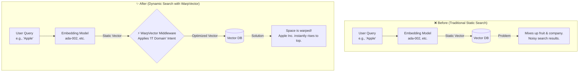
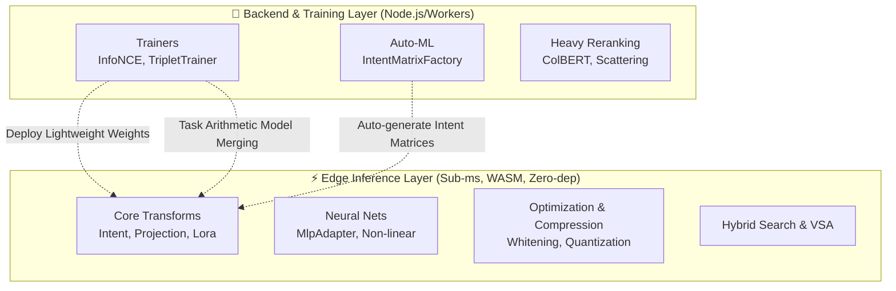

# warpvector 🌌

> [!NOTE]
> 🌍 **日本語のドキュメント:** [**🇯🇵 日本語版の README はこちらからお読みいただけます**](./README.ja.md)

[](https://badge.fury.io/js/warpvector)
[](https://opensource.org/licenses/MIT)
[](#)
[](#)
[](#)

**Warp your vector space at runtime — no retraining, no Python, just TypeScript.**

`warpvector` is a lightweight, zero-dependency TypeScript middleware that dynamically transforms vector spaces based on search context and user intent, without retraining AI models or running expensive re-inference.

### ✨ Project Highlights
- ⚡️ **Blazing Fast (Edge Ready)**: Sub-millisecond inference directly on Cloudflare Workers or in-browser via WASM.
- 🧠 **Dynamic & Smart**: Instantly warps the vector space in real-time based on user intent, boosting search accuracy.
- 💸 **Cost-Effective**: Slashes Vector DB storage and memory costs by up to 96.9% using Int8/Binary quantization.
- 📦 **Zero-Python (Pure TS)**: No heavy ML frameworks. Bring advanced machine learning directly into your JS/TS backend.

<div align="center">
  <br />
  <a href="https://daiki-moritake.github.io/warpvector/">
    
  </a>
  <br />
  <br />
  <b>Experience real-time vector space transformation and quantization in your browser via WASM.</b>
  <br />
  <br />
</div>

<br />

---

## 💡 Why WarpVector?

Traditional vector search is **static** — it depends entirely on pre-generated embedding distances. When you need context-aware tuning, your only options have been metadata filtering or expensive re-inference with instruction-tuned models (usually requiring a Python backend).

**WarpVector changes this.** It acts as a "magic filter" without ever touching the base embedding model.

### 🔄 Before / After: Evolution of Search Architecture



---

## 🎯 5 Key Use Cases

Integrating `warpvector` into your RAG or vector search systems solves the following challenges:

- 🎯 **1. Intent-Aware Personalized Search**
  > Standard embeddings can't distinguish "Apple" (fruit) from "Apple" (company). WarpVector lets you switch **intents** to instantly warp the vector space toward the right domain.

- 🔄 **2. Log-Driven Online Learning (Separation of Concerns)**
  > Collect user click/skip logs at the edge, run online learning in your backend, and instantly deploy only the lightweight transformation matrices to the edge — keeping inference lightning fast.

- 📐 **3. Auto-Correction of Embedding Anisotropy**
  > Many models produce vectors that are all too similar (anisotropy bias). `WhiteningAdapter` automatically learns and removes this bias via streaming PCA, dramatically improving search resolution.

- 💾 **4. 75–97% Memory Reduction via Quantization**
  > Add `.setFinalStage("quantize", ...)` to your pipeline to compress vectors from Float32 to Int8 or Binary format, shrinking DB costs without sacrificing accuracy.

- 🚀 **5. Drop-in Integration — Just a Few Lines of TS**
  > No Python or heavy ML frameworks needed. Pure TypeScript + WASM. Integrates cleanly with LangChain, LlamaIndex, and Prisma (pgvector).

### 🤝 Drop-in Integrations
`[LangChain]` `[LlamaIndex]` `[Prisma / pgvector]` `[Pinecone]` `[Cloudflare Vectorize]` `[Redis]`

---

## ⚡ Results at a Glance

| Metric | Before (vanilla search) | After (WarpVector) | Improvement |
|--------|------------------------|---------------------|-------------|
| **Int8 Quantization Fidelity** | — | cosine sim 0.9999 | Lossless compression |
| **MLP Inference (WASM)** | — | 1.1–3.8 µs/vector | Near-zero latency |
| **Int8 Quantization Speed** | — | 322K vecs/sec | Real-time capable |
| **Binary Quantization Speed** | — | 1.18M vecs/sec | Extreme throughput |
| **Memory Reduction (Int8)** | 6 KB/vec (1536-dim) | 1.5 KB/vec | **75% reduction** |
| **Memory Reduction (Binary)** | 6 KB/vec (1536-dim) | 192 B/vec | **96.9% reduction** |
| **Pipeline Latency** | — | 119 µs (Intent + Projection) | Sub-millisecond |
| **IR Accuracy (NDCG@10)** | 68.2% (vanilla) | 77.0% (Intent Warping) | **+13.0% improvement** |
| **Quantization Recall@10 (Int8)** | — | 86–96% | Near-lossless retrieval |

<details>
<summary>📊 Full Benchmark Results</summary>

| Adapter | Dimensions | Avg Latency | Accuracy Metric | Value |
|---------|-----------|-------------|----------------|-------|
| IntentAdapter | 128D | 21.1 µs | Identity precision | 1.000000 |
| IntentAdapter | 768D | 603.3 µs | Identity precision | 1.000000 |
| IntentAdapter | 1536D | 2406.2 µs | Identity precision | 1.000000 |
| ProjectionAdapter | 1536 → 512 | 807.0 µs | — | — |
| ProjectionAdapter | 768 → 256 | 204.0 µs | — | — |
| QuantizationAdapter | 128D (int8) | 0.7 µs | Quantization fidelity | 0.999992 |
| QuantizationAdapter | 768D (int8) | 4.2 µs | Quantization fidelity | 0.999992 |
| QuantizationAdapter | 1536D (int8) | 4.2 µs | Quantization fidelity | 0.999992 |
| MlpAdapter (WASM) | 128 → 64 | 2.2 µs | — | — |
| MlpAdapter (WASM) | 768 → 256 | 3.8 µs | — | — |
| MlpAdapter (WASM) | 1536 → 512 → 128 | 1.1 µs | — | — |
| Pipeline | 768 → 256 (Intent+Proj) | 119.1 µs | — | — |

*Benchmarked on Apple M-series, Bun runtime. Run `bun run benchmarks/accuracy.ts` to reproduce.*

</details>

---

## 🧩 Feature Architecture (Edge vs Backend)

`warpvector` adopts a clear architectural separation between "Edge Inference" (requiring ultra-low latency) and "Backend Training" (requiring heavy compute resources).



---

## 📦 Installation

```bash
npm install warpvector
# or
bun add warpvector
```

Core features operate with **zero dependencies**. For integrations:

```bash
# Prisma + pgvector
npm install @prisma/client sql-template-tag

# LangChain / LlamaIndex
npm install @langchain/core
```

---

## 🛠 Quick Start Guide

WarpVector is feature-rich, so we've grouped the basic usage by category. Refer to the documentation links below for details.

### 1. Basic Pipeline Configuration (WarpPipeline)
Compose complex vector transformations and DB format outputs intuitively.

```typescript
import { WarpPipeline } from 'warpvector';
import { MlpAdapter } from 'warpvector/ml';
import { QuantizationAdapter } from 'warpvector/extras';

// 1. Compose the pipeline
const pipeline = new WarpPipeline(1536)
  .addStep(new MlpAdapter(layers))
  .addIntent({ "domain_x": intentWeights })
  .setFinalStage(new QuantizationAdapter({ type: "int8", dim: 1536 }));

// 2. Async init (WASM setup, etc.)
await pipeline.init();

// 3. Fast inference & output formatting
const pineconeQuery = pipeline.runAndFormat(
  rawVector, 
  { format: "pinecone", topK: 10, filter: { genre: "action" } },
  { intent: "domain_x" }
);
```

### 2. Core Transforms (Intent & Dimensionality Reduction)
<details>
<summary>💻 Domain Warping (IntentAdapter) & Dimensionality Reduction (ProjectionAdapter)</summary>

```typescript
import { IntentAdapter, ProjectionAdapter } from 'warpvector';

// 1. IntentAdapter: Define domain-specific affine transformations
const adapter = new IntentAdapter({
  riskAnalysis: { matrix: [...], bias: [...] }
});
const warpedVector = adapter.tune(baseVector, "riskAnalysis");

// 2. ProjectionAdapter: Fast WASM dimensionality reduction (e.g., 1536D -> 512D)
const projAdapter = new ProjectionAdapter(1536, 512, { v1: { matrix: projMatrix, bias: projBias } });
const compressedVector = projAdapter.tune(baseVector, "v1");
```
</details>

### 3. Neural Nets & Space Optimization
<details>
<summary>💻 WASM MLP Inference / Whitening / Inverse Diffusion</summary>

```typescript
import { MlpAdapter, WhiteningAdapter } from 'warpvector/ml';
import { SoftWhiteningAdapter } from 'warpvector/train';

// 1. MlpAdapter: Ultra-fast non-linear inference via WASM
const mlp = new MlpAdapter([{ matrix, bias, activation: "relu" }]);
await mlp.init();
const mlpOutput = mlp.tune(inputVector);

// 2. Whitening: Remove online spatial bias (anisotropy)
const whitener = new WhiteningAdapter(1536, { learningRate: 0.01, numComponents: 1 });
whitener.update(rawVector); // Streaming PCA
const whitened = whitener.tune(searchVector);

// 3. Inverse Diffusion: Extract sharp intent from mixed contexts
const softWhitener = new SoftWhiteningAdapter(1536, { tau: 2.0 });
const sharpVector = softWhitener.tune(queryVector);
```
</details>

### 4. Auto-Learning & Federated Learning (Backend Layer)
<details>
<summary>💻 IntentMatrixFactory / Federated Learning</summary>

```typescript
import { IntentMatrixFactory, InfoNCETrainer, FeedbackCollector } from 'warpvector/train';

// 1. IntentMatrixFactory: Auto-generate matrices from samples 🆕
const factory = new IntentMatrixFactory(1536);
factory.addCategory("tech", [techVec1, techVec2]);
const intents = await factory.build(); // Generated via InfoNCE loss

// 2. Feedback & Training: Generate training data from logs
const collector = new FeedbackCollector({ dwellThresholdMs: 3000 });
// ... (collect logs)
const trainer = new InfoNCETrainer(1536);
const updatedWeights = await trainer.updateOnline(currentWeights, collector.toTripletExamples()[0], { learningRate: 0.001 });
```
</details>

### 5. Advanced Search Algorithms
<details>
<summary>💻 Quantization / Hybrid Search / ColBERT / VSA</summary>

```typescript
import { QuantizationAdapter, rrf, ColbertAdapter, VsaAdapter } from 'warpvector';

// 1. Quantization: Int8 (1/4 size) or Binary (1/32 size)
const int8Adapter = new QuantizationAdapter({ type: "int8", dim: 1536 });
const int8Vec = int8Adapter.tune(floatVector);

// 2. Hybrid Search (RRF): Merge Dense & Sparse (BM25) results
const rrfResults = rrf([denseResults, sparseResults]);

// 3. ColBERT: WASM-accelerated MaxSim token matching
const colbert = new ColbertAdapter();
const ranks = colbert.rank(queryTokens, [doc1Tokens, doc2Tokens], 1536);

// 4. VSA (Vector Symbolic Architecture): Bundle and bind vectors
const bundled = VsaAdapter.bundle([scienceVec, technologyVec]);
const bound = VsaAdapter.bind(keyVec, valueVec);
```
</details>

### 6. Ecosystem Integrations
<details>
<summary>💻 Prisma (pgvector) / LangChain / Cloudflare</summary>

**Prisma + pgvector:**
```typescript
import { PrismaClient } from '@prisma/client';
import { withWarpVector } from 'warpvector/prisma';

const prisma = new PrismaClient().$extends(
  withWarpVector({ adapter: myAdapter, vectorField: "embedding" })
);
const results = await prisma.document.searchByVector({ vector: rawVector, topK: 10 });
```

**LangChain:**
```typescript
import { WarpEmbeddings } from "warpvector/langchain";
const warpEmbeddings = new WarpEmbeddings({ baseEmbeddings, adapter, intentName: "domain_x" });
```

**Cloudflare Vectorize:**
```typescript
import { VectorDBAdapter } from "warpvector";
const { vector, options } = VectorDBAdapter.toVectorizeQuery(pipeline.run(queryEmbedding), 10);
const results = await env.VECTORIZE_INDEX.query(vector, options);
```
</details>

---

## 📚 Cookbooks (Practical Examples)

See the `examples/` and `docs/cookbook/` directories for drop-in solutions:

1. **[Secure RAG Pipeline](./examples/01-secure-rag-pipeline.ts)** (`AnomalyDetection` + `SafeQuantization`)
2. **[MoE and Auto-Tuning](./examples/02-moe-auto-tuning.ts)**
3. **[Cross-Encoder Training for Rerankers](./examples/03-cross-encoder-training.ts)**
4. **[E-commerce Search Cookbook](./docs/cookbook/ecommerce-search.md)**
5. **[Cost-efficient RAG with Pinecone](./docs/cookbook/rag-with-pinecone.md)**
6. **[Cloudflare Edge Execution](./docs/cookbook/edge-cloudflare.md)**

---

## 📖 Documentation

| # | Topic | Description |
|---|-------|-------------|
| 0 | [Edge Quickstart](./docs/edge-quickstart.md) | Deploy on Cloudflare Workers / Vercel Edge |
| 0.5 | [Auto-Learning Guide](./docs/auto-learning-guide.md) | Build self-optimizing search pipelines |
| 1 | [Core Adapters](./docs/1-core-adapters.md) | IntentAdapter, ProjectionAdapter, LoRA |
| 2 | [Neural Networks](./docs/2-neural-networks.md) | MLP inference with WASM |
| 3 | [Whitening / PCA](./docs/3-whitening-pca.md) | Online anisotropy correction |
| 4 | [Quantization](./docs/4-quantization.md) | Int8 (4×) and Binary (32×) compression |
| 5 | [ColBERT](./docs/5-colbert.md) | WASM-accelerated late interaction |
| 6 | [Hybrid Search](./docs/6-hybrid-search.md) | RRF & RSF fusion |
| 7 | [Trainers](./docs/7-trainers.md) | InfoNCE, Triplet, Online learning |
| 8 | [Integrations](./docs/8-integrations.md) | LangChain, Prisma, LlamaIndex |
| 9 | [Serialization](./docs/9-serialization.md) | State persistence & restoration |
| 10 | [Projection & Migration](./docs/10-projection-migration.md) | Dimension reduction & model migration |
| 11 | [Task Arithmetic](./docs/11-task-arithmetic.md) | Zero-overhead model merging |
| 12 | [VSA](./docs/12-vsa.md) | Vector Symbolic Architecture |
| 13 | [Feedback & Federated](./docs/13-feedback-loop.md) | FeedbackCollector + FedAvg |
| 14 | [Inverse Diffusion](./docs/14-soft-whitening.md) | Semantic sharpening |
| 15 | [Time-Reversal Reranker](./docs/15-time-reversal-reranker.md) | Wave-inspired reranking |
| 16 | [Multipath Scattering](./docs/16-multipath-scattering-reranker.md) | Random-walk hub detection |
| 17 | [IntentMatrixFactory](./docs/17-intent-matrix-factory.md) | Auto-generate intent matrices from samples |
| — | [API Reference](./docs/api-reference.md) | Full API documentation |
| — | [Troubleshooting](./docs/troubleshooting.md) | Common issues & solutions |
| — | [Migration Guide](./docs/migration-guide.md) | v0.1 → v0.2 upgrade guide |

---

## 🔍 Debugging & Observability

<details>
<summary>💻 Inspect pipelines and OpenTelemetry tracing</summary>

```typescript
// Debug intermediate steps
const debug = pipeline.dryRun(testVector, { intent: "tech" });

// OpenTelemetry compatible tracing
import { WarpTracer } from "warpvector";
const tracer = new WarpTracer();
const warped = tracer.trace("intent.tune", { intent: "tech" }, () => adapter.tune(vector, "tech"));
console.log(tracer.getMetrics());
```
</details>

---

## 📐 Mathematical Background

Given a base embedding vector $\mathbf{x} \in \mathbb{R}^d$, WarpVector applies an **affine map**:

$$\mathbf{x}' = \sigma(\mathbf{W}_I \mathbf{x} + \mathbf{b}_I)$$

- $\mathbf{W}_I \in \mathbb{R}^{d \times d}$: Intent transformation matrix (rotation, scaling, shearing)
- $\mathbf{b}_I \in \mathbb{R}^d$: Intent bias vector (translation)
- $\sigma$: Non-linear activation function (ReLU, Sigmoid, Tanh)

Computational complexity is $\mathcal{O}(d^2)$ (or $\mathcal{O}(d \cdot r)$ with LoRA), optimized via WASM and `Float32Array` memory alignment for **sub-millisecond inference on edge devices**.

---

## 🤝 Contributing

We welcome contributions! See [CONTRIBUTING.md](./CONTRIBUTING.md) for guidelines.

- 🐛 [Bug Reports](.github/ISSUE_TEMPLATE/bug_report.md)
- 💡 [Feature Requests](.github/ISSUE_TEMPLATE/feature_request.md)
- 📖 Documentation improvements
- 🧪 New adapters and integrations

## 📄 License

MIT License
