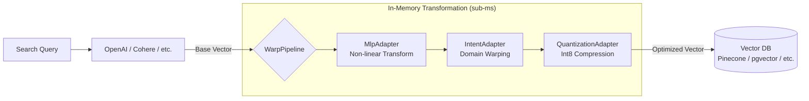

# warpvector 🌌

[](https://badge.fury.io/js/warpvector)
[](https://opensource.org/licenses/MIT)
[](#)
[](#)
[](#)

**Warp your vector space at runtime — no retraining, no Python, just TypeScript.**

`warpvector` is a lightweight, zero-dependency TypeScript middleware that dynamically transforms vector spaces based on search context and user intent, without retraining AI models or running expensive re-inference.

It sits between your embedding model and vector database, applying fast in-memory affine transformations to bring semantic distances closer to the user's **true intent**.

> 📖 [日本語版 README はこちら](./README.ja.md)

---

## ⚡ Results at a Glance

| Metric | Before (vanilla search) | After (WarpVector) | Improvement |
|--------|------------------------|---------------------|-------------|
| **Int8 Quantization Fidelity** | — | cosine sim 0.9999 | Lossless compression |
| **MLP Inference (WASM)** | — | 1.1–3.8 µs/vector | Near-zero latency |
| **Int8 Quantization Speed** | — | 322K vecs/sec | Real-time capable |
| **Binary Quantization Speed** | — | 1.18M vecs/sec | Extreme throughput |
| **Memory Reduction (Int8)** | 6 KB/vec (1536-dim) | 1.5 KB/vec | **75% reduction** |
| **Memory Reduction (Binary)** | 6 KB/vec (1536-dim) | 192 B/vec | **96.9% reduction** |
| **Pipeline Latency** | — | 119 µs (Intent + Projection) | Sub-millisecond |

<details>
<summary>📊 Full Benchmark Results</summary>

| Adapter | Dimensions | Avg Latency | Accuracy Metric | Value |
|---------|-----------|-------------|----------------|-------|
| IntentAdapter | 128D | 21.1 µs | Identity precision | 1.000000 |
| IntentAdapter | 768D | 603.3 µs | Identity precision | 1.000000 |
| IntentAdapter | 1536D | 2406.2 µs | Identity precision | 1.000000 |
| ProjectionAdapter | 1536 → 512 | 807.0 µs | — | — |
| ProjectionAdapter | 768 → 256 | 204.0 µs | — | — |
| QuantizationAdapter | 128D (int8) | 0.7 µs | Quantization fidelity | 0.999992 |
| QuantizationAdapter | 768D (int8) | 4.2 µs | Quantization fidelity | 0.999992 |
| QuantizationAdapter | 1536D (int8) | 4.2 µs | Quantization fidelity | 0.999992 |
| MlpAdapter (WASM) | 128 → 64 | 2.2 µs | — | — |
| MlpAdapter (WASM) | 768 → 256 | 3.8 µs | — | — |
| MlpAdapter (WASM) | 1536 → 512 → 128 | 1.1 µs | — | — |
| Pipeline | 768 → 256 (Intent+Proj) | 119.1 µs | — | — |

*Benchmarked on Apple M-series, Bun runtime. Run `bun run benchmarks/accuracy.ts` to reproduce.*

</details>

---

## 💡 Why WarpVector?

Traditional vector search is **static** — it depends entirely on pre-generated embedding distances. When you need context-aware tuning, your only options have been metadata filtering or expensive re-inference with instruction-tuned models.

**WarpVector changes this.** It applies lightweight matrix operations at query time, warping the vector space to match user intent — all without touching the base embedding model.



---

## 🎯 Key Use Cases

### 1. Intent-Aware Personalized Search
Standard embeddings can't distinguish "Apple" (fruit) from "Apple" (company). WarpVector lets you switch **intents** to instantly warp the vector space toward the right domain.

### 2. Real-Time Online Learning at the Edge
No need to retrain LLMs. Learn from user clicks and skips directly on Cloudflare Workers or Vercel Edge — updating only the lightweight transformation matrix, not the model itself.

### 3. Auto-Correction of Embedding Anisotropy
Many embedding models produce vectors that are all too similar (anisotropy). `WhiteningAdapter` automatically learns and removes this bias via streaming Online PCA, dramatically improving search resolution.

### 4. 75–97% Memory Reduction via Quantization
Add `.setFinalStage("quantize", quantizer)` to your pipeline to compress vectors from Float32 to Int8 (4× reduction) or Binary (32× reduction) with 0.9999+ cosine similarity preservation.

### 5. Drop-in Integration — Just a Few Lines
No Python. No heavy ML frameworks. Pure TypeScript + WASM. Works with **LangChain, Prisma (pgvector), and LlamaIndex** out of the box.

---

## 📦 Installation

```bash
npm install warpvector
# or
bun add warpvector
```

All core features work with **zero dependencies**. For integrations:

```bash
# Prisma + pgvector
npm install @prisma/client sql-template-tag

# LangChain
npm install @langchain/core
```

---

## 🚀 Quick Start

### Basic Pipeline (5 lines to production-ready search)

```typescript
import { WarpPipeline } from 'warpvector';

const pipeline = new WarpPipeline(1536)
  .addIntent({ tech: { matrix: techMatrix, bias: techBias } })
  .setFinalStage("quantize", new QuantizationAdapter({ type: "int8", dim: 1536 }));

// Auto-initializes WASM on first call — no manual init() needed
const result = pipeline.run(baseVector, { intent: "tech" });
```

### Intent-Aware Transformation

```typescript
import { IntentAdapter } from 'warpvector';

const adapter = new IntentAdapter(1536);
adapter.addIntent("technical", { matrix: techMatrix, bias: techBias });
adapter.addIntent("business",  { matrix: bizMatrix,  bias: bizBias  });

// Same vector, different results based on intent
const techResult = adapter.tune(queryVector, "technical");
const bizResult  = adapter.tune(queryVector, "business");
```

### WASM-Accelerated Neural Network Inference

```typescript
import { MlpAdapter } from 'warpvector/ml';

const mlp = new MlpAdapter([
  { matrix: layer1Weights, bias: layer1Bias, activation: "relu" },
  { matrix: layer2Weights, bias: layer2Bias, activation: "linear" },
]);
await mlp.init(); // Load WASM

const output = mlp.tune(inputVector); // ~2µs per inference
```

### Online Whitening (Auto-fix Embedding Anisotropy)

```typescript
import { WhiteningAdapter } from 'warpvector/ml';

const adapter = new WhiteningAdapter(1536, { learningRate: 0.01, numComponents: 1 });

// Streaming learning — call update() with each incoming vector
adapter.update(vector1);
adapter.update(vector2);

// Apply whitening to remove learned bias
const improved = adapter.tune(searchVector);
```

### Prisma + pgvector Integration

```typescript
import { PrismaClient } from '@prisma/client';
import { withWarpVector } from 'warpvector/prisma';

const prisma = new PrismaClient().$extends(
  withWarpVector({ adapter, vectorField: "embedding", distanceOperator: "<=>" })
);

const results = await prisma.document.searchByVector({
  vector: rawVector, topK: 10, where: "category = 'science'"
});
```

---

## 🧩 Feature Overview

| Category | Features |
|----------|----------|
| **Core Transforms** | IntentAdapter, LoraIntentAdapter, ProjectionAdapter |
| **Neural Networks** | MlpAdapter (WASM), Non-linear activations (ReLU, Sigmoid, Tanh) |
| **Online Learning** | WhiteningAdapter (PCA), SoftWhiteningAdapter (Inverse Diffusion) |
| **Quantization** | Int8 scalar (4× compression), Binary (32× compression) |
| **Reranking** | ColBERT/Late Interaction (WASM), TimeReversalReranker, MultipathScatteringReranker |
| **Hybrid Search** | Reciprocal Rank Fusion (RRF), Relative Score Fusion (RSF) |
| **Training** | InfoNCE, Triplet Loss, MigrationTrainer (Adam optimizer, edge-ready) |
| **Advanced** | Task Arithmetic (model merging), VSA (Vector Symbolic Architecture), Federated Learning |
| **Integrations** | Prisma + pgvector, LangChain, LlamaIndex |
| **Runtime** | Zero dependencies, WASM/SIMD, Cloudflare Workers / Bun / Node.js |

---

## 🔍 Debugging & Observability

```typescript
// Inspect pipeline structure
console.log(pipeline.inspect());
// Pipeline [1536-dim]
//   Step 0: MlpAdapter
//   Step 1: IntentAdapter
//   Final: QuantizationAdapter

// Debug each step's intermediate output
const debug = pipeline.dryRun(testVector, { intent: "tech" });
debug.forEach(r => console.log(`${r.step}: dim=${r.output.length}, ${r.durationMs.toFixed(2)}ms`));

// Enable metrics collection
pipeline.metrics.enable();
pipeline.run(vector, { intent: "tech" });
console.log(pipeline.metrics.getMetrics());
// { totalRuns: 1, avgRunDurationMs: 0.12, avgStepDurationMs: { MlpAdapter: 0.05, ... } }
```

---

## 📚 Documentation

| # | Topic | Description |
|---|-------|-------------|
| 0 | [Edge Quickstart](./docs/edge-quickstart.md) | Deploy on Cloudflare Workers / Vercel Edge |
| 0.5 | [Auto-Learning Guide](./docs/auto-learning-guide.md) | Build self-optimizing search pipelines |
| 1 | [Core Adapters](./docs/1-core-adapters.md) | IntentAdapter, ProjectionAdapter, LoRA |
| 2 | [Neural Networks](./docs/2-neural-networks.md) | MLP inference with WASM |
| 3 | [Whitening / PCA](./docs/3-whitening-pca.md) | Online anisotropy correction |
| 4 | [Quantization](./docs/4-quantization.md) | Int8 (4×) and Binary (32×) compression |
| 5 | [ColBERT](./docs/5-colbert.md) | WASM-accelerated late interaction |
| 6 | [Hybrid Search](./docs/6-hybrid-search.md) | RRF & RSF fusion |
| 7 | [Trainers](./docs/7-trainers.md) | InfoNCE, Triplet, Online learning |
| 8 | [Integrations](./docs/8-integrations.md) | LangChain, Prisma, LlamaIndex |
| 9 | [Serialization](./docs/9-serialization.md) | State persistence & restoration |
| 10 | [Projection & Migration](./docs/10-projection-migration.md) | Dimension reduction & model migration |
| 11 | [Task Arithmetic](./docs/11-task-arithmetic.md) | Zero-overhead model merging |
| 12 | [VSA](./docs/12-vsa.md) | Vector Symbolic Architecture |
| 13 | [Feedback & Federated](./docs/13-feedback-loop.md) | FeedbackCollector + FedAvg |
| 14 | [Inverse Diffusion](./docs/14-soft-whitening.md) | Semantic sharpening |
| 15 | [Time-Reversal Reranker](./docs/15-time-reversal-reranker.md) | Wave-inspired reranking |
| 16 | [Multipath Scattering](./docs/16-multipath-scattering-reranker.md) | Random-walk hub detection |
| — | [API Reference](./docs/api-reference.md) | Full API documentation |
| — | [Troubleshooting](./docs/troubleshooting.md) | Common issues & solutions |
| — | [Migration Guide](./docs/migration-guide.md) | v0.1 → v0.2 upgrade guide |

---

## 📐 Mathematical Background

Given a base embedding vector $\mathbf{x} \in \mathbb{R}^d$, WarpVector applies an **affine map**:

$$\mathbf{x}' = \sigma(\mathbf{W}_I \mathbf{x} + \mathbf{b}_I)$$

- $\mathbf{W}_I \in \mathbb{R}^{d \times d}$: Intent transformation matrix (rotation, scaling, shearing)
- $\mathbf{b}_I \in \mathbb{R}^d$: Intent bias vector (translation)
- $\sigma$: Non-linear activation function (ReLU, Sigmoid, Tanh)

Computational complexity is $\mathcal{O}(d^2)$ (or $\mathcal{O}(d \cdot r)$ with LoRA), optimized via WASM and `Float32Array` memory alignment for **sub-millisecond inference on edge devices**.

---

## 🤝 Contributing

We welcome contributions! See [CONTRIBUTING.md](./CONTRIBUTING.md) for guidelines.

- 🐛 [Bug Reports](.github/ISSUE_TEMPLATE/bug_report.md)
- 💡 [Feature Requests](.github/ISSUE_TEMPLATE/feature_request.md)
- 📖 Documentation improvements
- 🧪 New adapters and integrations

## 📄 License

MIT License
