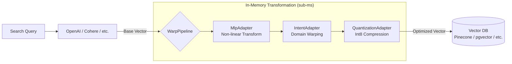

# warpvector 🌌

[](https://badge.fury.io/js/warpvector)
[](https://opensource.org/licenses/MIT)
[](#)
[](#)
[](#)

**Warp your vector space at runtime — no retraining, no Python, just TypeScript.**

`warpvector` is a lightweight, zero-dependency TypeScript middleware that dynamically transforms vector spaces based on search context and user intent, without retraining AI models or running expensive re-inference.

It sits between your embedding model and vector database, applying fast in-memory affine transformations to bring semantic distances closer to the user's **true intent**.

<div align="center">
  <br />
  <a href="https://daiki-moritake.github.io/warpvector/">
    
  </a>
  <br />
  <br />
  <b>Experience real-time vector space transformation and quantization in your browser via WASM.</b>
  <br />
  <br />
</div>

<div align="center">
  <a href="./README.md"></a>
  &nbsp;&nbsp;
  <a href="./README.ja.md"></a>
</div>

---

## ⚡ Results at a Glance

| Metric | Before (vanilla search) | After (WarpVector) | Improvement |
|--------|------------------------|---------------------|-------------|
| **Int8 Quantization Fidelity** | — | cosine sim 0.9999 | Lossless compression |
| **MLP Inference (WASM)** | — | 1.1–3.8 µs/vector | Near-zero latency |
| **Int8 Quantization Speed** | — | 322K vecs/sec | Real-time capable |
| **Binary Quantization Speed** | — | 1.18M vecs/sec | Extreme throughput |
| **Memory Reduction (Int8)** | 6 KB/vec (1536-dim) | 1.5 KB/vec | **75% reduction** |
| **Memory Reduction (Binary)** | 6 KB/vec (1536-dim) | 192 B/vec | **96.9% reduction** |
| **Pipeline Latency** | — | 119 µs (Intent + Projection) | Sub-millisecond |
| **IR Accuracy (NDCG@10)** | 68.2% (vanilla) | 77.0% (Intent Warping) | **+13.0% improvement** |
| **Quantization Recall@10 (Int8)** | — | 86–96% | Near-lossless retrieval |

<details>
<summary>📊 Full Benchmark Results</summary>

| Adapter | Dimensions | Avg Latency | Accuracy Metric | Value |
|---------|-----------|-------------|----------------|-------|
| IntentAdapter | 128D | 21.1 µs | Identity precision | 1.000000 |
| IntentAdapter | 768D | 603.3 µs | Identity precision | 1.000000 |
| IntentAdapter | 1536D | 2406.2 µs | Identity precision | 1.000000 |
| ProjectionAdapter | 1536 → 512 | 807.0 µs | — | — |
| ProjectionAdapter | 768 → 256 | 204.0 µs | — | — |
| QuantizationAdapter | 128D (int8) | 0.7 µs | Quantization fidelity | 0.999992 |
| QuantizationAdapter | 768D (int8) | 4.2 µs | Quantization fidelity | 0.999992 |
| QuantizationAdapter | 1536D (int8) | 4.2 µs | Quantization fidelity | 0.999992 |
| MlpAdapter (WASM) | 128 → 64 | 2.2 µs | — | — |
| MlpAdapter (WASM) | 768 → 256 | 3.8 µs | — | — |
| MlpAdapter (WASM) | 1536 → 512 → 128 | 1.1 µs | — | — |
| Pipeline | 768 → 256 (Intent+Proj) | 119.1 µs | — | — |

*Benchmarked on Apple M-series, Bun runtime. Run `bun run benchmarks/accuracy.ts` to reproduce.*

</details>

---

## 💡 Why WarpVector?

Traditional vector search is **static** — it depends entirely on pre-generated embedding distances. When you need context-aware tuning, your only options have been metadata filtering or expensive re-inference with instruction-tuned models.

**WarpVector changes this.** It applies lightweight matrix operations at query time, warping the vector space to match user intent — all without touching the base embedding model.



---

## 🎯 Key Use Cases

### 1. Intent-Aware Personalized Search
Standard embeddings can't distinguish "Apple" (fruit) from "Apple" (company). WarpVector lets you switch **intents** to instantly warp the vector space toward the right domain.

### 2. Log-Driven Online Learning (Separation of Concerns)
No need to retrain LLMs. Collect user click/skip logs at the edge, and run the online learning in your Node.js or backend workers. You update only the lightweight transformation matrix, not the model itself, and instantly deploy the new matrix to the edge—keeping inference lightning fast.

### 3. Auto-Correction of Embedding Anisotropy
Many embedding models produce vectors that are all too similar (anisotropy). `WhiteningAdapter` automatically learns and removes this bias via streaming PCA, dramatically improving search resolution.

### 4. 75–97% Memory Reduction via Quantization
Add `.setFinalStage("quantize", quantizer)` to your pipeline to compress vectors from Float32 to Int8 (4× reduction) or Binary (32× reduction) with 0.9999+ cosine similarity preservation.

### 5. Drop-in Integration — Just a Few Lines
No Python. No heavy ML frameworks. Pure TypeScript + WASM. Works with **LangChain, Prisma (pgvector), and LlamaIndex** out of the box.

---

## 📦 Installation

```bash
npm install warpvector
# or
bun add warpvector
```

All core features work with **zero dependencies**. For integrations:

```bash
# Prisma + pgvector
npm install @prisma/client sql-template-tag

# LangChain
npm install @langchain/core
```

---

## 🚀 Quick Start

### Basic Pipeline (5 lines to production-ready search)

```typescript
import { WarpPipeline } from 'warpvector';

const pipeline = new WarpPipeline(1536)
  .addIntent({ tech: { matrix: techMatrix, bias: techBias } })
  .setFinalStage("quantize", new QuantizationAdapter({ type: "int8", dim: 1536 }));

// Auto-initializes WASM on first call — no manual init() needed
const result = pipeline.run(baseVector, { intent: "tech" });
```

### Intent-Aware Transformation

```typescript
import { IntentAdapter } from 'warpvector';

const adapter = new IntentAdapter(1536);
adapter.addIntent("technical", { matrix: techMatrix, bias: techBias });
adapter.addIntent("business",  { matrix: bizMatrix,  bias: bizBias  });

// Same vector, different results based on intent
const techResult = adapter.tune(queryVector, "technical");
const bizResult  = adapter.tune(queryVector, "business");
```

### Auto-Generate Intent Matrices (NEW)

```typescript
import { IntentMatrixFactory } from 'warpvector/train';
import { IntentAdapter } from 'warpvector';

// No manual matrix needed — just provide category samples
const factory = new IntentMatrixFactory(1536);
factory.addCategory("tech", [techVec1, techVec2, techVec3]);
factory.addCategory("business", [bizVec1, bizVec2, bizVec3]);

// Auto-learns optimal affine transformations via contrastive learning
const intents = await factory.build();

const adapter = new IntentAdapter(1536);
adapter.addIntent("tech", intents.tech);
adapter.addIntent("business", intents.business);

// Auto-blending: automatically routes queries to the best intent
const result = adapter.tuneAutoBlended(queryVector);
```

### WASM-Accelerated Neural Network Inference

```typescript
import { MlpAdapter } from 'warpvector/ml';

const mlp = new MlpAdapter([
  { matrix: layer1Weights, bias: layer1Bias, activation: "relu" },
  { matrix: layer2Weights, bias: layer2Bias, activation: "linear" },
]);
await mlp.init(); // Load WASM

const output = mlp.tune(inputVector); // ~2µs per inference
```

### Online Whitening (Auto-fix Embedding Anisotropy)

```typescript
import { WhiteningAdapter } from 'warpvector/ml';

const adapter = new WhiteningAdapter(1536, { learningRate: 0.01, numComponents: 1 });

// Streaming learning — call update() with each incoming vector
adapter.update(vector1);
adapter.update(vector2);

// Apply whitening to remove learned bias
const improved = adapter.tune(searchVector);
```

### Prisma + pgvector Integration

```typescript
import { PrismaClient } from '@prisma/client';
import sql from 'sql-template-tag';
import { withWarpVector } from 'warpvector/prisma';

const prisma = new PrismaClient().$extends(
  withWarpVector({ adapter, vectorField: "embedding", distanceOperator: "<=>" })
);

const results = await prisma.document.searchByVector({
  vector: rawVector, topK: 10, where: sql`category = 'science'`
});
```

---

## 🧩 Feature Architecture

`warpvector` adopts a clear architectural separation between "Edge Inference" (requiring ultra-low latency) and "Backend / Heavy Reranking" (requiring heavy compute resources).

### ⚡ Edge Inference Layer (Sub-millisecond & Zero-dependency)
Ultra-lightweight layer running directly on Cloudflare Workers or in the browser.

| Category | Features |
|----------|----------|
| **Core Transforms** | IntentAdapter, LoraIntentAdapter, ProjectionAdapter |
| **Neural Nets** | MlpAdapter (WASM), MoeAdapter (MoE), Non-linear activations (ReLU, Sigmoid, Tanh) |
| **Light Streaming** | WhiteningAdapter (Online PCA) |
| **Quantization** | Int8 scalar (4× compression), Binary (32× compression), SafeQuantizationAdapter |
| **Hybrid Search** | Reciprocal Rank Fusion (RRF), Relative Score Fusion (RSF) |
| **VSA** | Vector Symbolic Architecture (Bind / Bundle / Unbind) |
| **Security** | AnomalyDetectionAdapter |

### 🧠 Backend & Training Layer (Heavy Compute)
Runs in resource-rich environments like Node.js or background workers to generate "weights" or optimized vectors for the edge.

| Category | Features |
|----------|----------|
| **Training** | IntentTrainer, CrossEncoderTrainer, InfoNCE, Triplet Loss, MigrationTrainer |
| **Auto-ML** | IntentMatrixFactory, PipelineAutoTuner |
| **Advanced Learning** | SoftWhiteningAdapter (Inverse Diffusion) |
| **Model Merging** | Task Arithmetic, Federated Learning (FedAvg) |

### 🚀 Heavy Reranking Layer (Server-side Only)
Advanced search algorithms that require dedicated compute environments and shouldn't be run on the edge.

| Category | Features |
|----------|----------|
| **Late Interaction** | ColBERT (MaxSim Token Matching) |
| **Wave/Scattering** | TimeReversalReranker, MultipathScatteringReranker |

---

## 🔍 Debugging & Observability

```typescript
// Inspect pipeline structure
console.log(pipeline.inspect());
// Pipeline [1536-dim]
//   Step 0: MlpAdapter
//   Step 1: IntentAdapter
//   Final: QuantizationAdapter

// Debug each step's intermediate output
const debug = pipeline.dryRun(testVector, { intent: "tech" });
debug.forEach(r => console.log(`${r.step}: dim=${r.output.length}, ${r.durationMs.toFixed(2)}ms`));

// Enable metrics collection
pipeline.metrics.enable();
pipeline.run(vector, { intent: "tech" });
console.log(pipeline.metrics.getMetrics());
// { totalRuns: 1, avgRunDurationMs: 0.12, avgStepDurationMs: { MlpAdapter: 0.05, ... } }
```

---

## 📚 Documentation

| # | Topic | Description |
|---|-------|-------------|
| 0 | [Edge Quickstart](./docs/edge-quickstart.md) | Deploy on Cloudflare Workers / Vercel Edge |
| 0.5 | [Auto-Learning Guide](./docs/auto-learning-guide.md) | Build self-optimizing search pipelines |
| 1 | [Core Adapters](./docs/1-core-adapters.md) | IntentAdapter, ProjectionAdapter, LoRA |
| 2 | [Neural Networks](./docs/2-neural-networks.md) | MLP inference with WASM |
| 3 | [Whitening / PCA](./docs/3-whitening-pca.md) | Online anisotropy correction |
| 4 | [Quantization](./docs/4-quantization.md) | Int8 (4×) and Binary (32×) compression |
| 5 | [ColBERT](./docs/5-colbert.md) | WASM-accelerated late interaction |
| 6 | [Hybrid Search](./docs/6-hybrid-search.md) | RRF & RSF fusion |
| 7 | [Trainers](./docs/7-trainers.md) | InfoNCE, Triplet, Online learning |
| 8 | [Integrations](./docs/8-integrations.md) | LangChain, Prisma, LlamaIndex |
| 9 | [Serialization](./docs/9-serialization.md) | State persistence & restoration |
| 10 | [Projection & Migration](./docs/10-projection-migration.md) | Dimension reduction & model migration |
| 11 | [Task Arithmetic](./docs/11-task-arithmetic.md) | Zero-overhead model merging |
| 12 | [VSA](./docs/12-vsa.md) | Vector Symbolic Architecture |
| 13 | [Feedback & Federated](./docs/13-feedback-loop.md) | FeedbackCollector + FedAvg |
| 14 | [Inverse Diffusion](./docs/14-soft-whitening.md) | Semantic sharpening |
| 15 | [Time-Reversal Reranker](./docs/15-time-reversal-reranker.md) | Wave-inspired reranking |
| 16 | [Multipath Scattering](./docs/16-multipath-scattering-reranker.md) | Random-walk hub detection |
| 17 | [IntentMatrixFactory](./docs/17-intent-matrix-factory.md) | Auto-generate intent matrices from samples |
| C1 | [E-commerce Search Cookbook](./docs/cookbook/ecommerce-search.md) | Intent-based routing |
| C2 | [Pinecone RAG Cookbook](./docs/cookbook/rag-with-pinecone.md) | Cost-efficient RAG |
| C3 | [Cloudflare Edge Cookbook](./docs/cookbook/edge-cloudflare.md) | Edge inference |
| — | [API Reference](./docs/api-reference.md) | Full API documentation |
| — | [Troubleshooting](./docs/troubleshooting.md) | Common issues & solutions |
| — | [Migration Guide](./docs/migration-guide.md) | v0.1 → v0.2 upgrade guide |

---

## 📐 Mathematical Background

Given a base embedding vector $\mathbf{x} \in \mathbb{R}^d$, WarpVector applies an **affine map**:

$$\mathbf{x}' = \sigma(\mathbf{W}_I \mathbf{x} + \mathbf{b}_I)$$

- $\mathbf{W}_I \in \mathbb{R}^{d \times d}$: Intent transformation matrix (rotation, scaling, shearing)
- $\mathbf{b}_I \in \mathbb{R}^d$: Intent bias vector (translation)
- $\sigma$: Non-linear activation function (ReLU, Sigmoid, Tanh)

Computational complexity is $\mathcal{O}(d^2)$ (or $\mathcal{O}(d \cdot r)$ with LoRA), optimized via WASM and `Float32Array` memory alignment for **sub-millisecond inference on edge devices**.

---

## ☁️ Cloudflare Vectorize Integration

```typescript
import { WarpPipeline, VectorDBAdapter } from "warpvector";

// Upsert warped vectors
const records = documents.map((doc, i) =>
  VectorDBAdapter.toVectorizeRecord(`doc-${i}`, pipeline.run(doc.embedding), { title: doc.title })
);
await env.VECTORIZE_INDEX.upsert(records);

// Query with intent warping
const { vector, options } = VectorDBAdapter.toVectorizeQuery(
  pipeline.run(queryEmbedding),
  10,
  { returnMetadata: true }
);
const results = await env.VECTORIZE_INDEX.query(vector, options);
```

Also supports **pgvector**, **Pinecone**, and **Redis** out of the box.

---

## 📊 OpenTelemetry-Compatible Tracing

```typescript
import { WarpTracer, IntentAdapter } from "warpvector";

const tracer = new WarpTracer();
const adapter = new IntentAdapter(768);

// Trace any operation
const warped = tracer.trace("intent.tune", { intent: "tech", dim: 768 }, () => {
  return adapter.tune(vector, "tech");
});

// Get metrics
const metrics = tracer.getMetrics();
// { totalCalls: 1, avgLatencyMs: 0.12, operationCounts: { "intent.tune": 1 } }
```

Zero-dependency — works without `@opentelemetry/api` installed.

---

## 🤝 Contributing

We welcome contributions! See [CONTRIBUTING.md](./CONTRIBUTING.md) for guidelines.

- 🐛 [Bug Reports](.github/ISSUE_TEMPLATE/bug_report.md)
- 💡 [Feature Requests](.github/ISSUE_TEMPLATE/feature_request.md)
- 📖 Documentation improvements
- 🧪 New adapters and integrations

## 📄 License

MIT License
