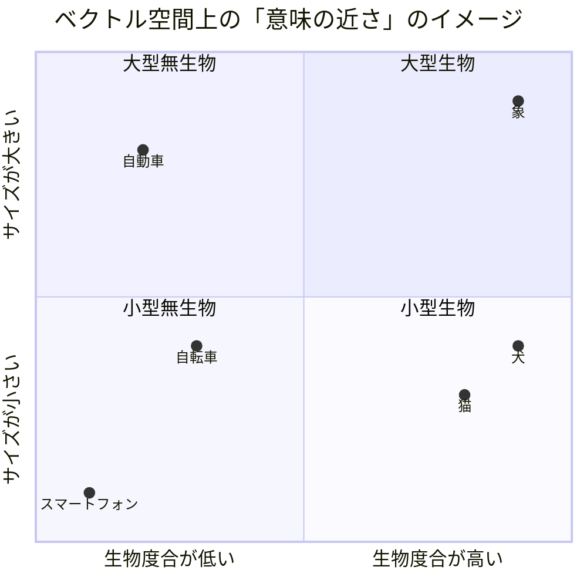
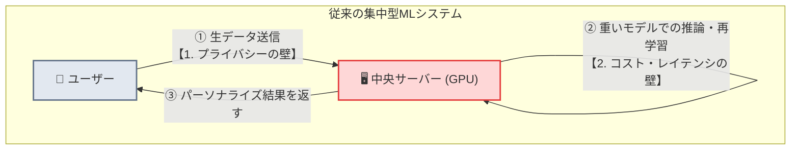
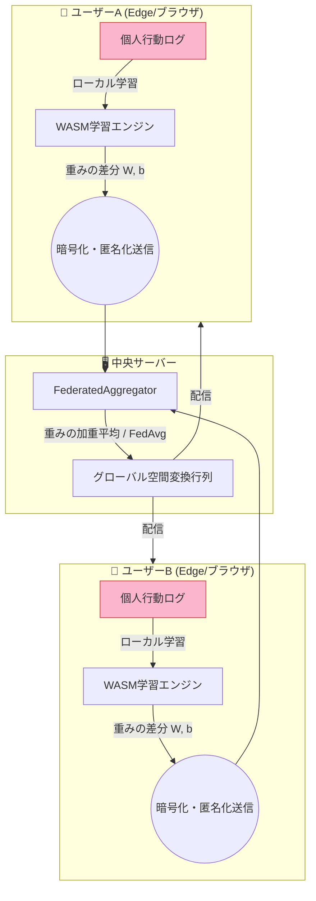

## はじめに

生成AI（LLM）の発展により、検索（RAG）、パーソナライズ、レコメンデーションなど、多様なAI機能がアプリケーションに組み込まれるようになりました。しかし、プロトタイプから「社会実装（実用フェーズ）」へ移行する際、多くの開発者が深刻な障壁に直面します。

特に大きな障壁となるのが、**「プライバシー保護」**と**「インフラコスト・レイテンシ」**の二大課題です。

本記事では、この社会実装における具体的な課題（問題定義）を整理した上で、WarpVector が提唱する **「エッジでのアフィン変換（ベクトル空間変換）＋ 連合学習（Federated Learning）」** という、これらを一挙に解決するアプローチについて解説します。

---

## 🧠 前提：LLMとベクトル（Embedding）の仕組み

課題について触れる前に、そもそもLLM（大規模言語モデル）や検索システムがどのようにテキストを処理しているのかを簡単に整理します。

LLMやAI検索の根幹にあるのは**「Embedding（埋め込み）」**という技術です。これは、テキストや単語の意味を、コンピュータが計算しやすい「高次元の数値ベクトル（数列）」に変換する仕組みです。



- **意味の近さ = 距離の近さ**: 上図のように、「犬」と「猫」のベクトルは空間上で近くに配置され、「犬」と「自動車」は遠くに配置されます。
- **RAG（検索拡張生成）の仕組み**: ユーザーが質問を入力すると、その質問文もベクトル化されます。そして、データベース内のドキュメント群のベクトルと比較し、「距離が近い（=意味が近い）」ドキュメントを瞬時に検索して回答の根拠とします。

つまり、AIの精度や検索の質を向上させるということは、この**「ベクトル空間上での配置（距離感）を最適化すること」**に他なりません。しかし、この最適化を実際のユーザーのフィードバックに合わせて行おうとすると、次のような大きな壁にぶつかります。

---

## 🛑 問題定義：AI社会実装を阻む「2つの壁」

AIをプロダクトに社会実装し、継続的にユーザー体験を向上させるためには、ユーザーのアクションログ（クリック、購入、検索など）をフィードバックとして受け取り、モデルの精度や検索結果を継続的にチューニングする必要があります。しかし、ここには以下の2つの壁が立ちはだかります。



### 1. プライバシー保護とセキュリティの壁
EUのGDPR（一般データ保護規則）や日本の改正個人情報保護法など、データプライバシーに対する法規制は世界的に厳格化しています。
- **データ送信の懸念**: ユーザーが「何を検索し、どの結果を何秒間閲覧したか」といった詳細な操作ログやプライベートなデータを、最適化のために直接中央のクラウドサーバーに送信することは、セキュリティポリシー上許容されないケースが増えています。
- **データ漏洩リスク**: 中央サーバーにすべてのログを集約する構成は、ひとたび不正アクセスを受ければ、全ユーザーの行動履歴や個人情報が大規模に漏洩するリスクを内包します。

### 2. インフラコストとレイテンシ（運用効率）の壁
検索の質を向上させるために、ユーザーのフィードバックに基づいて埋め込みモデル（Embedding）をチューニングしたり、RAGシステムをパーソナライズしようとすると、莫大なリソースが必要になります。
- **ファインチューニングの限界**: LLMや埋め込みモデル自体のパラメータを再学習（微調整）するのは、非常に高いGPUコストがかかる上、リアルタイムにユーザーの好みを反映することは不可能です。
- **サーバーの複雑化**: Pythonなどで構築されたML推論・学習サーバーを常時稼働させるのは運用コストが高く、リクエストごとのネットワークオーバーヘッドによって応答性能（レイテンシ）も低下します。


---

## 💡 解決案：エッジでの空間変換 ＋ 連合学習の融合

WarpVector は、この2つの課題をクリアするために、**「モデル本体をいじるのではなく、生成されたベクトル空間の『形』を軽量に変形する」**アプローチと、それを分散実行する**「連合学習（Federated Learning）」**を提案しています。



### なぜ「ベクトル空間の変形」なのか？
モデル全体をファインチューニングする代わりに、ユーザーのブラウザやエッジサーバー（Cloudflare Workers など）に「空間変換ミドルウェア」を配置します。
これは、ベクトルに対してアフィン変換（線形変換 $W$ ＋ バイアス $b$）を施すだけの極めて軽量な行列演算（$y = W x + b$）です。
WASMで高速化されたこの演算は、わずか数ミリ秒で完了し、CPUのリソースをほとんど消費しません。ユーザーの意図に沿ってベクトル空間を歪めることで、LLMを触ることなく「検索のパーソナライズ」や「ドメイン特化チューニング」を実現できます。

### 連合学習によるプライバシーの完全保護
連合学習（Federated Learning）を用いることで、個人情報を中央サーバーに送信する必要はなくなります。
1. **ローカル学習**: ユーザーの操作ログをもとに、ユーザーのデバイス（エッジ）上で直接、空間変換行列の重み（$W, b$）を数ステップ学習（対照学習）させます。
2. **重み差分のみ送信**: デバイスから中央サーバーには、ユーザーの検索語や閲覧履歴といった「生データ」は一切送信せず、学習によって得られた**「変換行列の重み更新量（差分）」**のみを送信します。
3. **安全な集約**: サーバー側は、各エッジから届いた重みを **FedAvg（Federated Averaging）アルゴリズム**によって平均化し、全体の検索精度を向上させた「グローバルな空間変換行列」を合成します。

これにより、**「個人データは手元から一歩も出さず、全体の賢さ（検索・推薦精度）だけを継続的に向上させる」**というプライバシー保護と高精度化の両立が達成されます。

---

## 💻 具体的なコード実装

WarpVector を使うと、この「エッジ学習」と「サーバー集約」を TypeScript だけで簡単に実装できます。

### 1. クライアント側（エッジでの対照学習）
ユーザーのデバイスやエッジサーバー上で、`FeedbackCollector` を使って暗黙のフィードバック（滞在時間など）を収集し、`InfoNCETrainer` で即座に学習を行います。

```typescript
import { FeedbackCollector, InfoNCETrainer } from "@warpvector/train";

// 1. フィードバックコレクターと学習エンジンの初期化
const collector = new FeedbackCollector({ dwellThresholdMs: 3000 });
const trainer = new InfoNCETrainer(1536); // 1536次元ベクトルの場合

// 2. ユーザー行動（クリック・滞在時間）の収集
collector.recordFeedback({
  impressionId: "imp_123",
  resultIndex: 0, // 最初のドキュメントをクリック
  type: "click",
});

// 3. 行動ログから対照学習用のトリプレット（正解・不正解データ）を生成
const examples = collector.toTripletExamples();
const example = examples[0];

// 4. エッジ上でローカルの空間変換重みを更新
const currentWeights = { matrix: new Float32Array([...]), bias: new Float32Array([...]) };
const localWeights = await trainer.updateOnline(currentWeights, example, {
  learningRate: 0.001
});

// ※ この localWeights （重みの配列）のみをサーバーに送信します。
// ユーザーが検索した生テキストやドキュメントベクトルは送信しません。
```

### 2. サーバー側（連合学習による集約）
エッジから送られてきた複数の重みアップデートを、サーバー上の `FederatedAggregator` で FedAvg アルゴリズムを用いて統合します。

```typescript
import { FederatedAggregator } from "@warpvector/train";

// 1. 集約器の初期化
const initialWeights = { matrix: new Float32Array([...]), bias: new Float32Array([...]) };
const aggregator = new FederatedAggregator(initialWeights, 1536);

// 2. 各クライアントから送られてきた重み（と学習に用いたインタラクション数）を送信
aggregator.submitUpdate({ weights: clientA_localWeights, interactionCount: 120 });
aggregator.submitUpdate({ weights: clientB_localWeights, interactionCount: 80 });

// 3. FedAvgアルゴリズムで、安全に統合されたグローバル重みを生成
const globalWeights = aggregator.aggregate();

// ※ 生成された globalWeights は、定期的に各クライアントに配信され、
// 初期重み（ベース空間）として利用されます。
```

---

## 📈 このアーキテクチャがもたらす革新

このエッジAI・連合学習アプローチは、従来の集中管理型MLシステムと比べて圧倒的な優位性を誇ります。

| 評価軸 | 従来の集中型ML（Python推論サーバー） | WarpVector（エッジ＋連合学習） |
| :--- | :--- | :--- |
| **プライバシー** | 生のログ・データをサーバーへ全送信（流出懸念） | **生データはエッジに閉じる**（重み差分のみ送信） |
| **インフラコスト** | 高価な GPU サーバーの常時稼働、高額な API 課金 | エッジ（Workers/ブラウザ）＋ **安価な CPU サーバーのみ** |
| **レイテンシ** | ネットワーク往復 ＋ 重い推論（100ms〜） | エッジ上での超高速アフィン変換（**1〜3ms以内**） |
| **開発の複雑さ** | PythonとNode.jsの連携、複雑な学習パイプライン | **TypeScriptのみで構築可能** |

---

## まとめ

AIをビジネスや社会システムに広く実装するためには、プライバシー規制の遵守と、持続可能なインフラコストの両立が不可欠です。

WarpVector の空間変換と連合学習モデルは、高価なモデル学習サーバーを排除し、エッジの計算資源を有効活用することで、この二大課題を同時に解決します。

開発者は、個人情報保護の心配をすることなく、ユーザーのアクションに応じたリアルタイムかつ高精度なRAGやパーソナライズシステムをデプロイできるようになります。

社会実装の壁に直面している方は、ぜひこの分散アプローチを検討してみてください！

https://github.com/daiki-moritake/warpvector
