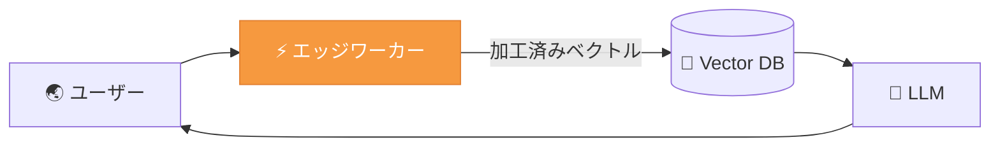

## はじめに

「AIの推論処理はサーバーサイド（Python）でやるもの」と思っていませんか？

近年、Cloudflare Workers や Vercel Edge Functions のようなエッジランタイムが急速に進化し、ユーザーに最も近い場所で超低レイテンシの処理が可能になりました。しかし、エッジ環境には厳しい制約があります。

- **Pythonが使えない**（NumPy, PyTorch は動かない）
- **メモリ制限が厳しい**（Cloudflare Workers は 128MB）
- **コールドスタートを最小化したい**

本記事では、**TypeScriptとWASM（WebAssembly）だけで、エッジ環境においてベクトル変換・推論をサブミリ秒で実行する方法**を、OSSライブラリ [WarpVector](https://github.com/daiki-moritake/warpvector) を使って紹介します。

---

## 🤔 なぜエッジでベクトル推論が必要なのか？

RAG（検索拡張生成）アプリケーションにおいて、ユーザーの検索クエリをベクトル化した後、DBに投げる前に「ベクトルを加工する」ニーズがあります。



具体的には以下のようなケースです。

- **パーソナライゼーション**: ユーザーごとに検索の方向性を変えたい
- **量子化（圧縮）**: DBに送る前にベクトルを軽量化したい
- **異方性の補正**: 埋め込みモデル特有の偏りをリアルタイムで除去したい

これらの処理をオリジンサーバーまで往復させると、数十〜数百ミリ秒のレイテンシが加算されます。エッジで完結させれば、**追加レイテンシをほぼゼロ**にできます。

---

## 🚀 WarpVector × Cloudflare Workers の実装

### セットアップ

```bash
# WarpVector のテンプレートを使えば一発で環境構築
npx create-warpvector-app@latest
```

もしくは既存の Workers プロジェクトに追加する場合：

```bash
npm install warpvector
```

WarpVector はゼロ依存（`node_modules` が肥大化しない）なので、Workers のバンドルサイズへの影響は最小限です。

### 実装例：ユーザーの意図に応じたベクトルワープ

```typescript
import { IntentAdapter } from "warpvector";

// 事前学習済みの意図行列（KV や R2 から読み込むことも可能）
const intentWeights = {
  tech: { matrix: techMatrix, bias: techBias },
  business: { matrix: bizMatrix, bias: bizBias },
};

const adapter = new IntentAdapter(intentWeights);

export default {
  async fetch(request: Request): Promise<Response> {
    const { queryVector, intent } = await request.json();

    // WASM による超高速アフィン変換（サブミリ秒）
    const warped = adapter.tune(queryVector, intent);

    // 変換済みベクトルで Pinecone 等に検索
    const results = await searchVectorDB(warped);

    return Response.json({ results });
  },
};
```

### パフォーマンス

| 処理                        | 所要時間     |
| --------------------------- | ------------ |
| アフィン変換（1536次元）    | **< 0.1ms**  |
| Int8 量子化                 | **< 0.05ms** |
| Binary 量子化               | **< 0.02ms** |
| Online Whitening（PCA更新） | **< 0.3ms**  |

いずれも Workers の CPU 時間制限（10ms〜50ms）に対して余裕を持って収まります。

:::message
**📏 計測条件:** 1536次元ベクトル、Apple M1 MacBook Pro (Node.js v20)、100回実行の中央値。WASM バックエンド使用。エッジ環境ではハードウェアにより多少変動します。
:::

---

## 💡 応用：エッジでのオンライン学習

WarpVector の `InfoNCETrainer` を使えば、ユーザーのクリックログをもとにエッジ上で直接オンライン学習（対照学習）を行うことも可能です。

```typescript
import { InfoNCETrainer } from "warpvector/train";
import { FeedbackCollector } from "warpvector/train";

const trainer = new InfoNCETrainer(1536);
const collector = new FeedbackCollector({ dwellThresholdMs: 3000 });

// ユーザーのクリックを記録
collector.recordFeedback({
  impressionId: "imp_001",
  resultIndex: 0,
  type: "click",
});

// 学習データに変換し、重みを更新
const examples = collector.toTripletExamples();
const newWeights = await trainer.updateOnline(currentWeights, examples[0]);

// 更新された重みを KV に保存（次回リクエストで使用）
await env.KV.put("intent_weights", JSON.stringify(newWeights));
```

Pythonサーバーを一切立てずに、**エッジだけで検索パーソナライゼーションの学習ループが完結**します。

---

## まとめ

| 従来のアプローチ                  | WarpVector + Edge                |
| --------------------------------- | -------------------------------- |
| Python (PyTorch) をサーバーで実行 | TypeScript + WASM をエッジで実行 |
| レイテンシ: 50〜200ms             | レイテンシ: **< 1ms**            |
| コールドスタートが重い            | ゼロ依存で即時起動               |
| ユーザーから遠いリージョン        | ユーザー最寄りのエッジPOP        |

エッジでベクトル推論を動かすことで、RAGアプリのレスポンスタイムとパーソナライゼーション品質を同時に向上させることができます。

> 🎮 **ブラウザ上でWASM推論を体験できるPlayground**
> [https://daiki-moritake.github.io/warpvector/](https://daiki-moritake.github.io/warpvector/)

https://github.com/daiki-moritake/warpvector

---

### 📚 関連記事

- [Pineconeのコストを96%削減し、RAGの精度を劇的に向上させる方法](/daiki_moritake/articles/reduce-pinecone-costs)
- [RAGの検索精度が低い？ベクトル空間の「異方性」を3ステップで解決する方法](/daiki_moritake/articles/fix-rag-anisotropy)
- [LangChainの検索精度に不満？ミドルウェアを1つ挟むだけで劇的に改善する方法](/daiki_moritake/articles/langchain-search-improvement)
- [Pythonなしで検索のパーソナライズを実装する](/daiki_moritake/articles/ts-contrastive-learning)
