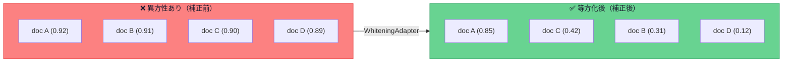

## はじめに

RAG（Retrieval-Augmented Generation）を実装してみたものの、**検索結果がイマイチ的外れ**で困っていませんか？

- 「関係ない文書ばかりヒットする」
- 「コサイン類似度が全部0.8以上で、ランキングに差がつかない」
- 「キーワードが一致するものしか拾えない（意味検索になっていない）」

これらの問題の根本原因は、実は**あなたのコードではなく、埋め込みモデル自体の「空間の歪み」**にあるかもしれません。

本記事では、**OpenAI の埋め込みモデル（ada-002 / text-embedding-3-small等）が抱える「異方性問題」**とその解決策を、ライブラリ [WarpVector](https://github.com/daiki-moritake/warpvector) を使って紹介します。

---

## 🤔 なぜ「何を入れても類似度が高い」のか？

多くの埋め込みモデルは**異方性（Anisotropy）** という性質を持っています。

これは、ベクトル空間の中で全てのベクトルが特定の方向に偏って分布してしまう現象です。イメージとしては、地球儀の表面全体にデータが散らばっているべきなのに、**北極付近にデータが集中している**状態です。



補正前は全ドキュメントの類似度が0.89〜0.92の狭い範囲に集中しており、**ランキングに意味のある差がつかない**状態です。補正後は類似度のレンジが広がり、**本当に関連性の高い文書だけが高スコア**になります。

---

## 🛠 3ステップで異方性を解決する

WarpVector の `WhiteningAdapter` を使えば、オンラインで自動的に空間の偏りを学習・除去できます。本質的に必要なのは **「作成」「学習」「補正」の3ステップ** だけです。

```typescript
import { WhiteningAdapter } from "warpvector";

// 1. アダプターを作成（1536次元、主成分1つを除去）
const adapter = new WhiteningAdapter(1536, {
  learningRate: 0.01,
  numComponents: 1,
});

// 2. ベクトルを受け取るたびに偏りの方向を自動学習（Oja's Rule）
adapter.update(rawVector); // 検索クエリやドキュメントを流すだけ

// 3. 検索時に偏りを除去して精度を劇的に向上
const correctedVector = adapter.tune(searchVector);
```

やっていることは本質的に **オンラインPCA（主成分分析）** です。ベクトルを受け取るたびに、空間の「偏り」の方向を統計的に学習し、検索時にその方向成分を差し引くことで、ベクトル空間を等方的（均一）にします。

### なぜ「オンライン」なのか？

バッチ処理のPCA（scikit-learn等）と違い、WarpVectorのWhiteningは**ストリーミング処理**に対応しています。

| 方式                           | メリット                        | デメリット                       |
| ------------------------------ | ------------------------------- | -------------------------------- |
| バッチPCA (Python)             | 数学的に厳密                    | 全データが必要、エッジで動かない |
| **オンラインPCA (WarpVector)** | **1件ずつ漸進学習、エッジ対応** | 収束に数百件必要                 |

つまり、データベースの全データを一括処理する必要がなく、**リクエストが来るたびに少しずつ賢くなる**ことが可能です。

---

## 📊 効果の実感

異方性の補正による効果は、特に以下のケースで顕著です。

:::message
**効果が大きいケース：**

- OpenAI `ada-002` を使っている（異方性が特に強いことで知られる）
- 大量のドキュメントで「似たような文書ばかりヒットする」
- nDCG@10 や MRR を改善したい
  :::

:::message alert
**効果が限定的なケース：**

- ドキュメント数が少ない（数十件程度）
- 既にリランカー（Cross-Encoder）を使用している
- カテゴリが全く異なるドキュメント群（そもそも混同しない）
  :::

---

## 🔥 さらに精度を上げる：パイプラインの組み合わせ

WarpVectorでは、複数のアダプターをパイプラインとして組み合わせることができます。

```typescript
import { WarpPipeline } from "warpvector";
import { MlpAdapter } from "warpvector/ml";

const pipeline = new WarpPipeline(1536)
  .addStep("whitening", whiteningAdapter) // 1. 異方性の除去
  .addIntent({ tech: techWeights }) // 2. ユーザーの意図に合わせた空間変形
  .addStep("mlp", mlpAdapter); // 3. 非線形変換で意味の切り分けを強化

await pipeline.init();

const result = await pipeline.run(queryVector, { intent: "tech" });
```

**異方性の除去 → 意図の反映 → 非線形変換** を一気通貫で実行することで、各段階が相乗効果を発揮し、検索精度を最大化できます。

---

## まとめ

RAGの検索精度が上がらない原因は、**あなたのプロンプトやチャンク分割ではなく、ベクトル空間自体の「歪み」** にあるかもしれません。

WarpVector の `WhiteningAdapter` を挟むだけで、埋め込みモデルが抱える異方性を自動補正し、**検索の解像度を劇的に向上**させることができます。しかも、TypeScript + WASMなので、Node.js からエッジ環境まで、どこでも動きます。

> 🎮 **ブラウザ上で異方性補正の効果を体験できるPlayground**
> [https://daiki-moritake.github.io/warpvector/](https://daiki-moritake.github.io/warpvector/)

https://github.com/daiki-moritake/warpvector

---

### 📚 関連記事

- [Pineconeのコストを96%削減し、RAGの精度を劇的に向上させる方法](/daiki_moritake/articles/reduce-pinecone-costs)
- [Cloudflare Workersで「ベクトル推論」をサブミリ秒で動かす方法](/daiki_moritake/articles/edge-vector-inference)
- [LangChainの検索精度に不満？ミドルウェアを1つ挟むだけで劇的に改善する方法](/daiki_moritake/articles/langchain-search-improvement)
- [Pythonなしで検索のパーソナライズを実装する](/daiki_moritake/articles/ts-contrastive-learning)
