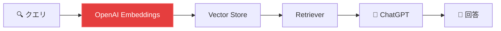
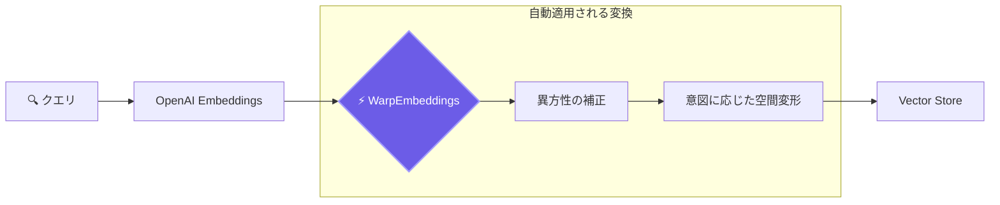

## はじめに

LangChain を使ってRAGアプリを構築したものの、**検索精度が思ったほど上がらない**という経験はありませんか？

チャンク分割を工夫したり、プロンプトを書き直したり…。でも本質的な問題は、**LLMが生成したベクトルがそのままDBに投げられている**ことにあるかもしれません。

本記事では、LangChain のベクトル検索パイプラインに**たった3行のコードを追加するだけ**で、検索精度を劇的に向上させる方法を、OSSライブラリ [WarpVector](https://github.com/daiki-moritake/warpvector) を使って紹介します。

---

## 🤔 LangChainの検索フローと「見落とされがちなボトルネック」

LangChain の典型的なRAGフローは以下の通りです。



赤くハイライトした **Embeddings の直後** が、見落とされがちなボトルネックです。

ベクトル化されたクエリは、何の加工もなくそのまま Vector Store に投げられます。しかし、このベクトルには以下の問題があります。

1. **異方性（偏り）**: ada-002 等のモデルは、全てのベクトルが似た方向を向きがち
2. **意図の欠落**: 「Apple」が果物なのか企業なのか、ベクトルだけでは区別できない
3. **次元の冗長性**: 1536次元のうち、多くの次元が実質的にノイズ

WarpVector は、このボトルネックに**ミドルウェアとして介入**し、ベクトルを最適化してから DB に渡します。

---

## 🛠 LangChain への統合（たった3行）

WarpVector は LangChain の `Embeddings` インターフェースに準拠したラッパー `WarpEmbeddings` を提供しています。既存のコードを壊す必要はありません。

### Before（通常の LangChain コード）

```typescript
import { OpenAIEmbeddings } from "@langchain/openai";
import { MemoryVectorStore } from "langchain/vectorstores/memory";

const embeddings = new OpenAIEmbeddings();
const vectorStore = new MemoryVectorStore(embeddings);
```

### After（WarpVector を追加）

```typescript
import { OpenAIEmbeddings } from "@langchain/openai";
import { MemoryVectorStore } from "langchain/vectorstores/memory";
import { IntentAdapter } from "warpvector"; // 追加①
import { WarpEmbeddings } from "warpvector/integrations/langchain"; // 追加②

const baseEmbeddings = new OpenAIEmbeddings();
const adapter = new IntentAdapter(intentWeights);

// ラップするだけ！既存の vectorStore はそのまま使える
const embeddings = new WarpEmbeddings({
  baseEmbeddings,
  adapter,
  intentName: "tech",
});

const vectorStore = new MemoryVectorStore(embeddings);
```

変更点は **import 2行 + ラッパー1つ** だけです。`MemoryVectorStore`、`Chroma`、`Pinecone` など、LangChain がサポートする全ての Vector Store でそのまま動きます。

---

## 📊 何がどう変わるのか？

WarpEmbeddings は内部で以下の処理を自動的に行います。



| 処理                     | 効果                                               |
| ------------------------ | -------------------------------------------------- |
| **異方性の補正**         | 類似度スコアのレンジが広がり、ランキングに差がつく |
| **意図に応じた空間変形** | コンテキストに合った文書が上位にランクイン         |

重要なのは、**ドキュメントの埋め込み時（indexing）には変換を適用せず、検索クエリ側にだけ適用する**点です。これにより、既にDBに格納済みの大量のベクトルを再計算する必要がありません。

---

## 🔥 応用：LlamaIndex との統合

LlamaIndex を使っている場合も、同様のラッパーが用意されています。

```typescript
import { OpenAIEmbedding } from "llamaindex";
import { WarpLlamaIndexEmbeddings } from "warpvector/integrations/llama-index";

const embeddings = new WarpLlamaIndexEmbeddings({
  baseEmbeddings: new OpenAIEmbedding(),
  adapter: intentAdapter,
  intentName: "tech",
});

// LlamaIndex の VectorStoreIndex にそのまま渡せる
```

---

## 💡 Prisma + pgvector との統合

PostgreSQL + pgvector を Prisma 経由で使っている場合は、Prisma Client Extension として統合できます。

```typescript
import { PrismaClient } from "@prisma/client";
import { withWarpVector } from "warpvector/integrations/prisma";

const prisma = new PrismaClient().$extends(
  withWarpVector({
    adapter: whiteningAdapter,
    vectorField: "embedding",
    distanceOperator: "<=>",
  }),
);

// 生のベクトルを渡すだけ（内部で自動的にWarp変換 + SQL生成）
const results = await prisma.document.searchByVector({
  vector: rawSearchVector,
  topK: 10,
});
```

---

## まとめ

LangChain・LlamaIndex・Prisma、どのエコシステムを使っていても、WarpVector は**既存のコードを壊さず、数行のラッパーを追加するだけ**で検索精度を向上させます。

:::message
**導入の手軽さ：**

- LangChain → `WarpEmbeddings` でラップ
- LlamaIndex → `WarpLlamaIndexEmbeddings` でラップ
- Prisma → `withWarpVector()` で Extension 追加

いずれも既存のベクトルの再計算は不要。クエリ側だけの変換で効果を発揮します。
:::

> 🎮 **ブラウザ上でリアルタイム変換を体験できるPlayground**
> [https://daiki-moritake.github.io/warpvector/](https://daiki-moritake.github.io/warpvector/)

https://github.com/daiki-moritake/warpvector

---

### 📚 関連記事

- [Pineconeのコストを96%削減し、RAGの精度を劇的に向上させる方法](/articles/reduce-pinecone-costs)
- [RAGの検索精度が低い？ベクトル空間の「異方性」を3ステップで解決する方法](/articles/fix-rag-anisotropy)
- [Cloudflare Workersで「ベクトル推論」をサブミリ秒で動かす方法](/articles/edge-vector-inference)
- [Pythonなしで検索のパーソナライズを実装する](/articles/ts-contrastive-learning)
