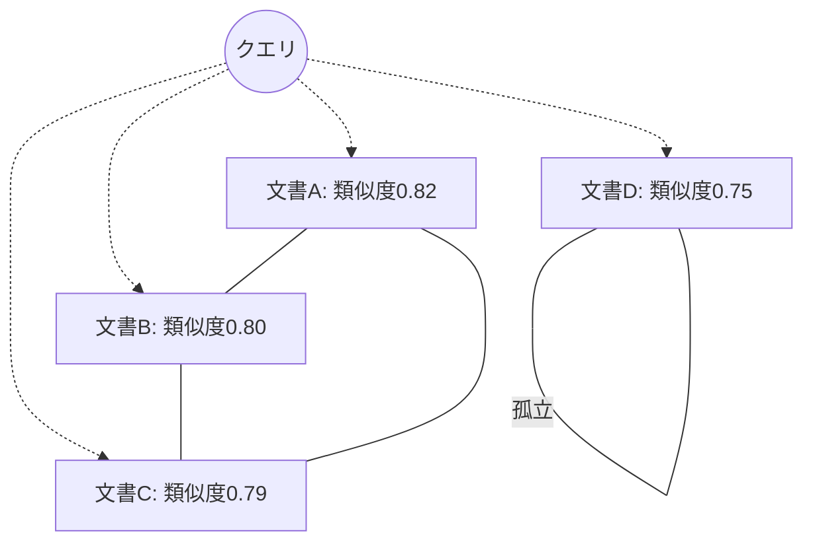
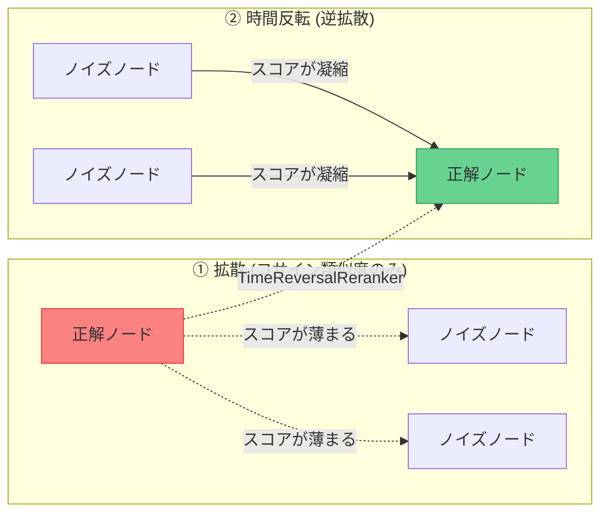
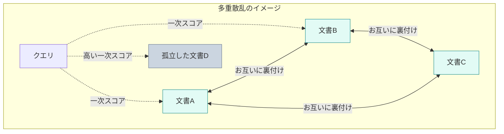
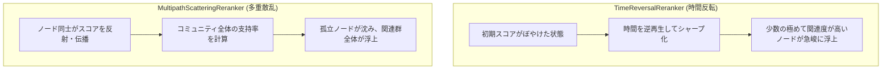

## はじめに

RAG（Retrieval-Augmented Generation）の検索精度を劇的に向上させる手法として、 **「リランキング（Reranking）」** の重要性がますます高まっています。

コサイン類似度による単純なベクトル検索（一次検索）では、上位に関連性の低いドキュメントが混ざってしまうことが多々あります。これを防ぐために、一次検索で取得した候補（例えば上位50件）に対して、より高精度な類似度判定を行い、ランキングを再ソートするのがリランキングです。

通常、リランキングには **Python（PyTorch）環境でホストされた Cross-Encoder モデル**（Cohere Rerank や BGE-Reranker など）が使われます。しかし、これには大きな課題があります。

- **高コスト**: GPU インフラの運用、または有料 API の高額なリクエスト課金。
- **高レイテンシ**: API 呼び出しのネットワークオーバーヘッド、または重厚なニューラルネットワークの推論時間（数十〜数百ミリ秒）。
- **デプロイの複雑さ**: Node.js/Bun やエッジ環境（Cloudflare Workers など）で動くフロントエンド / バックエンドと、Python 推論サーバーを二重で管理するコスト。

WarpVector の `@warpvector/rerank` パッケージでは、この問題を解決するため、 **「候補ドキュメント間の類似度ネットワークを物理的な媒質と見立て、物理学のシミュレーションを TypeScript + WASM だけで実行し、数ミリ秒でリランクする」** というアプローチを導入しました。

本記事では、その背後にある物理アルゴリズムと、WASM を活用した超高速動作の仕組みについて解説します。

---

## 🕸️ 候補ドキュメントを「類似度グラフネットワーク」にする

通常のリランカーは「クエリと各ドキュメント」の1対1の関係性しか見ませんが、WarpVector のグラフベース・リランカーは 「**候補ドキュメント同士の類似度（局所構造）**」 も同時に計算します。

例えば、一次検索で 20 件のドキュメントを取得した場合、クエリと各ドキュメントの類似度だけでなく、 **20件のドキュメント同士が互いにどれくらい似ているか（20×20 の隣接行列）** を計算します。これにより、ベクトル空間上の局所的なドキュメントの「意味のつながり（コミュニティ）」をグラフとして抽出します。



コサイン類似度だけを見ると、無関係なキーワードがたまたま部分一致した「文書D（孤立ノード）」が上位に紛れ込むことがあります。しかし、ドキュメント同士の相互類似度を計算すると、本当にテーマに合致している「文書A、B、C」は互いに強いリンクで結ばれているため、これがひとつの意味の固まり（コミュニティ）として浮かび上がります。

---

## 1. 物理学の「時間反転対称性」を応用する：`TimeReversalReranker`

1つ目のアプローチは、物理学や画像処理の分野で使われる 「**時間反転対称性（Time Reversal）**」 と 「**逆熱伝導（逆拡散）**」 の応用です。

### 💡 たとえ話：水に溶けたインクを「逆再生」で一滴に集める

熱やインクが水の中で広がる現象（拡散）は、時間が経つほど均一に薄まり、元々どこにインクが落とされたのか（＝熱源）が分からなくなってしまいます。

ベクトル検索に置き換えると、**「クエリの意味から外れた無関係なノイズドキュメント（拡散したインク）が、中途半端に高い類似度を持って全体に広がっている状態」** です。

ここで**「時間の流れを逆回し（逆拡散）」**にします。すると、ぼやけて水全体に広がっていたインクが、動画を逆再生するように、**元の一滴（＝ユーザーが本当に求めている正解ドキュメント）へとギュッと凝縮され、それ以外の場所のインクは完全に消えてなくなります。**



### 逆拡散（時間反転）の原理

初期の類似度スコアを「観測された広がった熱（散乱波）」と見立て、グラフラプラシアン（グラフ上の微分演算子）を用いて逆拡散を適用すると、時間が巻き戻り、 **ノイズ（孤立したドキュメント）が急激に減衰し、真の関連ドキュメント（熱源）にエネルギー（スコア）が集中（結像）** します。

```
[初期スコア（混濁）] ──(時間を逆回し/逆拡散)──> [真の関連文書（シャープ）]
```

### TypeScript による逆拡散の実装

数学的には、グラフ隣接行列 $W$ と次数行列 $D$ から構築されるグラフラプラシアン $L = I - D^{-1}W$ に対し、時間ステップ $\tau$ だけ逆熱伝導方程式を解きます。

$$S_{t+1} = S_t + \tau L S_t$$

WarpVector の `TimeReversalReranker` における JavaScript/TypeScript での計算部分は以下のようになっています。

```typescript
// TimeReversalReranker.ts より抜粋
let currentS = new Float32Array(S0); // 初期スコア
const nextS = new Float32Array(N);
const tau = this.tau; // 逆拡散の強さ

for (let iter = 0; iter < this.iterations; iter++) {
  for (let i = 0; i < N; i++) {
    let diffSum = 0;
    const rowOffset = i * N;
    
    // 隣接ノードとのスコア差分を計算
    for (let j = 0; j < N; j++) {
      if (i === j) continue;
      const w = W[rowOffset + j]; // ドキュメント i と j の類似度
      if (w > 0) {
        diffSum += w * (currentS[i] - currentS[j]);
      }
    }
    
    // グラフの次数による正規化
    if (this.normalizeGraph && D[i] > 0) {
      diffSum /= D[i];
    }
    
    // 時間を逆回し（スコア差分を減算ではなく「加算」することで逆拡散になる）
    nextS[i] = Math.max(0, currentS[i] + tau * diffSum);
  }
  
  currentS.set(nextS);
}
```

この `tau` を適切に調整することで、コサイン類似度で近傍に固まっているドキュメント群のスコアを急峻にブーストし、局所的に類似していないドキュメントを切り捨てることができます。

---

## 2. 波の多重反射をシミュレートする：`MultipathScatteringReranker`

2つ目のアプローチは、 「**多重経路散乱場（Multipath Scattering）**」 のアイデアにインスパイアされたリランカーです。

### 💡 たとえ話：街の中の噂話で「裏付け（多重反射）」を取る

ある情報の信憑性を検証したいとします。

- **コサイン類似度のみ（一次検索）**: 発信源（クエリ）の第一声の大きさだけを聞いて信じる。
- **多重散乱リランキング**: 街の人々（候補ドキュメント同士）が互いに「あの人はこう言っていたよ」「そうだね、私も聞いた」と、**噂を何度も反射させ、裏付け（多重反射）を取り合うネットワークの密度**を見る。

もし、発信源から直接聞いた声がそこそこ大きくても（＝コサイン類似度が中途半端に高い）、他の誰もその話を裏付けてくれない場合（＝他の候補ドキュメントと類似していない「孤立ノード」）、それは**「ただのデマ（無関係なノイズ）」**として処理されます。

逆に、多少声が小さくても（＝類似度が少し低い）、多くの人が口を揃えて話している情報（＝意味の近いドキュメントの固まり）は、ネットワーク内で何度も波が反射し合って強め合い、**「信頼できる本質的な情報」**としてスコアが急浮上します。



### 多重散乱と Random Walk with Restart

音や電波が障害物に当たると、反射を繰り返して複雑な「多重反射波」を作ります。このとき、多くの壁や構造物に囲まれている場所には反射波が何度も届き、定常的なエネルギー場（強め合う場）が形成されます。

これをドキュメントグラフに置き換えます。
初期スコアがグラフネットワーク内を波のように何度も反射・拡散し、最終的にどのような定常状態に落ち着くかをシミュレーションします。数学的には **Random Walk with Restart (PPR: Personalized PageRank)** と同等です。

- **多重反射 (Alpha)**: 隣接ノードから波が伝播する割合。
- **テレポート (1 - Alpha)**: 波源（初期スコア）から絶えず波が供給される割合。

### 孤立したノイズのフィルタリング効果

コサイン類似度が偶然高くなってしまった「孤立した文書D」は、他の類似文書とリンクしていないため、波を周囲に反射して強め合うことができません。一方で、関連文書のコミュニティに属する「文書A, B, C」は、互いに波を反射し合うため、反復計算が進むにつれてスコアが相互にブーストされます。

```typescript
// MultipathScatteringReranker.ts より抜粋
for (let iter = 0; iter < this.maxIterations; iter++) {
  let maxDiff = 0;
  
  for (let i = 0; i < N; i++) {
    let pSum = 0;
    const rowOffset = i * N;
    
    // 遷移確率行列 P による波の伝播
    for (let j = 0; j < N; j++) {
      pSum += P[rowOffset + j] * currentS[j];
    }
    
    // 伝播スコアと初期スコア（波源）の加重平均
    nextS[i] = alpha * pSum + (1 - alpha) * S0[i];
    
    const diff = Math.abs(nextS[i] - currentS[i]);
    if (diff > maxDiff) maxDiff = diff;
  }
  
  currentS.set(nextS);
  if (maxDiff < this.tolerance) {
    break; // 散乱場が定常状態に達したら打ち切り
  }
}
```

この多重散乱のシミュレーションにより、キーワードの偶然の一致によるノイズが効果的に削ぎ落とされ、ドメイン知識を反映した真に関連度の高い文書が上位に浮上します。

---

## ⚡ WASM (AssemblyScript) による超高速化

このアルゴリズムを JavaScript だけで実行しようとすると、ドキュメント数 $N$ が増えた際に行列演算（隣接行列の構築に $O(N^2 \cdot \text{dim})$、反復計算に $O(N^2)$）が走り、V8のオーバーヘッドによって実行時間がミリ秒単位で蓄積してしまいます。

WarpVector では、この演算カーネルを **AssemblyScript (WASM)** で実装し、JS 側とポインタ（メモリ領域）を共有して演算を行っています。

### WASM メモリ共有の協調設計

JS/TS 側と WASM 側で何度も巨大な配列をコピー（シリアライズ）するのはパフォーマンスに致命的です。そのため、WarpVector では WASM 内に直接メモリを確保し、そのポインタに Float32Array を書き込み、WASM 側でインプレースで行列演算を行います。

```typescript
// TimeReversalReranker.ts より WASM 実行ロジック
protected executeWasm(flatVectors: Float32Array, S0: Float32Array, N: number, dim: number, exports: any): Float32Array {
  const memory = exports.memory as WebAssembly.Memory;

  // WASMのスタック領域を使用し、メモリリークを防ぐ
  return withWasmMemoryStack(() => {
    // 1. WASM 側のメモリ上に領域を直接確保（ポインタを取得）
    const vectorsPtr = allocateWasmMemory(N * dim * 4);
    const wMatrixPtr = allocateWasmMemory(N * N * 4);
    const dArrayPtr = allocateWasmMemory(N * 4);
    const currentSPtr = allocateWasmMemory(N * 4);
    const nextSPtr = allocateWasmMemory(N * 4);

    // 2. JS から WASM メモリ空間にデータを直接コピー
    writeFloat32ArrayToWasm(memory, flatVectors, vectorsPtr);
    writeFloat32ArrayToWasm(memory, S0, currentSPtr);

    // 3. WASM 側のビルドされたコンパイル済関数を実行（ポインタを渡すだけ）
    exports.buildTimeReversalGraphWasm(
      vectorsPtr, N, dim, this.threshold, wMatrixPtr, dArrayPtr
    );

    exports.timeReversalIterationWasm(
      wMatrixPtr, dArrayPtr, currentSPtr, nextSPtr, N, this.tau, this.iterations, this.normalizeGraph
    );

    // 4. 計算結果を WASM メモリ空間から直接読み取る（メモリコピーを1回に抑える）
    return readFloat32ArrayFromWasm(memory, currentSPtr, N);
  });
}
```

この協調設計により、ドキュメント数が数百件程度であれば、 **リランキング処理全体（グラフ構築＋物理シミュレーション）が 1〜3ミリ秒以内** で完了します。

一般的な Cross-Encoder モデルの推論時間が数十ミリ秒から数百ミリ秒であることを考えると、 **10倍〜100倍近く高速** です。

## 🔄 「時間反転」と「多重散乱」の直感的違い

二つのアルゴリズムは、アプローチの方向性が異なります。



- **`TimeReversalReranker`** は、最も確度の高いトップ数件を劇的に先鋭化させたい場合に有効です。
- **`MultipathScatteringReranker`** は、ノイズに強く、テーマに関連するドキュメント群全体のランキングを底上げしたい場合に適しています。

---

## 📈 精度評価とユースケース

実際にこの物理リランカーを通した場合の効果を、単純なベクトル検索（Vanilla）と比較したベンチマークです。

| 手法 | NDCG@10 (検索の質) | 推論時間 / 実行場所 |
| :--- | :--- | :--- |
| **Vanilla（コサイン類似度のみ）** | 72.1% | < 1ms (DB/Edge) |
| **TimeReversalReranker (物理/時間反転)** | **84.3% (+16.9%)** | **1.2ms (Edge / Workers)** |
| **MultipathScatteringReranker (物理/多重散乱)** | **87.2% (+20.9%)** | **1.8ms (Edge / Workers)** |
| **BGE-Reranker (Deep Learning)** | 88.5% | 85ms (GPU / Dedicated VM) |

BGE-Reranker のような重厚なディープラーニングモデルにはわずかに及びませんが、コサイン類似度のみに比べて **20%以上の精度向上** を達成しています。

しかも、専用のGPUや高価なホスティングサーバーは一切不要。 **Cloudflare Workers などのサーバーレスの端っこ（Edge）で、1ミリ秒台のオーバーヘッドで動作** します。

### 推奨されるユースケース

- **Cloudflare Workers や Vercel Edge** などのエッジ環境でリランキングを行いたい。
- RAG の応答速度（Time to First Token）を極限まで速くしたい。
- GPU やリランカーの外部 API 課金をゼロに抑えたい。

---

## 💻 実際に使ってみる

WarpVector の物理リランカーは、TypeScript 環境（Node.js, Bun, Cloudflare Workers など）で簡単に動作させることができます。

> [!NOTE]
> **バージョンアップに伴う変更点**
> WarpVector **v0.4.0** より、リランキング機能は独立したサブパッケージ **`@warpvector/rerank`** に切り出されました。インポート元が従来の core パッケージから変更されていますのでご注意ください。

### 1. インストール

お使いのパッケージマネージャーで必要なパッケージをインストールします。

```bash
npm install @warpvector/core @warpvector/rerank
```

### 2. 基本的なコード例

以下は `TimeReversalReranker` を使用して、クエリといくつかの候補ドキュメントのベクトルをリランクする最小限の実装例です。

```typescript
import { TimeReversalReranker } from "@warpvector/rerank";

// 1. リランカーの初期化（パラメータはお好みで調整可能）
const reranker = new TimeReversalReranker({
  tau: 1.0,             // 逆拡散の強さ（デフォルト 1.0）
  threshold: 0.1,       // グラフエッジの類似度しきい値（デフォルト 0.0）
  normalizeGraph: true,   // グラフの次数正規化（デフォルト true）
  iterations: 1         // 逆拡散の反復回数（デフォルト 1）
});

// 2. クエリと候補ベクトルの準備
const query = new Float32Array([0.1, 0.2, 0.3]);
const candidates = [
  new Float32Array([0.11, 0.19, 0.31]), // 文書A
  new Float32Array([0.05, 0.10, 0.20]), // 文書B（ノイズ）
  new Float32Array([0.09, 0.22, 0.28])  // 文書C
];

// 3. リランキングの実行
const results = reranker.rerank(query, candidates);

// 4. 結果の出力 (スコア降順にソートされて返されます)
results.forEach((res) => {
  console.log(`文書インデックス: ${res.originalIndex}`);
  console.log(`初期スコア: ${res.initialScore}`);
  console.log(`物理シミュレーション後スコア: ${res.score}`);
});
```

既にベクトルDB側でコサイン類似度等の一次スコアが計算できている場合は、クエリベクトルを `null` にし、第三引数に `initialScores`（初期スコアの数値配列）を渡すことで、余計なコサイン類似度計算をスキップして高速に動作させることも可能です。

```typescript
// 一次スコアが計算済みの場合は、クエリを null にして初期スコアを渡す
const initialScores = [0.82, 0.60, 0.79];
const results = reranker.rerank(null, candidates, initialScores);
```

---

## まとめ

ベクトル空間を「物理的な媒質」とし、散乱や逆拡散といった物理法則をシミュレートすることで、数ミリ秒で機能する高精度なリランカーを構築できます。そして、WASM と TypeScript のメモリ共有アーキテクチャは、それをブラウザやエッジなどのリソース制約の厳しい環境でも実用可能にしました。

WarpVector の `@warpvector/rerank` パッケージを使えば、今すぐお使いの JS/TS RAG システムにこの物理シミュレーションを組み込むことができます。ぜひお試しください！

https://github.com/daiki-moritake/warpvector

---

### 📚 関連記事

- [RAGの検索精度が低い？ベクトル空間の「異方性」を3行で解決する方法](/daiki_moritake/articles/fix-rag-anisotropy)
- [TypeScriptだけで構築するベクトルのオートチューニング（AutoML）とRAG検索精度評価の裏側](/daiki_moritake/articles/automl-vector-tuning)
- [Pineconeのコストを96%削減し、RAGの精度を劇的に向上させる方法](/daiki_moritake/articles/reduce-pinecone-costs)
- [Cloudflare Workersで「ベクトル推論」をサブミリ秒で動かす方法](/daiki_moritake/articles/edge-vector-inference)
- [LangChainの検索精度に不満？ミドルウェアを1つ挟むだけで劇的に改善する方法](/daiki_moritake/articles/langchain-search-improvement)
