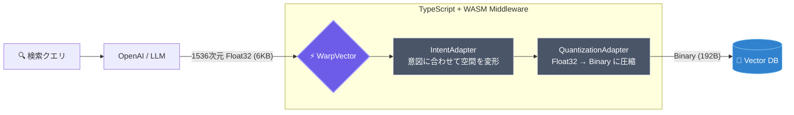
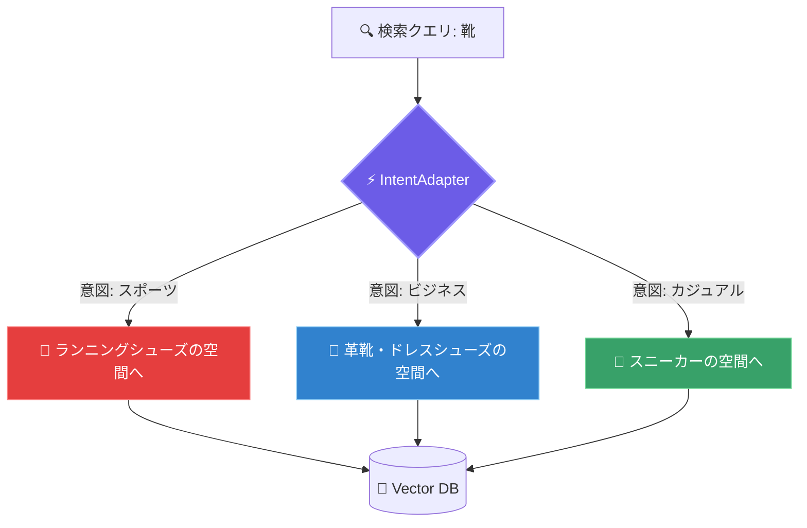

## はじめに

ベクトルデータベース（Pinecone, Qdrant, pgvector等）のコスト、高すぎませんか？

生成AIを使ったRAG（Retrieval-Augmented Generation）アプリを作っていると、以下のような壁にぶつかることが多いと思います。

1. **ベクトルDBのクラウドコストが肥大化する**（1536次元のベクトルは重い！）
2. **「Apple（果物）」と「Apple（企業）」の区別がつかず、検索精度が上がらない**
3. 精度を上げるためにLLMを再学習（ファインチューニング）したいが、**コストも時間もかかりすぎる**

これらの課題を解決するために、**Zero-dependencyのTypeScript製ベクトル変換ミドルウェア「[WarpVector](https://github.com/daiki-moritake/warpvector)」** を開発しました。

本記事では、WarpVectorを使って**ベクトルDBのストレージコストを最大96%削減**し、さらに**ユーザーの意図（Intent）に合わせて検索精度を向上させる**方法を紹介します。

---

## 🚀 WarpVectorとは？

WarpVectorは、LLM（OpenAI等）とベクトルデータベースの「間（ミドルウェア）」に配置する軽量なライブラリです。



ひとことで言うと、**「LLMモデルを再学習せずに、検索結果を賢く・軽く・パーソナライズできる魔法のフィルター」** です。

主な機能は以下の2つです。

1. **量子化 (Quantization)**: `Float32`のベクトルを`Int8`や`Binary`に圧縮し、メモリとコストを激減させます。
2. **動的ワープ (Intent Warping)**: ユーザーの検索意図に合わせて、**LLMの再学習なし**でベクトル空間をリアルタイムに歪ませます。

しかも、重いPythonのMLフレームワークは不要です。**純粋なTypeScriptとWASM（WebAssembly）** で実装されており、Node.jsはもちろん、**Cloudflare Workersなどのエッジ環境でもサブミリ秒で動作**します。

---

## 💰 1. Binary量子化でPineconeのコストを96%削減する

OpenAIの `text-embedding-3-small` のようなモデルは、1ベクトルあたり1536次元（約6KB）のメモリを消費します。
100万件のドキュメントを保存すると、それだけで **6GB** のメモリが必要です。Pinecone等のオンメモリDBでは、これがダイレクトに月額インフラコストに跳ね返ります。

WarpVectorの `QuantizationAdapter` を使えば、**検索精度（コサイン類似度）をほぼ維持したまま**、ベクトルをバイナリ（1ビット）まで圧縮できます。

### Before / After 比較

| | Before (Float32) | After (Binary) | 削減率 |
| --- | --- | --- | --- |
| **1ベクトルのサイズ** | 6,144 Bytes | 192 Bytes | **96.9%** |
| **100万件のDB容量** | 約 6 GB | 約 192 MB | **96.9%** |
| **月額インフラコスト（概算）** | 約 $180 | 約 $10 | **約 $170/月の節約** |
| **コサイン類似度の相関** | 1.0 (基準) | > 0.95 | ほぼ同等 |

### 使い方（たったの2行）

```typescript
import { QuantizationAdapter } from "warpvector/extras";

// 1536次元のBinary量子化アダプターを作成
const quantizer = new QuantizationAdapter({ type: "binary", dim: 1536 });

// OpenAIから取得した Float32Array を圧縮
const compressedVector = quantizer.encode(baseVector);
// -> Uint8Array になり、サイズは 6KB → 192Bytes に！
```

たったこれだけで、**6GB必要だったDB容量がわずか192MB**になります。既存のコードに `.encode()` を1行挟むだけで導入が完了します。

---

## 🎯 2. LLMの再学習なしで「検索意図（Intent）」を切り替える

通常のベクトル検索では、一度生成されたベクトルの距離は絶対的です。しかし、ECサイトで「靴」と検索したユーザーが「ランニングシューズ」を探しているのか、「革靴」を探しているのかは、コンテキストによって異なります。

WarpVectorの `IntentAdapter` を使えば、WASMによる超高速なアフィン変換（行列演算）で、ベクトルを特定の「インテント（意図）」の方向に動的に引き寄せることができます。



### 実装例

```typescript
import { IntentAdapter } from "warpvector";

const adapter = new IntentAdapter(1536);

// インテント行列を登録（事前計算された行列とバイアス）
adapter.addIntent("sport", { matrix: sportMatrix, bias: sportBias });
adapter.addIntent("business", { matrix: bizMatrix, bias: bizBias });

// ユーザーが「スポーツ用品」を探しているコンテキストの場合
const sportVector = adapter.tune(queryVector, "sport");

// ユーザーが「ビジネス用品」を探しているコンテキストの場合
const bizVector = adapter.tune(queryVector, "business");
```

同じクエリベクトルでも、ミドルウェア層で方向を補正することで、DBへの検索結果が劇的に変わります。**LLMの再学習は一切不要**です。

:::message
**💡 ポイント：** Intent行列の事前計算は、ユーザーのクリックログ（正解・不正解）を用いてエッジ上でオンライン学習できます。WarpVectorには `InfoNCETrainer` という対照学習エンジンが内蔵されているので、別途Pythonサーバーを立てる必要はありません。
:::

---

## ⚡ 3. エッジ（Cloudflare Workers）での実行

WarpVectorはZero-dependencyで、内部の行列計算にはWASMを使用しています。
そのため、Cloudflare WorkersやVercel Edge Functionsにデプロイして、**エッジロケーションでユーザーごとにパーソナライズされたベクトル変換**を行うことが可能です。

```typescript
import { IntentAdapter } from "warpvector";

// Cloudflare Workers での例
const adapter = new IntentAdapter(1536);
adapter.addIntent("tech", { matrix: techMatrix, bias: techBias });

export default {
  async fetch(request: Request): Promise<Response> {
    const { queryVector, intent } = await request.json();

    // サブミリ秒で変換完了（WASMによる高速処理）
    const warped = adapter.tune(queryVector, intent);

    return Response.json({ vector: Array.from(warped) });
  },
};
```

テンプレートから即座にプロジェクトを作成することもできます。

```bash
npx create-warpvector-app@latest
```

---

## 🌍 エコシステムにおけるWarpVectorの独自性

「同じようなライブラリはないの？」と思われるかもしれません。
結論から言うと、**「エッジネイティブ・ゼロ依存・TypeScript製で、ベクトルの後処理に特化したミドルウェア」は、現在のところWarpVector以外に存在しません。**

WarpVectorは既存のエコシステムにおいて、極めてユニークな立ち位置を持っています。

1. **vs. 巨大なLLMフレームワーク (LlamaIndex / LangChain)**
   LlamaIndex等にも「Embedding Adapters」という同等の概念が存在しますが、巨大な依存関係の一部に過ぎません。WarpVectorはこれを**WASM最適化された極小のミドルウェア**として抽出し、Cloudflare Workersなどのエッジ環境でも単体で超高速（サブミリ秒）に動作するよう設計されています。
2. **vs. バックエンドMLライブラリ (Faiss / Sentence-Transformers)**
   ベクトルの等方化（Whitening）、対照学習、最適化直積量子化（OPQ）などは、元来Python（PyTorch）やC++の重いインフラが必要でした。WarpVectorはこれらの**高度な数学的最適化をTypeScriptネイティブに再構築**し、フロントエンドやエッジランタイムに解放しました。

---

## まとめ

RAGの精度向上やコスト削減は、LLM側のモデル変更やベクトルDBのチューニングだけで解決しようとすると限界があります。

**「LLM」と「ベクトルDB」の間に、軽量なTypeScriptミドルウェアを挟んでベクトルをハックする** という新しいアプローチを、ぜひ試してみてください。

### WarpVectorの特徴まとめ

| 特徴 | 詳細 |
| --- | --- |
| **ゼロ依存** | NumPy・PyTorchなど外部ML依存なし |
| **WASM高速化** | ブラウザやエッジでもサブミリ秒の推論 |
| **量子化** | Float32 → Binary で最大96%のメモリ削減 |
| **Intent Warping** | LLM再学習なしで検索空間を動的に変形 |
| **エコシステム統合** | LangChain・LlamaIndex・Prisma (pgvector) 対応 |

> 🎮 **ブラウザ上でWASMによるリアルタイム変換を体験できるPlaygroundを用意しています！**
> [https://daiki-moritake.github.io/warpvector/](https://daiki-moritake.github.io/warpvector/)

GitHubリポジトリにスター🌟をいただけると開発の励みになります！

https://github.com/daiki-moritake/warpvector

---

### 📚 関連記事

- [RAGの検索精度が低い？ベクトル空間の「異方性」を3ステップで解決する方法](/daiki_moritake/articles/fix-rag-anisotropy)
- [Cloudflare Workersで「ベクトル推論」をサブミリ秒で動かす方法](/daiki_moritake/articles/edge-vector-inference)
- [LangChainの検索精度に不満？ミドルウェアを1つ挟むだけで劇的に改善する方法](/daiki_moritake/articles/langchain-search-improvement)
- [Pythonなしで検索のパーソナライズを実装する](/daiki_moritake/articles/ts-contrastive-learning)
