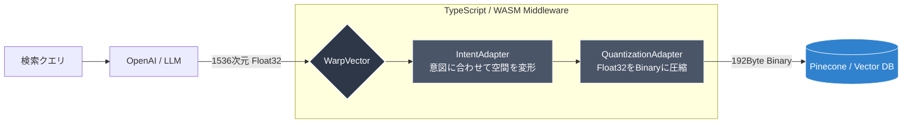
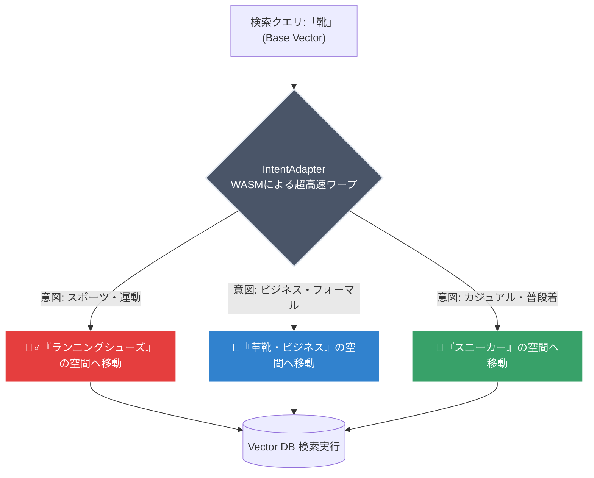

## はじめに

ベクトルデータベース（Pinecone, Qdrant, pgvector等）のコスト、高すぎませんか？

生成AIを使ったRAG（Retrieval-Augmented Generation）アプリを作っていると、以下のような壁にぶつかることが多いと思います。

1. **ベクトルDBのクラウドコストが肥大化する**（1536次元のベクトルは重い！）
2. **「Apple（果物）」と「Apple（企業）」の区別がつかず、検索精度が上がらない**
3. 精度を上げるためにLLMを再学習（ファインチューニング）したいが、**コストも時間もかかりすぎる**

これらの課題を解決するために、\*\*Zero-dependencyのTypeScript製ベクトル変換ミドルウェア「[WarpVector](https://github.com/daiki-moritake/warpvector)」を開発しました。

本記事では、WarpVectorを使って**ベクトルDBのストレージコストを最大96%削減**し、さらに**ユーザーの意図（Intent）に合わせて検索精度を向上させる**方法を紹介します。

---

## 🚀 WarpVectorとは？

WarpVectorは、LLM（OpenAI等）とベクトルデータベースの「中間（ミドルウェア）」に配置する軽量なライブラリです。



主な機能は以下の2つです。

1. **量子化 (Quantization)**: `Float32`のベクトルを`Int8`や`Binary`に圧縮し、メモリとコストを激減させます。
2. **動的ワープ (Intent Warping)**: ユーザーの検索意図に合わせて、**LLMの再学習なし**でベクトル空間をリアルタイムに歪ませます。

しかも、重いPythonのMLフレームワークは不要です。**純粋なTypeScriptとWASM（WebAssembly）**で実装されており、Node.jsはもちろん、**Cloudflare Workersなどのエッジ環境でもサブミリ秒で動作**します。

---

## 💰 1. Binary量子化でPineconeのコストを96%削減する

OpenAIの `text-embedding-3-small` のようなモデルは、1ベクトルあたり1536次元（約6KB）のメモリを消費します。
100万件のドキュメントを保存すると、それだけで **6GB** のメモリが必要です。Pinecone等のオンメモリDBでは、これがダイレクトに月額インフラコスト（約$180〜/月）に跳ね返ります。

WarpVectorの `QuantizationAdapter` を使えば、**検索精度（コサイン類似度）をほぼ維持したまま**、ベクトルをバイナリ（1ビット）まで圧縮できます。

### 使い方（たったの2行）

```typescript
import { QuantizationAdapter } from "warpvector/extras";

// 1536次元のBinary量子化アダプターを作成
const quantizer = new QuantizationAdapter({ type: "binary", dim: 1536 });

// OpenAIから取得した Float32Array を圧縮
const compressedVector = quantizer.tune(baseVector);
// -> Uint8Array になり、サイズは 6KB → 192Bytes に！
```

これにより、**6GB必要だったDB容量がわずか192MB**になり、インフラコストを**最大96%（約$170/月）削減**できます。

---

## 🎯 2. LLMの再学習なしで「検索意図（Intent）」を切り替える

通常のベクトル検索では、一度生成されたベクトルの距離は絶対的です。しかし、ECサイトで「靴」と検索したユーザーが「ランニングシューズ」を探しているのか、「革靴」を探しているのかは、コンテキストによって異なります。

WarpVectorの `IntentAdapter` を使えば、WASMによる超高速なアフィン変換を用いて、ベクトルを特定の「インテント（意図）」の方向に動的に引き寄せることができます。



### 実装例

```typescript
import { IntentAdapter } from "warpvector";

const adapter = new IntentAdapter(1536);

// インテント行列を登録（事前計算された行列とバイアス）
adapter.addIntent("tech", { matrix: techMatrix, bias: techBias });
adapter.addIntent("business", { matrix: bizMatrix, bias: bizBias });

// ユーザーが「技術ドキュメント」を探しているコンテキストの場合
const techVector = adapter.tune(queryVector, "tech");

// ユーザーが「ビジネス戦略」を探しているコンテキストの場合
const bizVector = adapter.tune(queryVector, "business");
```

このように、同じクエリベクトルでも、ミドルウェア層で方向を補正することで、DBへの検索結果を劇的に変えることができます。LLMの再学習は一切不要です。

---

## ⚡ エッジ（Cloudflare Workers）での実行

WarpVectorはZero-dependencyで書かれており、内部の行列計算にはWASMを使用しています。
そのため、Cloudflare WorkersやVercel Edge Functionsにデプロイして、**エッジロケーションでユーザーごとにパーソナライズされたベクトル変換**を行うことが可能です。

```bash
# テンプレートから即座にプロジェクトを作成可能
npx create-warpvector-app@latest
```

---

## まとめ

RAGの精度向上やコスト削減は、LLM側のモデル変更やベクトルDBのチューニングだけで解決しようとすると限界があります。

**「LLM」と「ベクトルDB」の間で、軽量なTypeScriptミドルウェアを使ってベクトルをハックする**という新しいアプローチを、ぜひ試してみてください。

> 🎮 **ブラウザ上でWASMによるリアルタイム変換を体験できるPlayground**を用意しています！
> [https://daiki-moritake.github.io/warpvector/](https://daiki-moritake.github.io/warpvector/)

GitHubリポジトリにスター🌟をいただけると開発の励みになります！
[https://github.com/daiki-moritake/warpvector](https://github.com/daiki-moritake/warpvector)
