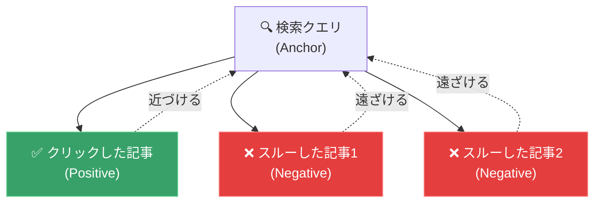
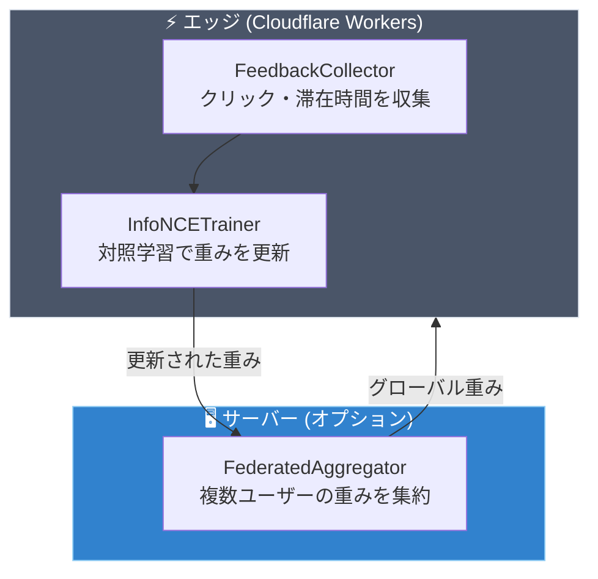

## はじめに

「ユーザーのクリック履歴をもとに、検索結果をパーソナライズしたい」

この要件を実現しようとすると、通常は以下のような大掛かりなアーキテクチャが必要になります。

1. クリックログを収集するバックエンド
2. PyTorch / TensorFlow で対照学習（Contrastive Learning）を行う学習サーバー
3. 学習済みモデルをデプロイするインファレンスサーバー
4. それらを管理するMLOpsパイプライン

**「検索を少し賢くしたいだけなのに、なぜここまで大がかりに…？」**

本記事では、上記すべてを **TypeScript + WASM だけで、エッジサーバー上で完結させる**方法を紹介します。使用するのは [WarpVector](https://github.com/daiki-moritake/warpvector) の学習エンジンです。

---

## 🤔 対照学習（Contrastive Learning）とは？

対照学習は、**「正解ペア」を近づけ、「不正解ペア」を遠ざける**ようにモデルを訓練する手法です。



ユーザーが「検索 → クリック」した行動ログから、自動的に学習データを生成できるため、**明示的なラベル付けが不要**という大きなメリットがあります。

---

## 🛠 WarpVectorでの実装

### Step 1：フィードバックの収集

まず、ユーザーの暗黙的なフィードバック（クリック、滞在時間）を収集します。

```typescript
import { FeedbackCollector } from "warpvector/train";

const collector = new FeedbackCollector({
  dwellThresholdMs: 3000, // 3秒以上滞在で「関心あり」と判定
});

// 検索結果の表示を記録
const impId = collector.recordImpression({
  queryVector: queryVec,
  resultVectors: [doc1Vec, doc2Vec, doc3Vec],
  timestamp: Date.now(),
});

// ユーザーのクリックを記録
collector.recordFeedback({
  impressionId: impId,
  resultIndex: 0, // 1番目の結果をクリック
  type: "click",
});

// 学習データに自動変換
const examples = collector.toTripletExamples();
// -> [{ anchor, positive, negatives: [...] }]
```

`FeedbackCollector` は、**クリックされた結果を Positive、スルーされた結果を Negative** として自動的にトリプレット（3つ組）を生成します。

---

### Step 2：オンライン学習（InfoNCE Loss）

収集した学習データを使って、ベクトル変換の重み（行列）をリアルタイムに更新します。

```typescript
import { InfoNCETrainer } from "warpvector/train";

const trainer = new InfoNCETrainer(1536);

// 1件目の学習データを取得
const example = examples[0];

// 1つの正解と複数の不正解から重みを更新（Adam Optimizer内蔵）
const updatedWeights = await trainer.updateOnline(
  currentWeights,
  example,
  {
    learningRate: 0.001,
    temperature: 0.1, // InfoNCE のスケーリング温度
  },
);
```

:::message
**💡 ポイント：** WarpVector の学習エンジンは **LLMの重みを変えるのではなく、ミドルウェア層の変換行列を更新**します。つまり、LLMの再学習（ファインチューニング）は一切不要で、変換行列だけを数ミリ秒で更新できます。
:::

---

### Step 3：学習率の自動調整

実運用では、学習率を適切に減衰させることが重要です。`AdaptiveScheduler` を使えば、バッチサイズと減衰率を自動管理できます。

```typescript
import { AdaptiveScheduler } from "warpvector/train";

const scheduler = new AdaptiveScheduler(trainer, {
  batchSize: 5, // 5件のフィードバックが溜まったらバッチ学習
  initialLearningRate: 0.01,
  decayRate: 0.95, // エポックごとに5%減衰
});

// フィードバックを追加するだけ（バッチサイズに達したら自動学習）
const newWeights = await scheduler.addFeedback(currentWeights, examples);
```

---

### Step 4：複数ユーザーの学習を集約（連合学習）

複数のユーザー（またはエッジノード）で個別に学習された重みを、サーバー側で集約する**連合学習（Federated Learning）** もサポートされています。

```typescript
import { FederatedAggregator } from "warpvector/train";

const aggregator = new FederatedAggregator(baseWeights, 1536);

// 各クライアントの学習済み重みを集約
aggregator.submitUpdate({ weights: userA_Weights, interactionCount: 100 });
aggregator.submitUpdate({ weights: userB_Weights, interactionCount: 50 });

// 重み付き平均で新しいグローバル重みを計算（FedAvg）
const globalWeights = aggregator.aggregate();
```

これにより、**個人データをサーバーに送らずに、全体の検索品質を向上**させることが可能です。

---

## 🏗 全体アーキテクチャ



**ポイント**: サーバーは集約のためだけに使用し、学習自体はエッジで完結します。サーバーを用意せず、エッジ単体で動かすことも可能です。

---

## まとめ

| 従来のアプローチ                      | WarpVector                        |
| ------------------------------------- | --------------------------------- |
| Python + PyTorch で学習サーバーを構築 | TypeScript + WASM でエッジ完結    |
| ラベル付きデータセットが必要          | クリックログから自動生成          |
| 学習に数時間〜数日                    | リアルタイム（ミリ秒単位）        |
| MLOps パイプラインが必要              | `npm install warpvector` で即導入 |
| LLMの再学習が必要                     | ミドルウェア層の行列だけを更新    |

検索のパーソナライズは、もはや大規模なMLインフラを必要としません。TypeScriptのエコシステムの中で、**フロントエンドエンジニアでも実装できるレベル**にまで簡素化されています。

> 🎮 **ブラウザ上でリアルタイム学習を体験できるPlayground**
> [https://daiki-moritake.github.io/warpvector/](https://daiki-moritake.github.io/warpvector/)

https://github.com/daiki-moritake/warpvector

---

### 📚 関連記事

- [Pineconeのコストを96%削減し、RAGの精度を劇的に向上させる方法](/daiki_moritake/articles/reduce-pinecone-costs)
- [RAGの検索精度が低い？ベクトル空間の「異方性」を3ステップで解決する方法](/daiki_moritake/articles/fix-rag-anisotropy)
- [Cloudflare Workersで「ベクトル推論」をサブミリ秒で動かす方法](/daiki_moritake/articles/edge-vector-inference)
- [LangChainの検索精度に不満？ミドルウェアを1つ挟むだけで劇的に改善する方法](/daiki_moritake/articles/langchain-search-improvement)
