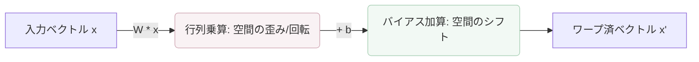
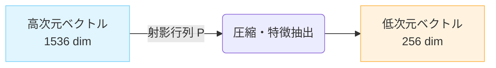
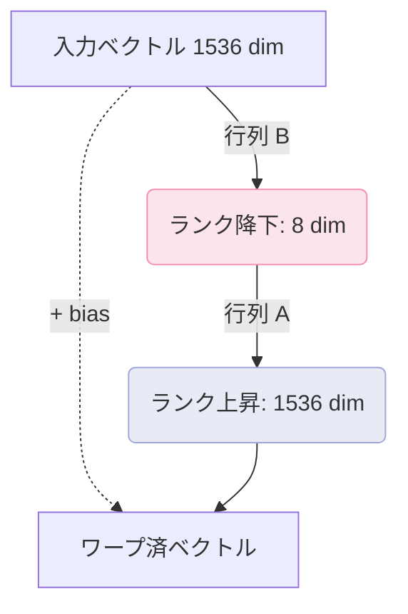

# コアアダプタ (Core Adapters)

WarpVector の中核をなすのは、ベクトルを特定の意図（コンテキスト）に合わせて動的に変形させる「コアアダプタ」群です。
これらは共通の `WarpAdapter` インターフェースを実装しており、どの環境やエコシステムでも透過的に利用できます。

## 1. IntentAdapter

`IntentAdapter` は、**線形のアフィン変換（$W \cdot x + b$）** を用いて、元のベクトル空間を歪めたりシフトさせたりする基本アダプタです。
例えば、「リスク分析」という意図と「経済的影響」という意図で、同じデータのベクトル（埋め込み）を全く異なる方向に変換します。



### 特徴
- **高速性**: 内部の行列演算は SIMD/WASM により最適化されており、大量のベクトル処理（バッチ処理）を数ミリ秒で完了します。
- **ブレンド**: 複数の意図を重み付けして合成する `tuneBlended` をサポート。
- **動的ルーティング**: クエリベクトルと意図の代表ベクトルの類似度から自動でブレンド比率を決定する `tuneAutoBlended` を搭載。

### 基本的な使い方

```typescript
import { IntentAdapter } from 'warpvector';

// インテント(意図)とその変換行列・バイアスを定義
const myIntents = {
  riskAnalysis: {
    matrix: [
      [1.2, 0.1, -0.4],
      [-0.1, 1.5, 0.2],
      [0.3, -0.2, 1.1],
    ],
    bias: [0.05, -0.1, 0.2],
    routingVector: [0.8, -0.1, 0.3] // 動的ブレンド用
  }
};

const adapter = new IntentAdapter(myIntents);
const baseVector = [0.15, -0.23, 0.88];

// 指定した意図に合わせてベクトルをワープ
const warpedVector = adapter.tune(baseVector, "riskAnalysis");
```

## 2. ProjectionAdapter

`ProjectionAdapter` は、**次元削減（Dimensionality Reduction）** に特化したアダプタです。
1536次元のような高次元ベクトルを、256次元や512次元といったより扱いやすい低次元に圧縮します。
これにより、ベクトルDBの保存コストやメモリ消費を大幅に削減しつつ、必要な意味的距離を保つことができます。



### 基本的な使い方

```typescript
import { ProjectionAdapter } from 'warpvector';

// 1536次元から256次元へ圧縮する行列
const matrix = new Float32Array(256 * 1536); 
// ... 行列の初期化 ...

// 入力1536次元、出力256次元のアダプタを作成
const adapter = new ProjectionAdapter(1536, 256);
adapter.addProjection("compress_256", { matrix });

const compressedVector = adapter.tune(baseVector, "compress_256"); 
// -> 256次元の Float32Array になる
```

## 3. LoraIntentAdapter

超高次元ベクトル（例: OpenAI の 1536 次元や Cohere の 1024 次元）に対して `IntentAdapter` の完全な行列 ($1536 \times 1536$) を保持すると、メモリ使用量や計算コストが膨大になります。

`LoraIntentAdapter` は、**LoRA (Low-Rank Adaptation)** アーキテクチャを採用し、変換行列を「低ランクの2つの行列」に分解して近似します（$W = A \cdot B$）。
これにより、パラメータ数と計算量を劇的に削減しながら、同等の変換精度を実現します。



### メリット
- メモリ削減: $1536 \times 1536 \approx 2.3M$ パラメータが、ランク $r=8$ の場合 $(1536 \times 8) + (8 \times 1536) \approx 24K$ パラメータ（約1/100）に削減。
- Edge環境に最適化: Cloudflare Workers などのメモリ制限が厳しい環境で威力を発揮します。

### 基本的な使い方

```typescript
import { LoraIntentAdapter } from 'warpvector';

const dimension = 1536;
const rank = 8;
const adapter = new LoraIntentAdapter(dimension, rank);

// 低ランク行列A (1536x8) と B (8x1536) を指定
adapter.addIntent("efficient_warp", {
  matrixA: getMatrixA(), 
  matrixB: getMatrixB(),
  bias: getBias()
});

// 計算は O(d * r) で済むため超高速
const fastWarpedVector = adapter.tune(baseVector, "efficient_warp");
```
