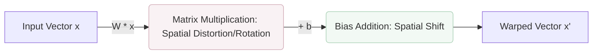
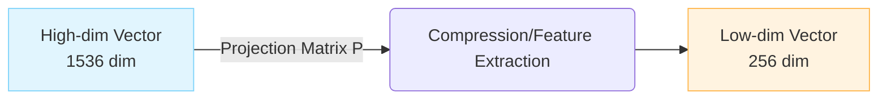
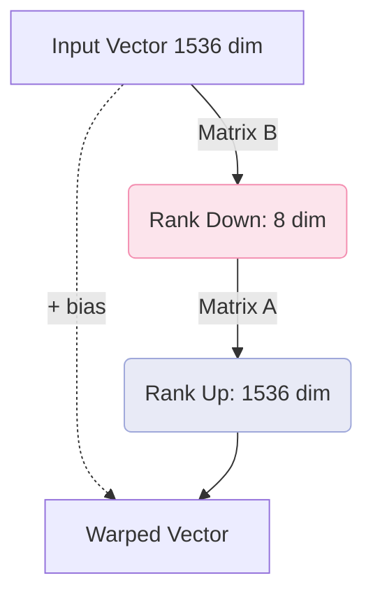

# Core Adapters

At the core of WarpVector is a set of "Core Adapters" that dynamically deform vectors to match specific intents (contexts).
These implement a common `WarpAdapter` interface, making them transparently usable in any environment or ecosystem.

## 1. IntentAdapter

`IntentAdapter` is the base adapter that distorts and shifts the original vector space using a **linear affine transformation ($W \cdot x + b$)**.
For example, it transforms the same data vector (embedding) into completely different directions for a "risk analysis" intent versus an "economic impact" intent.



### Features
- **High Speed**: Internal matrix operations are optimized via SIMD/WASM, completing massive vector processing (batch processing) in milliseconds.
- **Blending**: Supports `tuneBlended` to synthesize multiple intents with weights.
- **Dynamic Routing**: Features `tuneAutoBlended`, which automatically determines the blend ratio based on the similarity between the query vector and the representative vectors of the intents.

### Basic Usage

```typescript
import { IntentAdapter } from 'warpvector';

// Define intents and their transformation matrices and biases
const myIntents = {
  riskAnalysis: {
    matrix: [
      [1.2, 0.1, -0.4],
      [-0.1, 1.5, 0.2],
      [0.3, -0.2, 1.1],
    ],
    bias: [0.05, -0.1, 0.2],
    routingVector: [0.8, -0.1, 0.3] // For dynamic blending
  }
};

const adapter = new IntentAdapter(myIntents);
const baseVector = [0.15, -0.23, 0.88];

// Warp the vector according to the specified intent
const warpedVector = adapter.tune(baseVector, "riskAnalysis");
```

## 2. ProjectionAdapter

`ProjectionAdapter` is an adapter specialized for **Dimensionality Reduction**.
It compresses high-dimensional vectors, such as 1536 dimensions, down to more manageable low dimensions like 256 or 512.
This significantly reduces the storage costs and memory consumption of Vector DBs while maintaining necessary semantic distances.



### Basic Usage

```typescript
import { ProjectionAdapter } from 'warpvector';

// A matrix that compresses from 1536 dimensions to 256 dimensions
const matrix = new Float32Array(256 * 1536); 
// ... Initialize matrix ...

// Create an adapter with 1536 input dimensions and 256 output dimensions
const adapter = new ProjectionAdapter(1536, 256);
adapter.addProjection("compress_256", { matrix });

const compressedVector = adapter.tune(baseVector, "compress_256"); 
// -> Results in a 256-dimensional Float32Array
```

## 3. LoraIntentAdapter

For ultra-high-dimensional vectors (e.g., OpenAI's 1536 dimensions or Cohere's 1024 dimensions), retaining the complete matrix for `IntentAdapter` ($1536 \times 1536$) results in massive memory usage and computational costs.

`LoraIntentAdapter` employs the **LoRA (Low-Rank Adaptation)** architecture, decomposing the transformation matrix into two "low-rank matrices" to approximate it ($W = A \cdot B$).
This drastically reduces the number of parameters and the computational load while achieving equivalent transformation accuracy.



### Benefits
- Memory Reduction: $1536 \times 1536 \approx 2.3M$ parameters are reduced to $(1536 \times 8) + (8 \times 1536) \approx 24K$ parameters (about 1/100) when the rank is $r=8$.
- Optimized for the Edge: Extremely effective in memory-constrained environments like Cloudflare Workers.

### Basic Usage

```typescript
import { LoraIntentAdapter } from 'warpvector';

const dimension = 1536;
const rank = 8;
const adapter = new LoraIntentAdapter(dimension, rank);

// Specify the low-rank matrices A (1536x8) and B (8x1536)
adapter.addIntent("efficient_warp", {
  matrixA: getMatrixA(), 
  matrixB: getMatrixB(),
  bias: getBias()
});

// Ultra-fast because calculation is done in O(d * r)
const fastWarpedVector = adapter.tune(baseVector, "efficient_warp");
```
