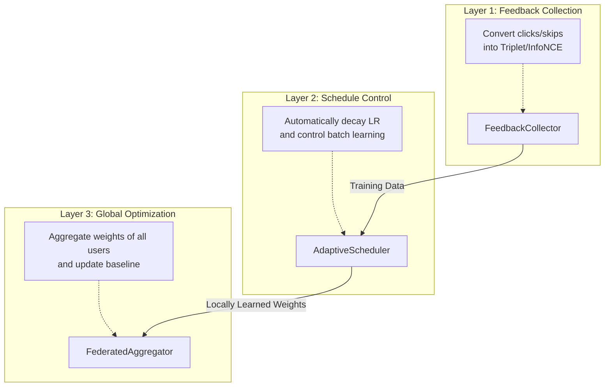

# §13 Feedback Loop Learning

WarpVector provides a flywheel learning mechanism that makes it "smarter the more it's used." It automatically converts users' search behaviors (clicks, skips, dwell time) into learning data, optimizing the vector space in real-time.

---

## Overview: 3-Layer Learning Loop



---

## FeedbackCollector

Collects implicit user feedback and automatically converts it into learning data.

### Basic Usage

```typescript
import { FeedbackCollector } from "@warpvector/ml";

const collector = new FeedbackCollector({
  dwellThresholdMs: 3000,  // Viewing for 3 seconds or more = positive
  maxImpressions: 200,     // Maximum holding capacity
});

// 1. Record an impression when search results are displayed
const impressionId = collector.recordImpression({
  queryVector: queryEmbedding,      // The search query's vector
  resultVectors: [doc1Vec, doc2Vec, doc3Vec], // The displayed results
  timestamp: Date.now(),
});

// 2. Record the user's action
// Click
collector.recordFeedback({
  impressionId,
  resultIndex: 0,
  type: "click",
});

// Skip (displayed but ignored)
collector.recordFeedback({
  impressionId,
  resultIndex: 2,
  type: "skip",
});

// Dwell time
collector.recordFeedback({
  impressionId,
  resultIndex: 1,
  type: "dwell",
  value: 5000,  // Viewed for 5 seconds
});
```

### Conversion to Training Data

```typescript
// Convert for TripletTrainer
const triplets = collector.toTripletExamples();
// -> [{ anchor: queryVec, positive: clickedDoc, negative: skippedDoc }, ...]

// Convert for InfoNCETrainer (Groups multiple negatives together)
const infoNCE = collector.toInfoNCEExamples();
// -> [{ anchor: queryVec, positive: clickedDoc, negatives: [skip1, skip2] }, ...]

// Clear the buffer after conversion
collector.flush();
```

### Conversion Rules

| Feedback | Classification | Condition |
|---|---|---|
| `click` | ✅ positive | Always |
| `dwell` | ✅ positive | `value >= dwellThresholdMs` |
| `dwell` | ❌ negative | `value < dwellThresholdMs` |
| `skip` | ❌ negative | Always |
| (No action) | ❌ negative | If a positive exists |

---

## AdaptiveScheduler

Performs automatic decay of the learning rate and controls the timing of batch learning.

```typescript
import { TripletTrainer, AdaptiveScheduler } from "@warpvector/ml";

const trainer = new TripletTrainer(1536);
const scheduler = new AdaptiveScheduler(trainer, {
  initialLearningRate: 0.01,   // Initial learning rate
  minLearningRate: 0.0001,     // Minimum learning rate
  decayRate: 0.001,            // Decay rate
  batchSize: 5,                // Auto-train when 5 items accumulate
  maxBufferSize: 100,          // Buffer limit
});

// Feedback -> Training Data -> Feed to Scheduler
const examples = collector.toTripletExamples();
const updated = await scheduler.addFeedback(currentWeights, examples);

if (updated) {
  // batchSize was reached and learning executed
  currentWeights = updated;
  console.log(`LR: ${scheduler.currentLearningRate}`);
  console.log(`Total steps: ${scheduler.totalSteps}`);
}
```

### Learning Rate Decay

```
lr(n) = max(minLR, initialLR / (1 + decayRate × n))
```

| Iterations (n) | Learning Rate (Default Settings) |
|---|---|
| 0 | 0.0100 |
| 100 | 0.0091 |
| 1,000 | 0.0050 |
| 10,000 | 0.0001 (Lower limit) |

### State Persistence

```typescript
// Export (saves totalSteps and hyperparameters)
const schedulerState = scheduler.exportState();
localStorage.setItem("scheduler", schedulerState);

// Import (Maintains continuity of the learning rate)
const restored = AdaptiveScheduler.importState(
  trainer,
  localStorage.getItem("scheduler")!,
);
```

---

## FederatedAggregator

Aggregates the learning results of multiple users using FedAvg to update the global baseline.

```typescript
import { FederatedAggregator } from "@warpvector/ml";

const aggregator = new FederatedAggregator(globalBaseWeights, 1536);

// Register each client's learned weights
aggregator.submitUpdate({
  weights: clientAWeights,
  interactionCount: 100,  // Learned 100 times -> High confidence
});

aggregator.submitUpdate({
  weights: clientBWeights,
  interactionCount: 25,   // Learned 25 times -> Low confidence
});

// Aggregate using FedAvg
const newGlobalBase = aggregator.aggregate();

// Prepare for the next round
aggregator.reset(newGlobalBase);
```

### Aggregation Algorithm (FedAvg)

```
W_new = W_base + Σ (count_i / total_count) × (W_i − W_base)
```

Clients with a higher `interactionCount` contribute more to the aggregated result.

---

## Practical Example: E-Commerce Search Overall Flow

```typescript
import {
  FeedbackCollector,
  AdaptiveScheduler,
  TripletTrainer,
} from "@warpvector/ml";
import { IntentAdapter } from "@warpvector/core";

// Initialization
const dim = 1536;
const collector = new FeedbackCollector();
const trainer = new TripletTrainer(dim);
const scheduler = new AdaptiveScheduler(trainer, { batchSize: 5 });
const adapter = new IntentAdapter(dim);

let weights = loadWeightsFromStorage() ?? adapter.getIdentityWeights();

// --- Every time a user searches ---

// 1. Display search results
const impId = collector.recordImpression({
  queryVector: await embed(query),
  resultVectors: results.map(r => r.vector),
  timestamp: Date.now(),
});

// 2. Click event
onResultClick((index) => {
  collector.recordFeedback({ impressionId: impId, resultIndex: index, type: "click" });
});

// 3. Learn periodically
async function learnFromFeedback() {
  const examples = collector.toTripletExamples();
  if (examples.length === 0) return;

  const updated = await scheduler.addFeedback(weights, examples);
  if (updated) {
    weights = updated;
    adapter.addIntent("search", weights);
    saveWeightsToStorage(weights);
  }
  collector.flush();
}

// 4. Execute learning every 30 seconds
setInterval(learnFromFeedback, 30_000);
```
