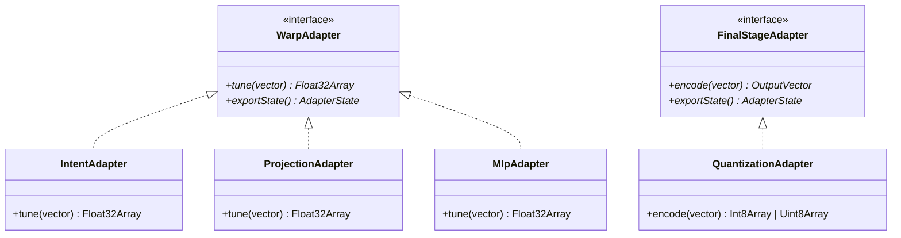

# API Reference

`warpvector` で提供される主要なクラスと関数のリファレンスです。

---

## Core Classes (`@warpvector/core`)

### `WarpPipeline`
複数のアダプタを直感的に繋ぎ合わせ、ベクトルの変換、非同期初期化、バッチ処理、DBフォーマット出力を一括で管理できる統合インターフェース。

- `constructor(inputDim: number)`
- `addIntent(intents?: Record<string, IntentWeights>): this`
- `addLoraIntent(rank: number, intents?: Record<string, LoraIntentWeights>): this`
- `addProjection(outputDim: number, projections?: Record<string, ProjectionWeights>): this`
- `addStep(type: string, adapter: WarpAdapter): this`
  - カスタムアダプタを直接パイプラインの末尾に追加します。
- `setFinalStage(type: string, adapter: FinalStageAdapter): this`
  - 量子化などの最終変換をパイプライン末尾に設定します。
- `init(): Promise<void>`
  - WASM等の非同期初期化が必要な組み込みアダプタを一括でセットアップします。
- `run(vector: number[] | Float32Array, context?: RunContext): any`
  - 構成された全ての変換ステップを順次適用します。
- `runBatch(vectors: (number[] | Float32Array)[], context?: RunContext): any[]`
  - 複数のベクトルを一括でパイプラインに流し込みます。WASM対応アダプタではバッチ処理が並列化されます。
- `runAndFormat(vector: number[] | Float32Array, dbOptions: FormatOptions, context?: RunContext): any`
  - 変換からデータベース向けフォーマット（pinecone, pgvector, redis）までの処理を1行で行います。
- `exportState(): PipelineState[]`
- `static importState(states: PipelineState[]): WarpPipeline`
- `static registerAdapter(type: string, importFn: (state: AdapterState) => WarpAdapter): void`
  - カスタムアダプタの復元関数を登録します。
- `static registerFinalStage(type: string, importFn: (state: AdapterState) => FinalStageAdapter): void`
  - FinalStageAdapter の復元関数を登録します。
- `static registerFormat(format: string, formatFn: (vector: OutputVector, options: FormatOptions) => unknown): void`
  - カスタム出力フォーマット（Milvus, Weaviate等）を登録します。

### `IntentAdapter`
インメモリでベクトルのアフィン変換を行うメインクラス。

- `constructor(intents: Record<string, IntentWeights> | number)`
  - 初期化時に指定された意図をロードし、WASM/Float32Array向けに最適化します。
- `tune(baseVector: number[] | Float32Array, intent: string, activation?: Activation): Float32Array`
  - 指定した意図のアフィン変換を単一のベクトルに適用します。
- `tuneBatch(baseVectors: (number[] | Float32Array)[], intent: string, activation?: Activation): Float32Array[]`
  - 複数のベクトルに一括で変換を適用します。可能であれば WASM / SIMD により高速化されます。
- `tuneBlended(baseVector: number[] | Float32Array, blendWeights: Record<string, number>, activation?: Activation): Float32Array`
  - 複数の意図を指定した割合（例: `{ intentA: 0.7, intentB: 0.3 }`）で合成し、適用します。
- `tuneBatchBlended(...)`
  - `tuneBlended` のバッチ処理（WASM対応）版。
- `tuneAutoBlended(baseVector: number[] | Float32Array, activation?: Activation): Float32Array`
  - `routingVector`（代表ベクトル）の設定に基づき、クエリベクトル自身から最適なブレンド割合を自動で計算して適用します。
- `addIntent(intentName: string, weights: IntentWeights): void`
- `removeIntent(intentName: string): void`
- `exportState(): string`
- `static importState(stateJson: string): IntentAdapter`

### `LoraIntentAdapter`
高次元（1536次元など）のベクトル向けに、低ランク行列(LoRA)を用いてメモリと計算量を劇的に削減するアダプター。

- `constructor(dimension: number, rank: number, intents?: Record<string, LoraIntentWeights>)`
- `tune(baseVector: number[] | Float32Array, intent: string): Float32Array`
- `addIntent(intentName: string, weights: LoraIntentWeights): void`
- `removeIntent(intentName: string): void`
- `exportState(): string`
- `static importState(stateJson: string): LoraIntentAdapter`

### `ProjectionAdapter`
PCAやSVDなどで計算された射影行列を用いて、次元削減や次元拡張を行うためのアダプター。

- `constructor(inDimension: number, outDimension: number, projections?: Record<string, ProjectionWeights>)`
- `tune(vector: number[] | Float32Array, version?: string): Float32Array`
- `addProjection(name: string, weights: ProjectionWeights): void`
- `removeProjection(name: string): void`
- `exportState(): string`
- `static importState(stateJson: string): ProjectionAdapter`

---

## ML Classes (`@warpvector/ml`)

### `MoeAdapter`
複数のエキスパート（他のアダプタ）を保持し、入力ベクトルに応じて動的に最適なエキスパートにルーティングするアダプター（Mixture of Experts）。

- `constructor(config: MoeAdapterConfig)`
- `init(): Promise<void>` — 内包する全エキスパートを初期化します。
- `tune(vector: number[] | Float32Array): Float32Array`
- `tuneBatch(vectors: (number[] | Float32Array)[]): Float32Array[]`
- `exportState(): string`
- `static importState(stateJson: string): MoeAdapter`

### `MlpAdapter`
WASMバックエンドにより、超高速に非線形な多層パーセプトロン推論を行うアダプター。

- `constructor(layers: MlpLayer[])`
- `tune(vector: number[] | Float32Array): Float32Array`
- `tuneBatch(vectors: (number[] | Float32Array)[]): Float32Array[]`
- `init(): Promise<void>` — WASM メモリに重みを永続化します。
- `exportState(): string`
- `static importState(stateJson: string): MlpAdapter`

### `WhiteningAdapter`
Oja's Rule によるオンラインPCAを用いて、ベクトル空間の等方化（Anisotropy Reduction）を行うアダプター。

- `constructor(dimension: number, config?: WhiteningConfig)`
- `tune(vector: number[] | Float32Array): Float32Array`
- `update(vector: number[] | Float32Array): void` — 主成分をストリーミング更新します。
- `exportState(): string`
- `static importState(stateJson: string): WhiteningAdapter`

---

## Training Classes (`@warpvector/train`)

### `PipelineAutoTuner`
検索精度（MRR等）を最大化するパイプラインのハイパーパラメータ構成を自動探索（グリッドサーチ）するAuto-MLユーティリティ。

- `constructor(dataset: SearchExample[])`
- `tuneGrid(config: TuneConfig): Promise<TuneResult>`

### `IntentTrainer`
汎用的なインテント学習用トレーナー。

- `constructor(dimension: number)`
- `updateOnline(currentWeights: IntentWeights, example: TrainingExample, options?: BaseTrainingOptions): Promise<IntentWeights>`

### `CrossEncoderTrainer`
クロスエンコーダー等を用いた精密なスコアリングモデルの学習用トレーナー。

- `constructor(dimension: number)`
- `updateOnline(currentWeights: IntentWeights, example: CrossEncoderExample, options?: BaseTrainingOptions): Promise<IntentWeights>`

### `InfoNCETrainer`
InfoNCE Loss を用いた対照学習トレーナー。1つの正解と複数の不正解を同時に学習。

- `constructor(dimension: number)`
- `updateOnline(currentWeights: IntentWeights, example: InfoNCEExample, options?: InfoNCEOnlineOptions): Promise<IntentWeights>`

### `TripletTrainer`
トリプレットロスを用いた対照学習トレーナー。

- `constructor(dimension: number)`
- `updateOnline(currentWeights: IntentWeights, example: TripletExample, options?: TripletOnlineOptions): Promise<IntentWeights>`

### `MigrationTrainer`
異なる埋め込みモデル間のベクトル空間を翻訳する射影行列を自動学習するトレーナー。

- `constructor(sourceDimension: number, targetDimension: number)`
- `addExample(example: MigrationExample): void`
- `train(options?: BaseTrainingOptions): Promise<ProjectionWeights>`

---

## Extras Classes (`@warpvector/extras`)

### `AnomalyDetectionAdapter`
入力されるベクトルに異常（NaN, Infinity, 極端な外れ値）がないかを検知・サニタイズするためのセキュリティアダプタ。

- `constructor(config?: AnomalyDetectionConfig)`
- `tune(vector: number[] | Float32Array): Float32Array`
- `exportState(): string`
- `static importState(stateJson: string): AnomalyDetectionAdapter`

### `SafeQuantizationAdapter`
異常値を安全な範囲にクリッピングしてから量子化（Int8等）を行うセキュリティ考慮のアダプタ。

- `constructor(config: QuantizationConfig, bounds: { min: number, max: number })`
- `tune(vector: number[] | Float32Array): Int8Array | Uint8Array`
- `encode(vector: number[] | Float32Array): Int8Array | Uint8Array`

### `QuantizationAdapter`
Float32 ベクトルを Int8 または Binary に圧縮するアダプター。

- `constructor(config: QuantizationConfig)`
- `tune(vector: number[] | Float32Array): Int8Array | Uint8Array`
- `encode(vector: number[] | Float32Array): Int8Array | Uint8Array` — `tune` のエイリアス
- `static int8DotProduct(a: Int8Array, b: Int8Array): number`
- `static hammingDistance(a: Uint8Array, b: Uint8Array): number`
- `exportState(): string`
- `static importState(stateJson: string): QuantizationAdapter`

### `ColbertAdapter`
WASM を用いた Late Interaction (ColBERT) の MaxSim 演算によるトークンレベル照合。

- `constructor()`
- `score(queryTokens: Float32Array, documentTokens: Float32Array, dim: number): number`
- `rank(queryTokens: Float32Array, documents: { id: string; tokens: Float32Array }[], dim: number): { id: string; score: number }[]`

### `VsaAdapter`
ベクトル・シンボリック・アーキテクチャ（VSA）/ 超次元計算。

- `static bundle(vectors: (number[] | Float32Array)[], options?: VsaOptions): Float32Array`
- `static bind(vec1: number[] | Float32Array, vec2: number[] | Float32Array, options?: VsaOptions): Float32Array`
- `static unbind(boundVec: number[] | Float32Array, keyVec: number[] | Float32Array, options?: VsaOptions): Float32Array`
- `static bindBinary(bin1: Uint8Array, bin2: Uint8Array): Uint8Array`
- `static unbindBinary(boundBin: Uint8Array, keyBin: Uint8Array): Uint8Array`
- `static bundleBinary(bins: Uint8Array[]): Uint8Array`

### `TaskArithmetic`
複数の学習済みアダプタ重みをタスクベクトルとして合成するユーティリティ。

- `static merge(tasks: TaskConfig[], baseIntent?: IntentWeights): IntentWeights`

### Fusion Functions

- `rrf(resultSets: { id: string; score: number }[][], k?: number): { id: string; score: number }[]`
  - Reciprocal Rank Fusion。順位ベースのスコア統合。
- `rsf(resultSets: { id: string; score: number }[][], weights?: number[]): { id: string; score: number }[]`
  - Relative Score Fusion。Min-Max正規化 + 重み付き加算。

---

## Integration Classes (`@warpvector/langchain`)

### `WarpEmbeddings`
LangChain の `Embeddings` インターフェースをラップし、検索クエリにのみ WarpVector 変換を適用。

- `constructor(options: WarpEmbeddingsOptions)`
- `embedQuery(text: string): Promise<number[]>`
- `embedDocuments(documents: string[]): Promise<number[][]>`
- `setIntent(intentName: string, activation?: Activation): void`
- `setAutoBlend(enabled: boolean): void`

### `WarpLlamaIndexEmbeddings`
LlamaIndex の BaseEmbedding インターフェースをラップし、検索クエリにのみ WarpVector 変換を適用。

- `constructor(options: WarpLlamaIndexEmbeddingsOptions)`
- `getQueryEmbedding(query: string): Promise<number[]>`
- `getTextEmbedding(text: string): Promise<number[]>`
- `getTextEmbeddings(texts: string[]): Promise<number[][]>`
- `setIntent(intentName: string, activation?: Activation): void`
- `setAutoBlend(enabled: boolean): void`

---

## Utility Functions

- `normalize(vector: number[] | Float32Array): Float32Array`
  - ベクトルのL2ノルムを計算し、長さを1に正規化します。
- `cosineSimilarity(v1: number[] | Float32Array, v2: number[] | Float32Array): number`
  - 2つのベクトルのコサイン類似度（-1.0〜1.0）を計算します。
- `innerProduct(v1: number[] | Float32Array, v2: number[] | Float32Array): number`
  - 2つのベクトルの内積を計算します。
- `slerp(v1: number[] | Float32Array, v2: number[] | Float32Array, t: number): Float32Array`
  - 球面線形補間。コサイン類似度の構造を維持したまま2つのベクトル間を補間します（t は 0.0〜1.0）。
- `reject(baseVector: number[] | Float32Array, negativeVector: number[] | Float32Array): Float32Array`
  - 直交射影による成分除去。`baseVector` から `negativeVector` の成分を完全に消し去ります。
- `applyActivationToVector(vector: Float32Array, activation?: Activation): void`
  - ベクトルに対してインプレースで非線形活性化関数を適用します。
- `softmax(values: number[]): number[]`
  - 数値配列を確率分布（合計1.0）に変換します。オーバーフロー防止機構付き。

---

## Types

### Core Types
- `IntentWeights`: `{ matrix: number[][] | Float32Array, bias: number[] | Float32Array, routingVector?: number[] }`
- `LoraIntentWeights`: `{ matrixA: number[][], matrixB: number[][], bias: number[] }`
- `ProjectionWeights`: `{ matrix: number[][] | Float32Array, bias?: number[] | Float32Array }`
- `Activation`: `"linear" | "relu" | "sigmoid" | "tanh"`
- `WarpAdapter`: `{ tune(vector, ...args): Float32Array; exportState(): AdapterState }`
- `FinalStageAdapter`: `{ encode(vector): OutputVector; exportState(): AdapterState }`
- `RunContext`: `{ intent?: string; version?: string }`
- `FormatOptions`: `{ format: string; topK?: number; filter?: Record<string, unknown> }`
- `PipelineState`: `{ type: string; state: AdapterState | null }`

### ML Types
- `MlpLayer`: `{ matrix: number[][] | Float32Array, bias: number[] | Float32Array, activation: Activation }`
- `WhiteningConfig`: `{ learningRate?: number; numComponents?: number }`

### Training Types
- `InfoNCEExample`: `{ anchor: number[] | Float32Array, positive: number[] | Float32Array, negatives: (number[] | Float32Array)[] }`
- `InfoNCEOnlineOptions`: `{ learningRate?: number; temperature?: number; regularization?: number }`
- `TripletExample`: `{ anchor: number[] | Float32Array, positive: number[] | Float32Array, negative: number[] | Float32Array }`
- `TripletOnlineOptions`: `{ learningRate?: number; margin?: number; regularization?: number }`
- `MigrationExample`: `{ source: number[] | Float32Array; target: number[] | Float32Array }`
- `BaseTrainingOptions`: `{ epochs?: number; learningRate?: number; regularization?: number; autoTune?: boolean }`

### Extras Types
- `QuantizationConfig`: `{ type: "int8" | "binary"; dim: number; dynamic?: boolean }`
- `VsaOptions`: `{ shouldNormalize?: boolean }`
- `TaskConfig`: `{ weights: IntentWeights; scale: number }`
