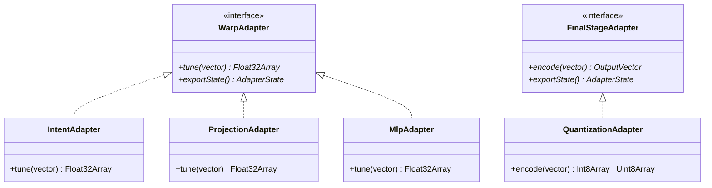

# API Reference

A reference for the core classes and functions provided by `warpvector`.

---

## Core Classes (`@warpvector/core`)

### `WarpPipeline`
An integrated interface that intuitively chains multiple adapters together and centrally manages vector transformation, asynchronous initialization, batch processing, and DB format output.

- `constructor(inputDim: number)`
- `addIntent(intents?: Record<string, IntentWeights>): this`
- `addLoraIntent(rank: number, intents?: Record<string, LoraIntentWeights>): this`
- `addProjection(outputDim: number, projections?: Record<string, ProjectionWeights>): this`
- `addStep(type: string, adapter: WarpAdapter): this`
  - Adds a custom adapter directly to the end of the pipeline.
- `setFinalStage(type: string, adapter: FinalStageAdapter): this`
  - Sets a final transformation, such as quantization, at the end of the pipeline.
- `init(): Promise<void>`
  - Sets up all built-in adapters that require asynchronous initialization, like WASM, at once.
- `run(vector: number[] | Float32Array, context?: RunContext): any`
  - Sequentially applies all configured transformation steps.
- `runBatch(vectors: (number[] | Float32Array)[], context?: RunContext): any[]`
  - Feeds multiple vectors into the pipeline in bulk. Batch processing is parallelized for WASM-supported adapters.
- `runAndFormat(vector: number[] | Float32Array, dbOptions: FormatOptions, context?: RunContext): any`
  - Handles everything from transformation to database formatting (pinecone, pgvector, redis) in a single line.
- `exportState(): PipelineState[]`
- `static importState(states: PipelineState[]): WarpPipeline`
- `static registerAdapter(type: string, importFn: (state: AdapterState) => WarpAdapter): void`
  - Registers a restore function for a custom adapter.
- `static registerFinalStage(type: string, importFn: (state: AdapterState) => FinalStageAdapter): void`
  - Registers a restore function for a FinalStageAdapter.
- `static registerFormat(format: string, formatFn: (vector: OutputVector, options: FormatOptions) => unknown): void`
  - Registers a custom output format (Milvus, Weaviate, etc.).

### `IntentAdapter`
The main class for performing in-memory affine transformations of vectors.

- `constructor(intents: Record<string, IntentWeights> | number)`
  - Loads the intents specified at initialization and optimizes them for WASM/Float32Array.
- `tune(baseVector: number[] | Float32Array, intent: string, activation?: Activation): Float32Array`
  - Applies the affine transformation of the specified intent to a single vector.
- `tuneBatch(baseVectors: (number[] | Float32Array)[], intent: string, activation?: Activation): Float32Array[]`
  - Applies transformations to multiple vectors in bulk. Accelerated by WASM / SIMD when possible.
- `tuneBlended(baseVector: number[] | Float32Array, blendWeights: Record<string, number>, activation?: Activation): Float32Array`
  - Synthesizes and applies multiple intents at a specified ratio (e.g., `{ intentA: 0.7, intentB: 0.3 }`).
- `tuneBatchBlended(...)`
  - Batch processing version (WASM supported) of `tuneBlended`.
- `tuneAutoBlended(baseVector: number[] | Float32Array, activation?: Activation): Float32Array`
  - Automatically calculates and applies the optimal blend ratio directly from the query vector itself, based on the `routingVector` (representative vector) settings.
- `addIntent(intentName: string, weights: IntentWeights): void`
- `removeIntent(intentName: string): void`
- `exportState(): string`
- `static importState(stateJson: string): IntentAdapter`

### `LoraIntentAdapter`
An adapter for high-dimensional vectors (like 1536 dimensions) that dramatically reduces memory and computational cost by using low-rank matrices (LoRA).

- `constructor(dimension: number, rank: number, intents?: Record<string, LoraIntentWeights>)`
- `tune(baseVector: number[] | Float32Array, intent: string): Float32Array`
- `addIntent(intentName: string, weights: LoraIntentWeights): void`
- `removeIntent(intentName: string): void`
- `exportState(): string`
- `static importState(stateJson: string): LoraIntentAdapter`

### `ProjectionAdapter`
An adapter for dimensionality reduction or expansion using projection matrices calculated via PCA or SVD.

- `constructor(inDimension: number, outDimension: number, projections?: Record<string, ProjectionWeights>)`
- `tune(vector: number[] | Float32Array, version?: string): Float32Array`
- `addProjection(name: string, weights: ProjectionWeights): void`
- `removeProjection(name: string): void`
- `exportState(): string`
- `static importState(stateJson: string): ProjectionAdapter`

---

## ML Classes (`@warpvector/ml`)

### `MlpAdapter`
An adapter that performs ultra-fast non-linear Multi-Layer Perceptron inference using a WASM backend.

- `constructor(layers: MlpLayer[])`
- `tune(vector: number[] | Float32Array): Float32Array`
- `tuneBatch(vectors: (number[] | Float32Array)[]): Float32Array[]`
- `init(): Promise<void>` — Persists weights in WASM memory.
- `exportState(): string`
- `static importState(stateJson: string): MlpAdapter`

### `WhiteningAdapter`
An adapter that performs Anisotropy Reduction (equalizing the vector space) using online PCA via Oja's Rule.

- `constructor(dimension: number, config?: WhiteningConfig)`
- `tune(vector: number[] | Float32Array): Float32Array`
- `update(vector: number[] | Float32Array): void` — Streams and updates the principal components.
- `exportState(): string`
- `static importState(stateJson: string): WhiteningAdapter`

### `InfoNCETrainer`
A contrastive learning trainer using InfoNCE Loss. Learns from one positive and multiple negatives simultaneously.

- `constructor(dimension: number)`
- `updateOnline(currentWeights: IntentWeights, example: InfoNCEExample, options?: InfoNCEOnlineOptions): Promise<IntentWeights>`

### `TripletTrainer`
A contrastive learning trainer using Triplet Loss.

- `constructor(dimension: number)`
- `updateOnline(currentWeights: IntentWeights, example: TripletExample, options?: TripletOnlineOptions): Promise<IntentWeights>`

### `MigrationTrainer`
A trainer that automatically learns a projection matrix to translate the vector space between different embedding models.

- `constructor(sourceDimension: number, targetDimension: number)`
- `addExample(example: MigrationExample): void`
- `train(options?: BaseTrainingOptions): Promise<ProjectionWeights>`

---

## Extras Classes (`@warpvector/extras`)

### `QuantizationAdapter`
An adapter that compresses Float32 vectors to Int8 or Binary.

- `constructor(config: QuantizationConfig)`
- `tune(vector: number[] | Float32Array): Int8Array | Uint8Array`
- `encode(vector: number[] | Float32Array): Int8Array | Uint8Array` — Alias for `tune`
- `static int8DotProduct(a: Int8Array, b: Int8Array): number`
- `static hammingDistance(a: Uint8Array, b: Uint8Array): number`
- `exportState(): string`
- `static importState(stateJson: string): QuantizationAdapter`

### `ColbertAdapter`
Token-level matching via MaxSim calculation for Late Interaction (ColBERT) using WASM.

- `constructor()`
- `score(queryTokens: Float32Array, documentTokens: Float32Array, dim: number): number`
- `rank(queryTokens: Float32Array, documents: { id: string; tokens: Float32Array }[], dim: number): { id: string; score: number }[]`

### `VsaAdapter`
Vector Symbolic Architecture (VSA) / Hyperdimensional Computing.

- `static bundle(vectors: (number[] | Float32Array)[], options?: VsaOptions): Float32Array`
- `static bind(vec1: number[] | Float32Array, vec2: number[] | Float32Array, options?: VsaOptions): Float32Array`
- `static unbind(boundVec: number[] | Float32Array, keyVec: number[] | Float32Array, options?: VsaOptions): Float32Array`
- `static bindBinary(bin1: Uint8Array, bin2: Uint8Array): Uint8Array`
- `static unbindBinary(boundBin: Uint8Array, keyBin: Uint8Array): Uint8Array`
- `static bundleBinary(bins: Uint8Array[]): Uint8Array`

### `TaskArithmetic`
Utility for synthesizing multiple learned adapter weights as task vectors.

- `static merge(tasks: TaskConfig[], baseIntent?: IntentWeights): IntentWeights`

### Fusion Functions

- `rrf(resultSets: { id: string; score: number }[][], k?: number): { id: string; score: number }[]`
  - Reciprocal Rank Fusion. Rank-based score integration.
- `rsf(resultSets: { id: string; score: number }[][], weights?: number[]): { id: string; score: number }[]`
  - Relative Score Fusion. Min-Max normalization + weighted addition.

---

## Integration Classes (`@warpvector/langchain`)

### `WarpEmbeddings`
Wraps LangChain's `Embeddings` interface, applying WarpVector transformations only to search queries.

- `constructor(options: WarpEmbeddingsOptions)`
- `embedQuery(text: string): Promise<number[]>`
- `embedDocuments(documents: string[]): Promise<number[][]>`
- `setIntent(intentName: string, activation?: Activation): void`
- `setAutoBlend(enabled: boolean): void`

### `WarpLlamaIndexEmbeddings`
Wraps LlamaIndex's BaseEmbedding interface, applying WarpVector transformations only to search queries.

- `constructor(options: WarpLlamaIndexEmbeddingsOptions)`
- `getQueryEmbedding(query: string): Promise<number[]>`
- `getTextEmbedding(text: string): Promise<number[]>`
- `getTextEmbeddings(texts: string[]): Promise<number[][]>`
- `setIntent(intentName: string, activation?: Activation): void`
- `setAutoBlend(enabled: boolean): void`

---

## Utility Functions

- `normalize(vector: number[] | Float32Array): Float32Array`
  - Calculates the L2 norm of the vector and normalizes its length to 1.
- `cosineSimilarity(v1: number[] | Float32Array, v2: number[] | Float32Array): number`
  - Calculates the cosine similarity (-1.0 to 1.0) between two vectors.
- `innerProduct(v1: number[] | Float32Array, v2: number[] | Float32Array): number`
  - Calculates the dot product of two vectors.
- `slerp(v1: number[] | Float32Array, v2: number[] | Float32Array, t: number): Float32Array`
  - Spherical Linear Interpolation. Interpolates between two vectors while maintaining the structure of cosine similarity (t is 0.0 to 1.0).
- `reject(baseVector: number[] | Float32Array, negativeVector: number[] | Float32Array): Float32Array`
  - Component removal via orthogonal projection. Completely removes the component of `negativeVector` from `baseVector`.
- `applyActivationToVector(vector: Float32Array, activation?: Activation): void`
  - Applies a non-linear activation function to the vector in-place.
- `softmax(values: number[]): number[]`
  - Converts an array of numbers into a probability distribution (summing to 1.0). Includes an overflow prevention mechanism.

---

## Types

### Core Types
- `IntentWeights`: `{ matrix: number[][] | Float32Array, bias: number[] | Float32Array, routingVector?: number[] }`
- `LoraIntentWeights`: `{ matrixA: number[][], matrixB: number[][], bias: number[] }`
- `ProjectionWeights`: `{ matrix: number[][] | Float32Array, bias?: number[] | Float32Array }`
- `Activation`: `"linear" | "relu" | "sigmoid" | "tanh"`
- `WarpAdapter`: `{ tune(vector, ...args): Float32Array; exportState(): AdapterState }`
- `FinalStageAdapter`: `{ encode(vector): OutputVector; exportState(): AdapterState }`
- `RunContext`: `{ intent?: string; version?: string }`
- `FormatOptions`: `{ format: string; top: number; filter?: Record<string, unknown> }`
- `PipelineState`: `{ type: string; state: AdapterState | null }`

### ML Types
- `MlpLayer`: `{ matrix: number[][] | Float32Array, bias: number[] | Float32Array, activation: Activation }`
- `WhiteningConfig`: `{ learningRate?: number; numComponents?: number }`
- `InfoNCEExample`: `{ anchor: number[] | Float32Array, positive: number[] | Float32Array, negatives: (number[] | Float32Array)[] }`
- `InfoNCEOnlineOptions`: `{ learningRate?: number; temperature?: number; regularization?: number }`
- `TripletExample`: `{ anchor: number[] | Float32Array, positive: number[] | Float32Array, negative: number[] | Float32Array }`
- `TripletOnlineOptions`: `{ learningRate?: number; margin?: number; regularization?: number }`
- `MigrationExample`: `{ source: number[] | Float32Array; target: number[] | Float32Array }`
- `BaseTrainingOptions`: `{ epochs?: number; learningRate?: number; regularization?: number; autoTune?: boolean }`

### Extras Types
- `QuantizationConfig`: `{ type: "int8" | "binary"; dim: number; dynamic?: boolean }`
- `VsaOptions`: `{ shouldNormalize?: boolean }`
- `TaskConfig`: `{ weights: IntentWeights; scale: number }`
